<!-- README.md is generated from README.Rmd. Please edit that file -->

# `litReview`: An R package for plotting literature review results 

<!-- badges: start -->

<!-- badges: end -->

`litReview` provides functions to summarize and visualize categorical
data from literature reviews. All plot functions return standard ggplot
objects you can customize with `+`.

## Installation

Install the released version from CRAN:

``` r
install.packages("litReview")
```

Or the development version from GitHub:

``` r
# install.packages("remotes")
remotes::install_github("sonsoleslp/litReview")
```

## Usage

``` r
library(litReview)
data(studies)
```

### Bar chart

``` r
reviewBar(studies, Design)
```

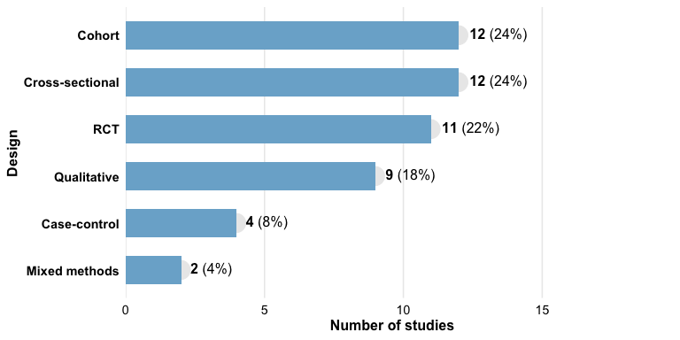

``` r
reviewBar(studies, Design, fill = "#59a14f") +
  ggplot2::labs(title = "Study Designs")
```

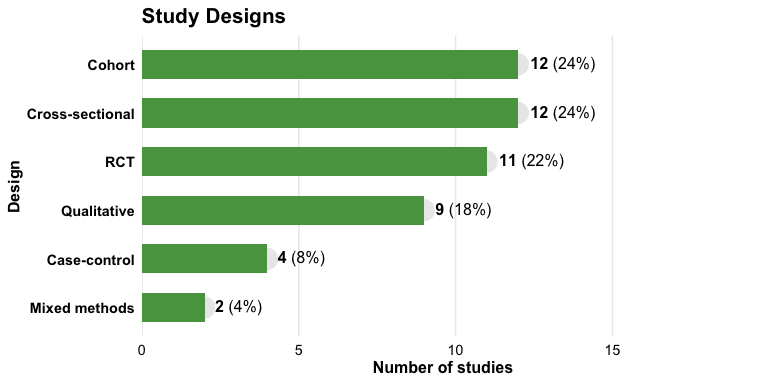

### Study labels on bars

``` r
reviewBar(studies, Design, fill = PALETTE[2], studlabs = TRUE)
```


### Stacked bar chart

`reviewStackedBar()` compares the composition of one category across
another. By default each bar is scaled to 100% to compare proportions:

``` r
reviewStackedBar(studies, Design, RiskOfBias)
```

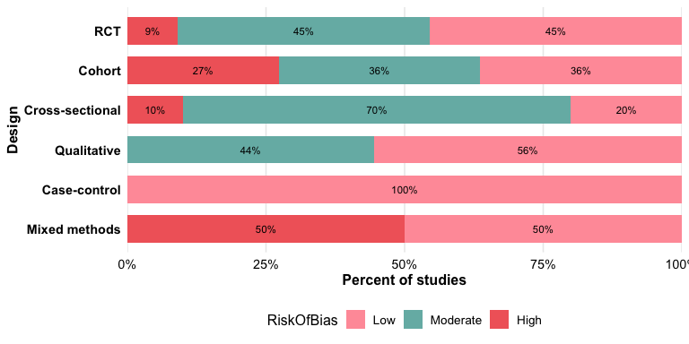

Use `position = "stack"` for raw counts:

``` r
reviewStackedBar(studies, Design, RiskOfBias, position = "stack")
```

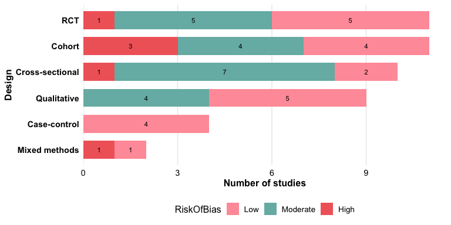

### Histogram

`reviewHistogram()` bins a numeric column; add `fill_by` to stack by a
group.

``` r
reviewHistogram(studies, SampleSize, bins = 15)
```

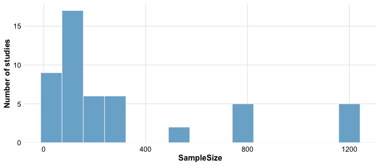

### Waffle chart

``` r
reviewWaffle(studies, Design, ncol = 10)
```

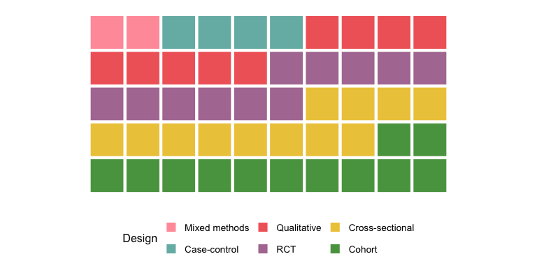

### Donut chart

``` r
reviewPie(studies, Design)
```

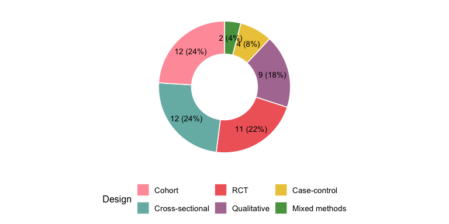

### Co-occurrence heatmap

``` r
reviewOverlap(studies, Design, Outcome, fill = "#b07aa1")
```

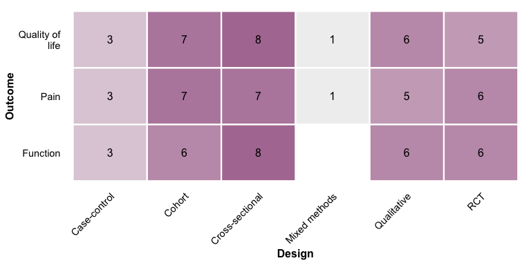

### UpSet plot

`reviewUpset()` shows how the values of a multi-value column co-occur
across studies — a scalable alternative to the pairwise heatmap.
Requires the `ggupset` package.

``` r
reviewUpset(studies, Outcome,  fill = "#f16769")
```

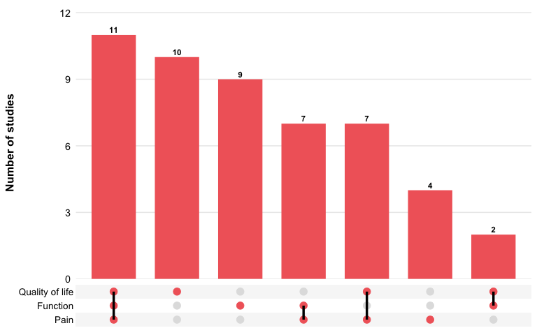

### Alluvial plot

``` r
reviewAlluvial(studies, c("Design", "Outcome"), labels = "prop")
```

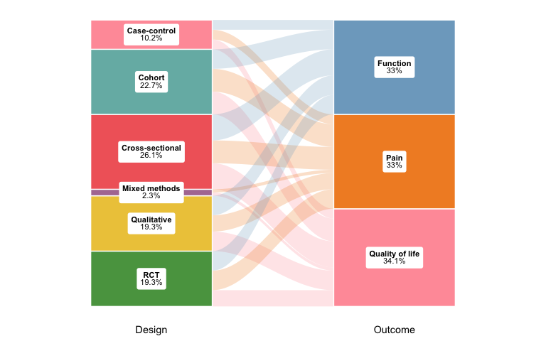

### Year trend

``` r
reviewTrend(studies, Design)
```


### World map

``` r
reviewMap(studies)
```

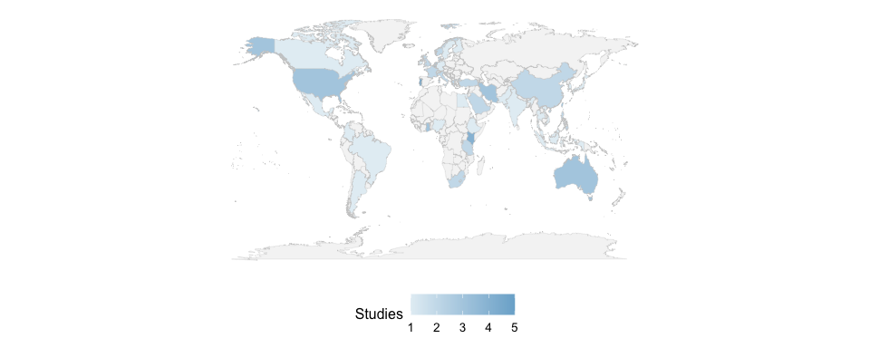

### Treemap

``` r
reviewTreemap(studies, Design)
```

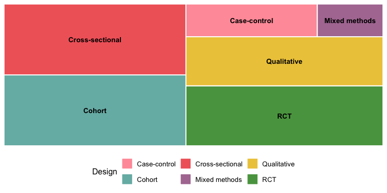

``` r
reviewTreemap(studies, Intervention, color_by = InterventionType)
```

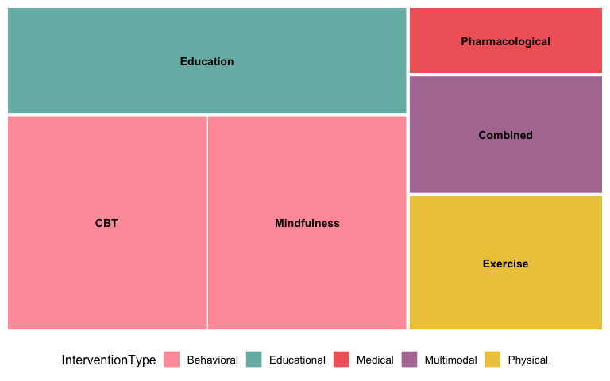

### Coding matrix

`reviewMatrix()` shows a study-by-criteria evidence matrix: a tile
wherever a study addresses a criterion, coloured by a study attribute
with the coding level inside.

``` r
criteria <- c("Randomization", "Blinding", "SampleJustification",
              "AttritionReported", "EthicsApproval", "EffectSize")
reviewMatrix(studies[1:20, ], criteria, color_by = "PubType",
             levels = c(F = "Full", P = "Partial", M = "Mention"))
```

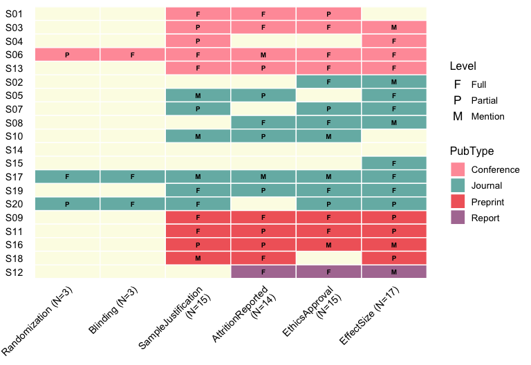

### Tree diagram

`reviewTree()` draws a left-to-right hierarchy from columns given in
order, listing the studies at each leaf.

``` r
reviewTree(studies, c("InterventionType", "Intervention"), study_id = Author)
```


### Summary table

``` r
reviewTable(studies, Design, study_id = "Author")
```


### Handling missing data

``` r
df_na <- data.frame(
  StudyID = paste0("S", 1:8),
  Design  = c("RCT", "Cohort", NA, "RCT", "Case-control", NA, "RCT", "Cohort"),
  stringsAsFactors = FALSE
)
reviewBar(df_na, Design, na.rm = FALSE, na_label = "Missing", na_last = TRUE)
```


