# Alluvial diagrams

``` r

library(litReview)
library(ggplot2)
data(studies)
```

[`reviewAlluvial()`](https://sonsoles.me/litReview/reference/reviewAlluvial.md)
shows how studies flow across two or more categorical columns: each
study traces a path through the strata, and the ribbons reveal which
category combinations co-occur. It is the tool for spotting patterns
like “which designs measure which outcomes.” This article walks through
**every argument** of

``` r

reviewAlluvial(data, cols, sep = "\r\n", study_id = StudyID, colors = PALETTE,
               base_size = 12, na.rm = TRUE, na_label = "Not reported",
               labels = c("none", "prop", "count", "both"), flow_labels = FALSE,
               flow_alpha = 0.25, stratum_width = 0.5, axis_labels = NULL)
```

It requires the **ggalluvial** package.

## Default

Pass the data frame and a character vector of column names. Each axis is
one column; the boxes (strata) are its categories, and the ribbons
connecting them are the studies.

``` r

reviewAlluvial(studies, c("Design", "Outcome"))
```


## `cols`: the columns to trace

`cols` is a **character vector of two or more column names**, one axis
per name, drawn left to right. A two-column diagram links designs to
outcomes:

``` r

reviewAlluvial(studies, c("Design", "Outcome"))
```


Add a third column and every study now traces a path across three axes.
Multi-value columns (`Outcome`, `AgeGroup`) are split first, so a study
with several values contributes a flow to each:

``` r

reviewAlluvial(studies, c("Design", "Outcome", "AgeGroup"))
```

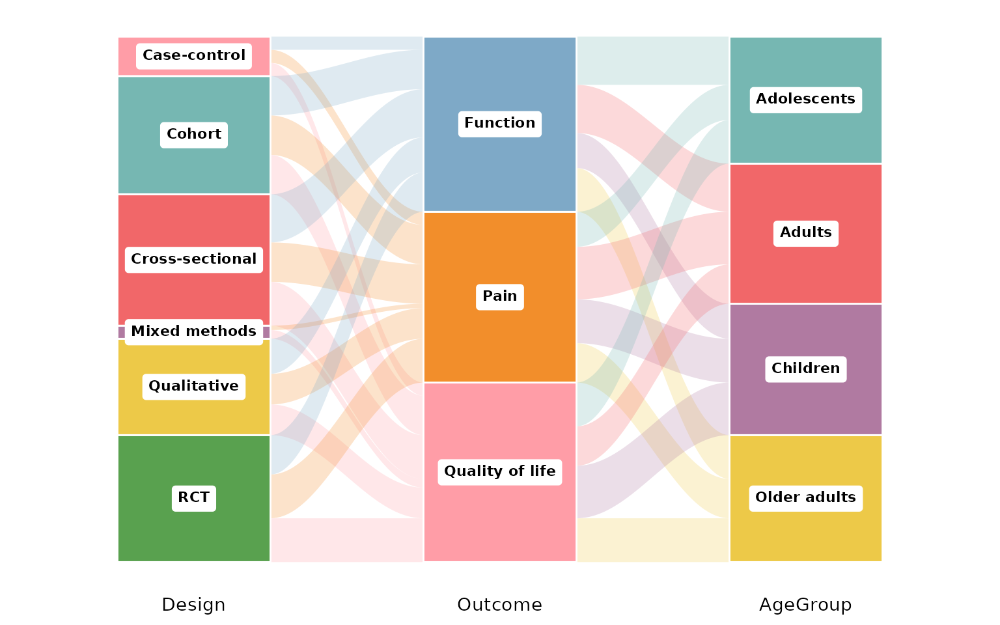

## `sep`: multi-value separator

Some cells hold several values. In `studies`, `Outcome` and `AgeGroup`
use newline separators (`"\r\n"`, the default), so each value spawns its
own flow. If your data uses a different delimiter, set `sep`. Here we
rebuild a semicolon-separated column to demonstrate:

``` r

studies_semi <- studies
studies_semi$Outcome <- gsub("\r\n", "; ", studies_semi$Outcome)
reviewAlluvial(studies_semi, c("Design", "Outcome"), sep = "; ")
```

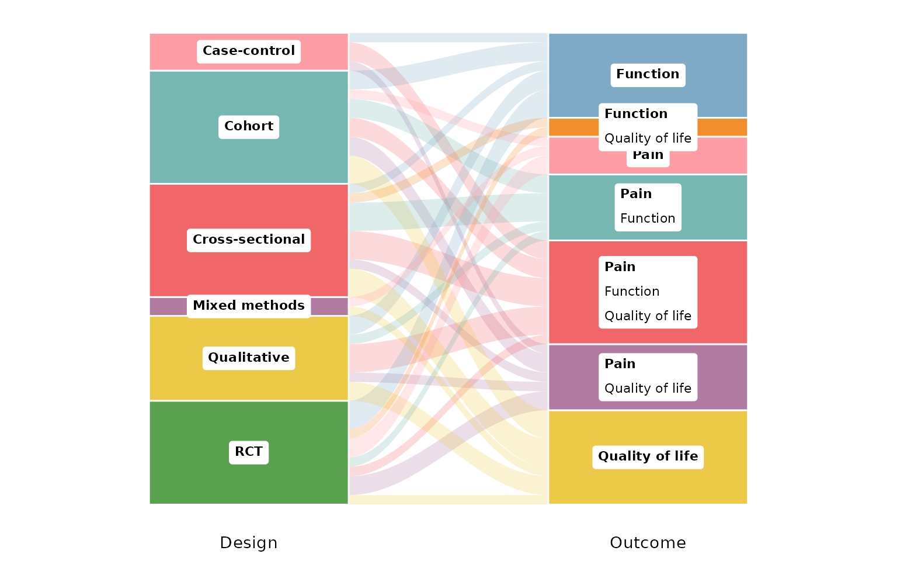

## `study_id`: the identifier column

`study_id` names the column that identifies one study (default
`StudyID`). It defines what a single flow is: rows sharing an ID are one
study, so multi-value cells fan out from the same origin. Any unique
identifier works — here we use `Author`:

``` r

reviewAlluvial(studies, c("Design", "Outcome"), study_id = Author)
```


## `colors`: the stratum palette

Strata are filled from a palette vector (default `PALETTE`). Print it to
see the default colors:

``` r

PALETTE
#> [1] "#ff9da7" "#76b7b2" "#f16769" "#b07aa1" "#edc948" "#59a14f" "#7ea9c7"
#> [8] "#F28E2B"
```

Pass your own vector to recolor the strata (recycled if shorter than the
number of categories):

``` r

reviewAlluvial(studies, c("Design", "Outcome"),
               colors = c("#4E79A7", "#F28E2B", "#E15759", "#76B7B2",
                          "#59A14F", "#EDC948"))
```

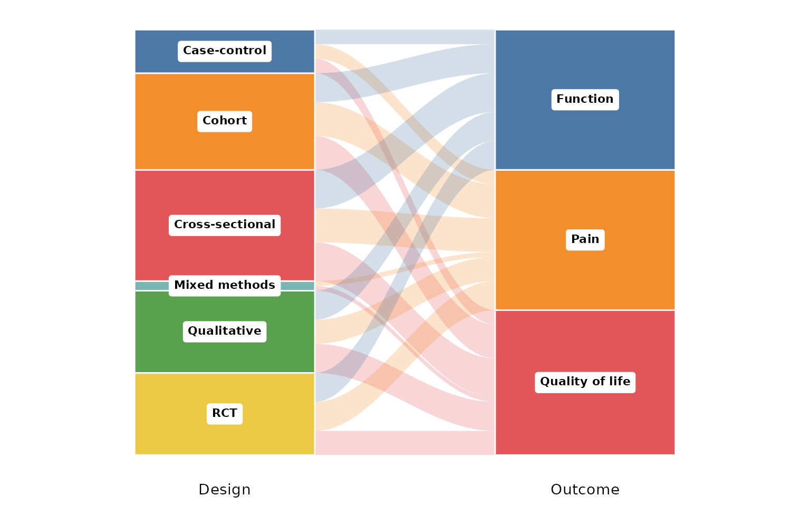

## `base_size`: overall text and element scaling

A single knob scales all text and spacing proportionally. Smaller, for
multi-panel figures:

``` r

reviewAlluvial(studies, c("Design", "Outcome"), base_size = 9)
```

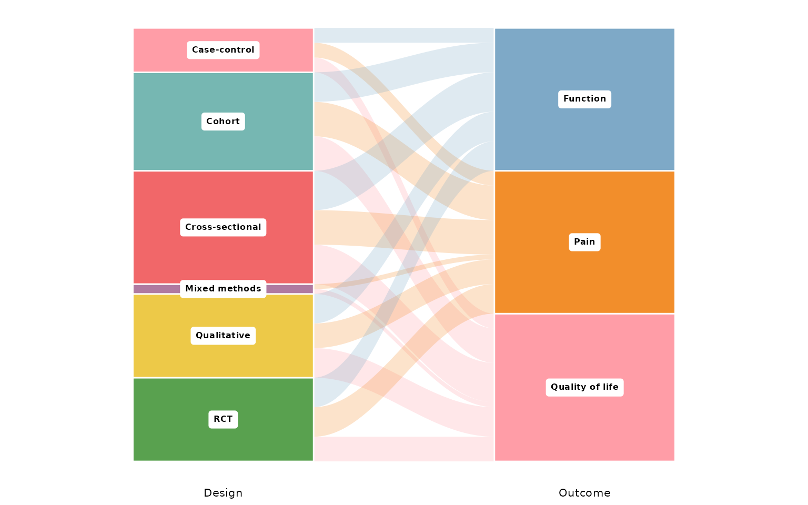

Larger, for slides or posters:

``` r

reviewAlluvial(studies, c("Design", "Outcome"), base_size = 18)
```

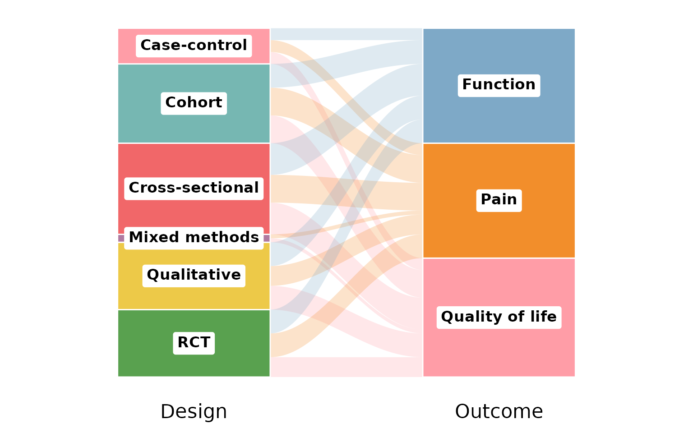

## Missing data: `na.rm` and `na_label`

By default `na.rm = TRUE` drops studies with a missing (or empty) value
in any of the plotted columns. We use `RiskOfBias` and `FundingSource` —
the latter has missing values:

``` r

reviewAlluvial(studies, c("RiskOfBias", "FundingSource"))
```

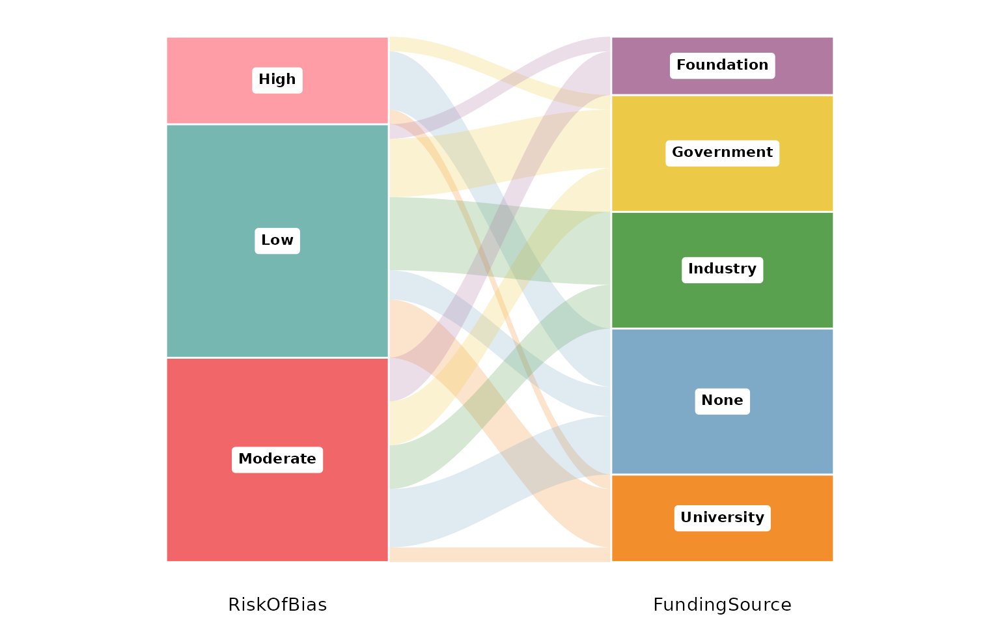

Set `na.rm = FALSE` to keep the missing values as their own stratum;
`na_label` names it:

``` r

reviewAlluvial(studies, c("RiskOfBias", "FundingSource"),
               na.rm = FALSE, na_label = "Not reported")
```

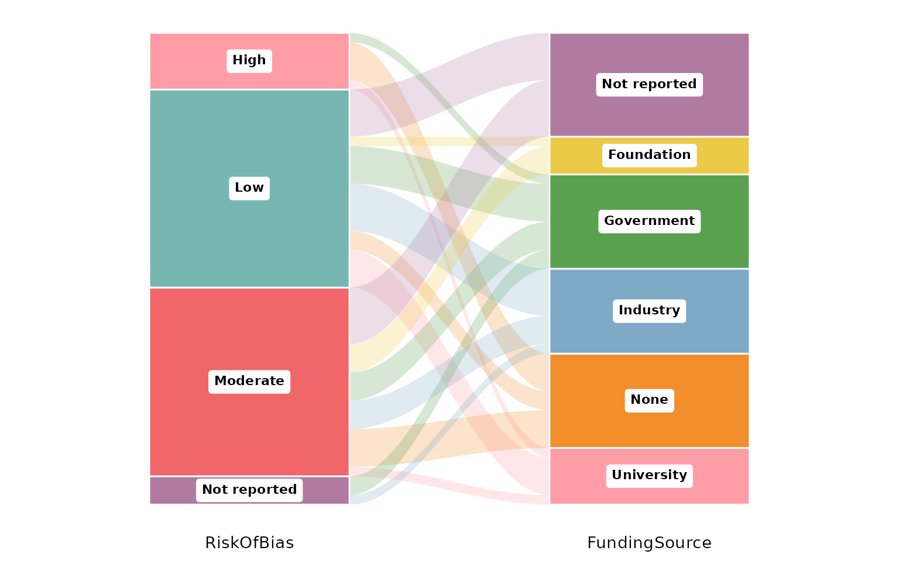

## `labels`: what to print on each stratum

`labels` controls the annotation inside each stratum box. The default
`"none"` leaves them bare:

``` r

reviewAlluvial(studies, c("Design", "Outcome"), labels = "none")
```


`"count"` adds the number of studies in each stratum:

``` r

reviewAlluvial(studies, c("Design", "Outcome"), labels = "count")
```


`"prop"` shows the proportion instead:

``` r

reviewAlluvial(studies, c("Design", "Outcome"), labels = "prop")
```

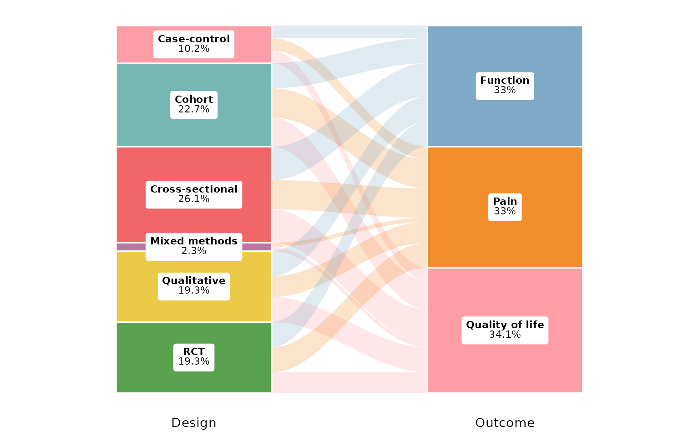

`"both"` prints count and proportion together:

``` r

reviewAlluvial(studies, c("Design", "Outcome"), labels = "both")
```

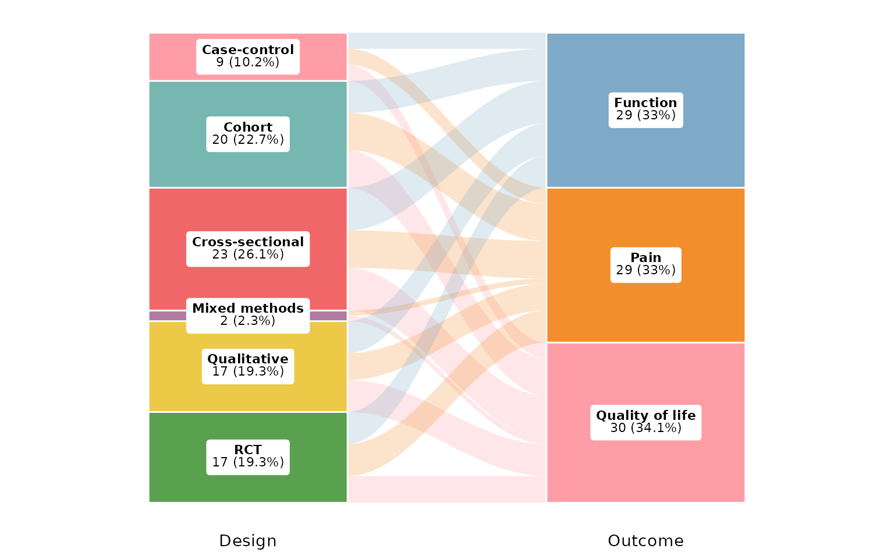

## `flow_labels`: counts on the ribbons

Set `flow_labels = TRUE` to print the number of studies on each ribbon
between strata, making individual co-occurrences legible:

``` r

reviewAlluvial(studies, c("Design", "Outcome"), flow_labels = TRUE)
```

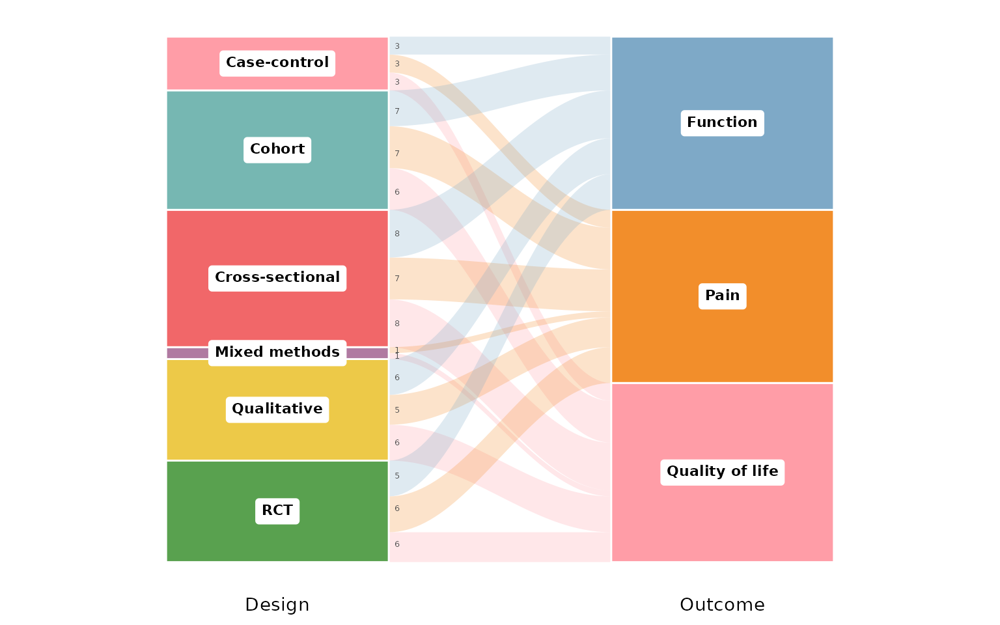

## `flow_alpha`: ribbon transparency

`flow_alpha` sets the opacity of the ribbons, from 0 (invisible) to 1
(opaque). Low values keep dense diagrams readable by letting overlaps
show through:

``` r

reviewAlluvial(studies, c("Design", "Outcome"), flow_alpha = 0.15)
```

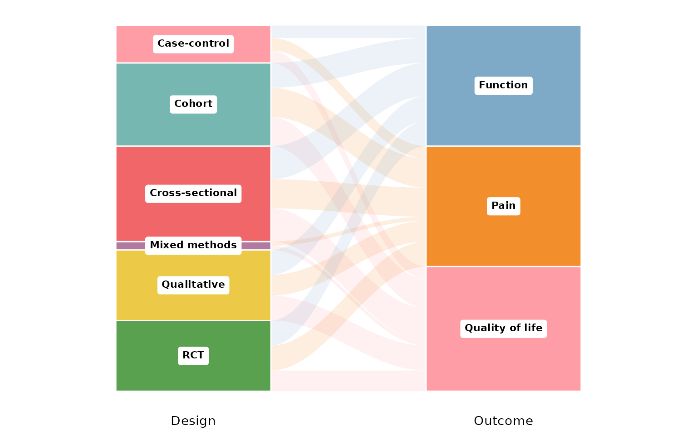

A high value makes the flows bold and solid:

``` r

reviewAlluvial(studies, c("Design", "Outcome"), flow_alpha = 0.9)
```

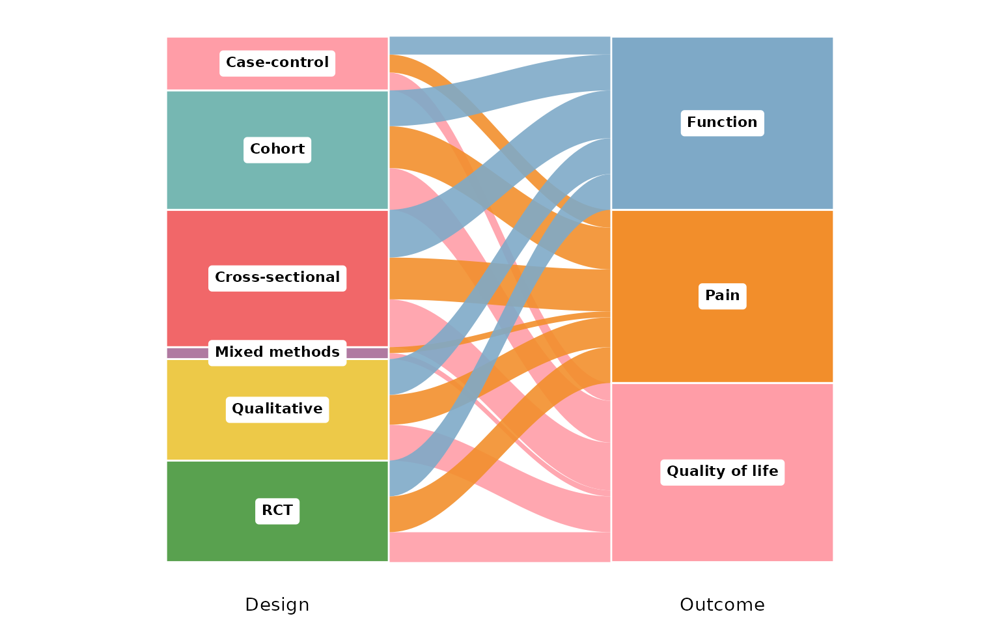

## `stratum_width`: width of the stratum boxes

`stratum_width` runs from 0 to 1 (fraction of the axis band). Narrow
boxes give the ribbons more room:

``` r

reviewAlluvial(studies, c("Design", "Outcome"), stratum_width = 0.2)
```

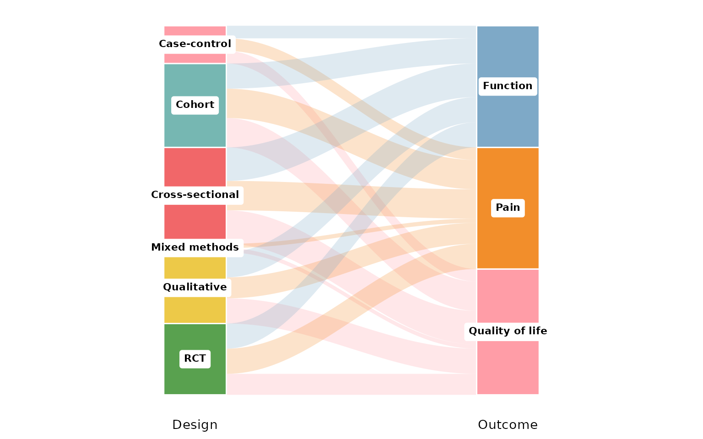

Wide boxes emphasise the strata over the flows:

``` r

reviewAlluvial(studies, c("Design", "Outcome"), stratum_width = 0.8)
```

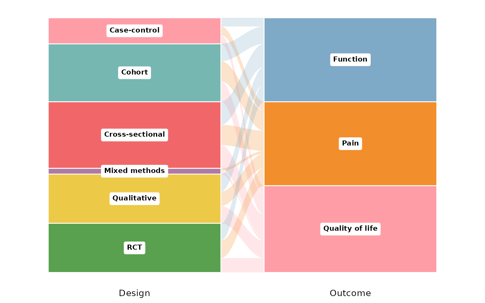

## `axis_labels`: custom axis titles

By default each axis is titled with its column name. Pass `axis_labels`,
a character vector matching `cols`, to rename them:

``` r

reviewAlluvial(studies, c("Design", "Outcome", "AgeGroup"),
               axis_labels = c("Study design", "Outcome", "Age group"))
```


## Composing with ggplot2

Every `review*()` function returns a plain ggplot, so you can keep
adding layers, scales, and labels with `+`:

``` r

reviewAlluvial(studies, c("Design", "Outcome")) +
  labs(title = "Designs and outcomes", subtitle = "n = 50 studies",
       caption = "Source: example dataset") +
  theme(plot.title.position = "plot")
```

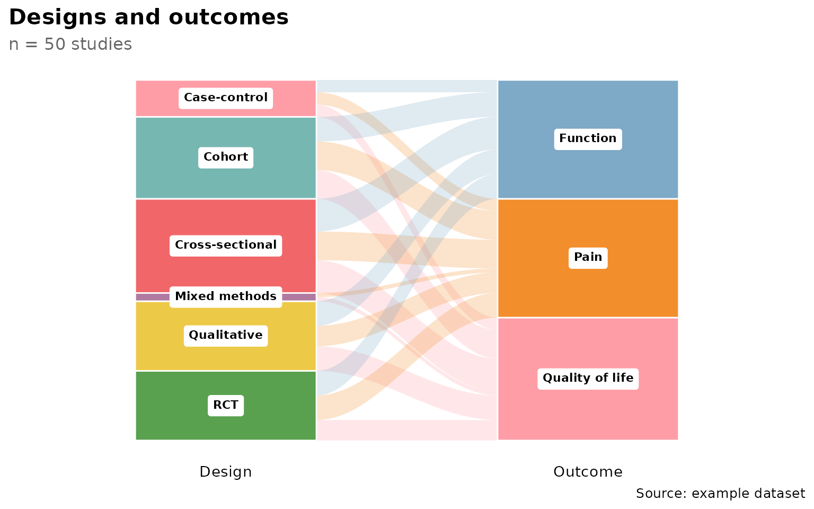
