# Bar charts

``` r

library(litReview)
library(ggplot2)
data(studies)
```

[`reviewBar()`](https://sonsoles.me/litReview/reference/reviewBar.md)
summarizes a single column as a horizontal bar chart with frequency and
percentage labels. It is the workhorse plot of the package. This article
walks through **every argument** of

``` r

reviewBar(data, col, fill = "#7BB0D1", width = 0.6, sep = "\r\n",
          studlabs = FALSE, study_id = StudyID, label_space = 1.6,
          base_size = 12, na.rm = TRUE, na_label = "Not reported",
          na_in_percent = TRUE, na_last = FALSE)
```

## Default

Pass the data frame and a column. Column names may be bare or quoted.
Bars are ordered by frequency, and each is annotated with its count and
percentage.

``` r

reviewBar(studies, Design)
```

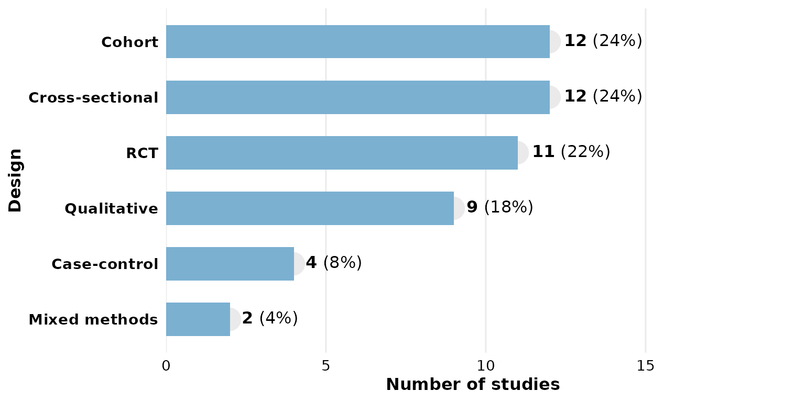

## `col`: the column to summarize

Any categorical column works. Multi-value columns (cells holding several
values) are split first — see [`sep`](#sep-multi-value-separator) below.

``` r

reviewBar(studies, Setting)
```

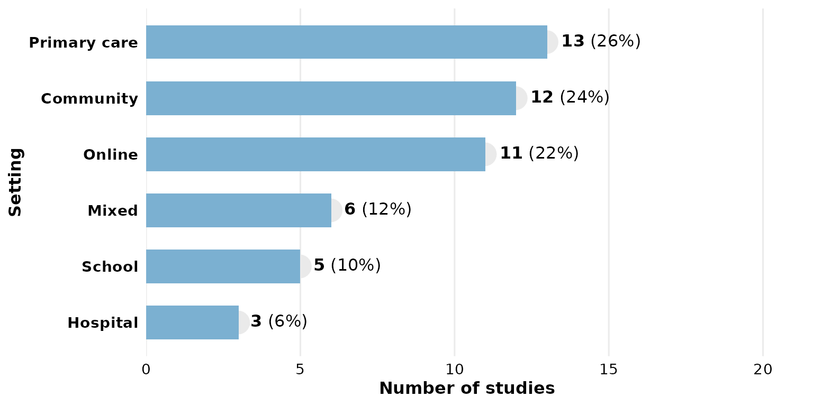

## `fill`: bar color

A single hex color paints every bar:

``` r

reviewBar(studies, Design, fill = "#59a14f")
```

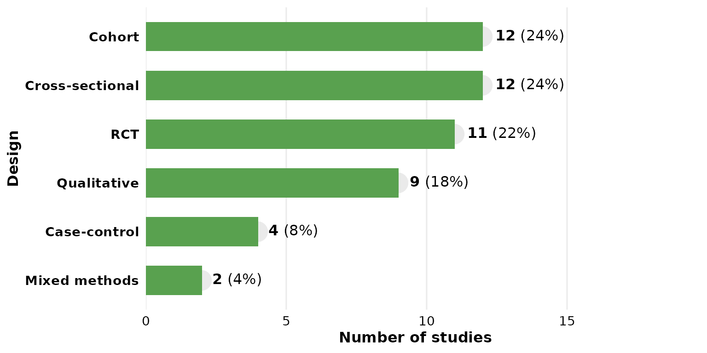

Use one of the package
[`PALETTE`](https://sonsoles.me/litReview/reference/PALETTE.md) colors:

``` r

reviewBar(studies, Design, fill = PALETTE[4])
```

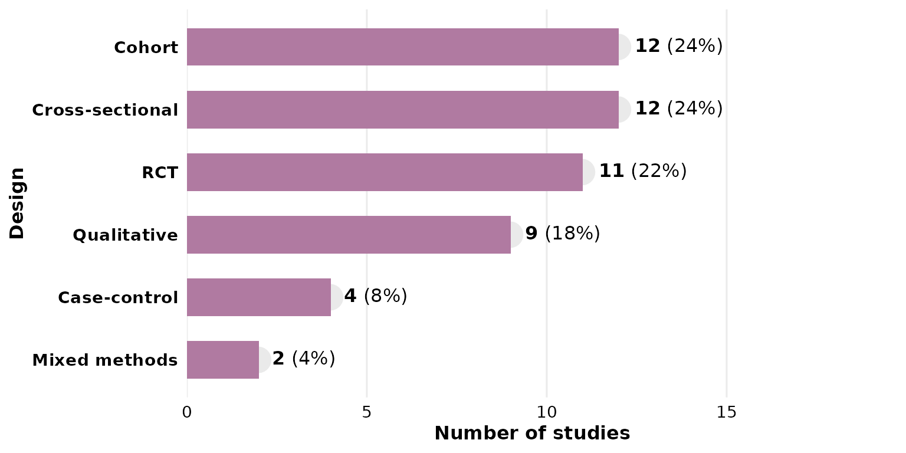

Passing a **vector** of colors maps one color per bar (recycled if
shorter than the number of categories):

``` r

reviewBar(studies, Design, fill = PALETTE)
```

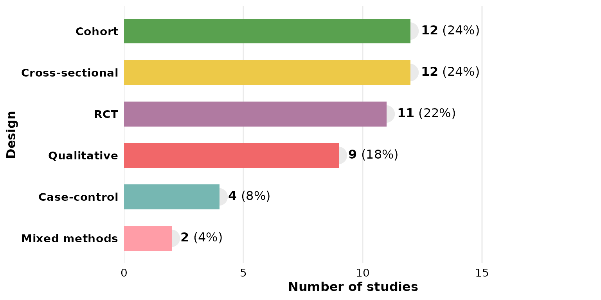

A **named** vector pins specific colors to specific categories:

``` r

reviewBar(studies, Design,
          fill = c("RCT" = "#f16769", "Cohort" = "#7ea9c7"))
```

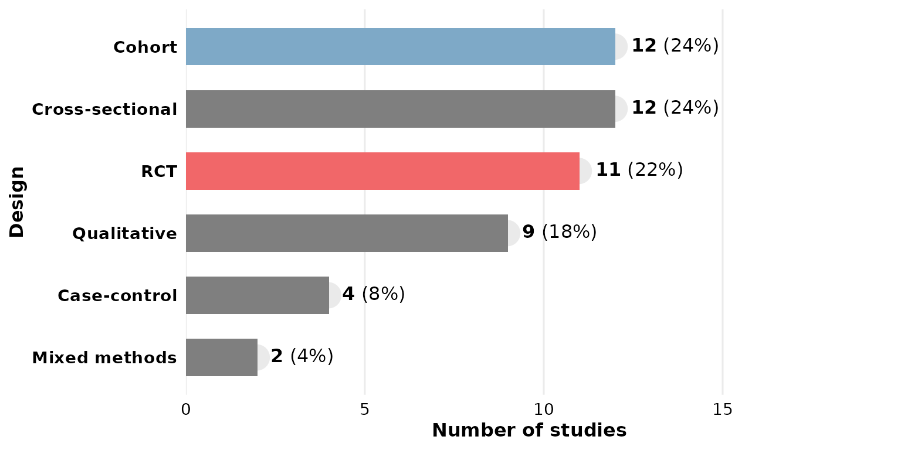

## `width`: bar thickness

`width` runs from 0 to 1 (fraction of the available band). Thin bars:

``` r

reviewBar(studies, Design, width = 0.3)
```

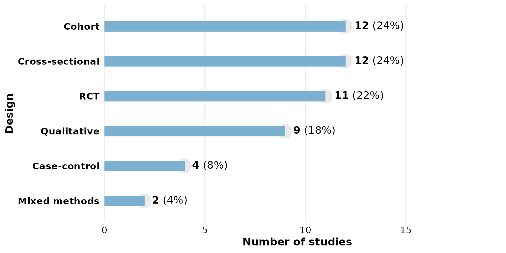

Full-width bars:

``` r

reviewBar(studies, Design, width = 1)
```

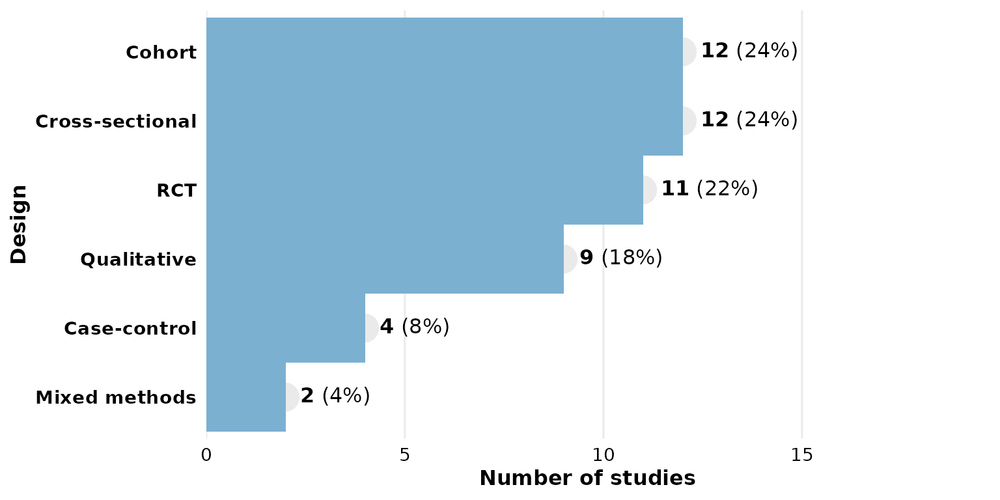

## `sep`: multi-value separator

Some cells hold several values. In `studies`, `Outcome` uses newline
separators (`"\r\n"`, the default), so each value is counted
independently:

``` r

reviewBar(studies, Outcome)
```

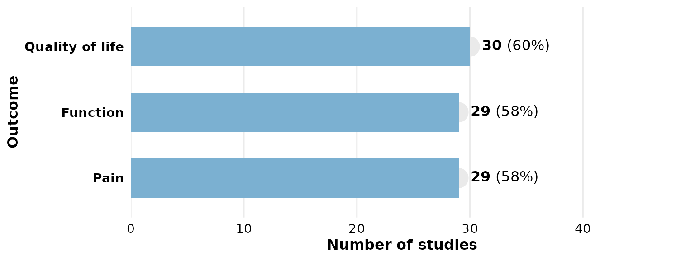

If your data uses a different delimiter, set `sep`. Here we rebuild a
semicolon-separated column to demonstrate:

``` r

studies_semi <- studies
studies_semi$Outcome <- gsub("\r\n", "; ", studies_semi$Outcome)
reviewBar(studies_semi, Outcome, sep = "; ")
```

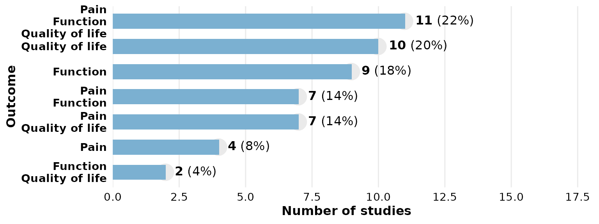

## `studlabs` and `study_id`: label bars with study IDs

Set `studlabs = TRUE` to overlay the contributing study identifiers on
each bar. This requires the **ggfittext** package.

``` r

reviewBar(studies, Design, fill = PALETTE[2], studlabs = TRUE)
```


`study_id` selects which column supplies those identifiers (default
`StudyID`). Here we label with the author instead:

``` r

reviewBar(studies, Design, studlabs = TRUE, study_id = Author)
```

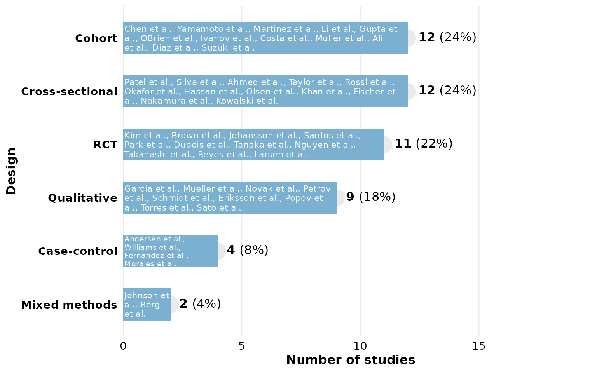

## `label_space`: room for the count labels

The count/percentage labels sit to the right of each bar. If a long
label is clipped, increase `label_space` (a multiplier on the x-axis
headroom, default `1.6`). Country names are long, so give them more
room:

``` r

reviewBar(studies, Country, fill = PALETTE[6], label_space = 2)
```

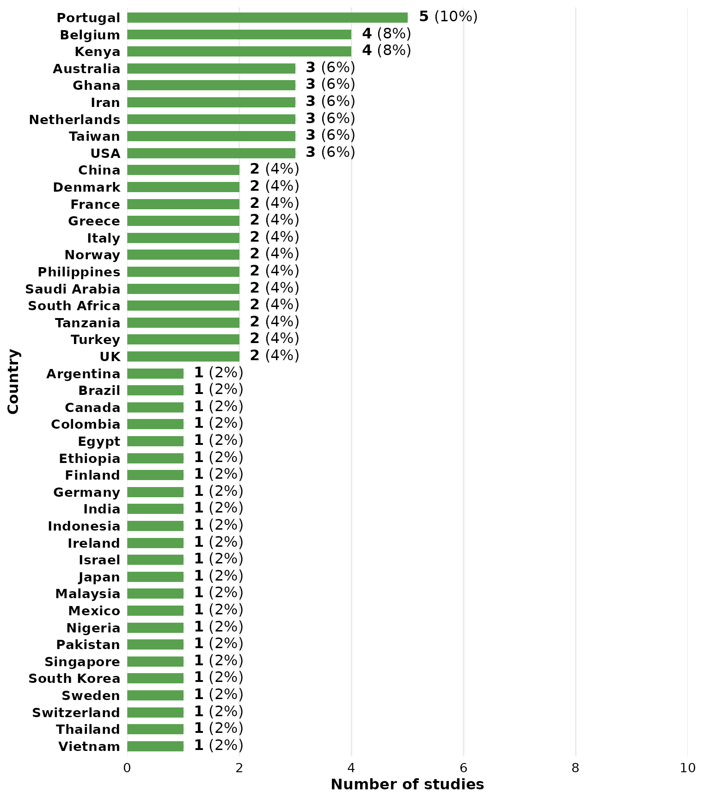

A tighter value packs the plot horizontally:

``` r

reviewBar(studies, Design, label_space = 1.2)
```

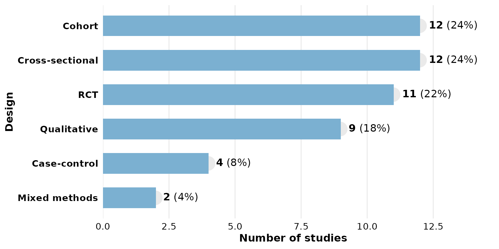

## `base_size`: overall text and element scaling

A single knob scales all text and spacing proportionally. Smaller, for
multi-panel figures:

``` r

reviewBar(studies, Design, base_size = 9)
```

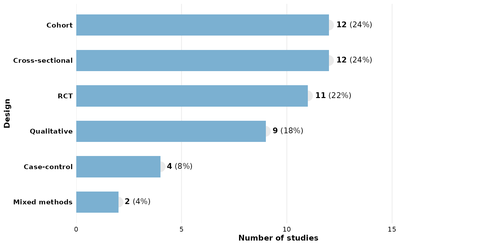

Larger, for slides or posters:

``` r

reviewBar(studies, Design, base_size = 18)
```

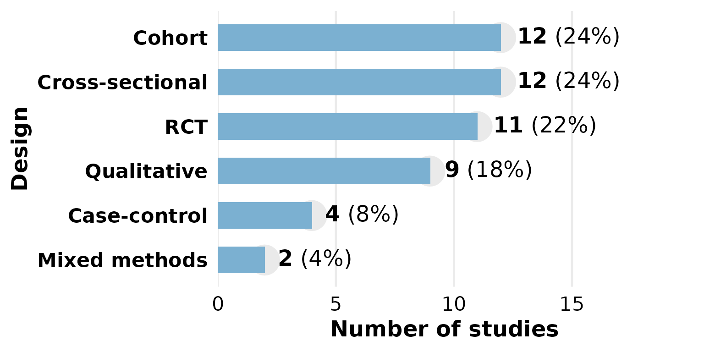

## Missing data: `na.rm`, `na_label`, `na_in_percent`, `na_last`

These four arguments control how `NA` (and empty) cells are treated. We
use a column that actually has missing values — `FundingSource`.

By default `na.rm = TRUE` drops missing rows, but the percentage
denominator is still the full sample, so the shown percentages need not
sum to 100%:

``` r

reviewBar(studies, FundingSource)
```

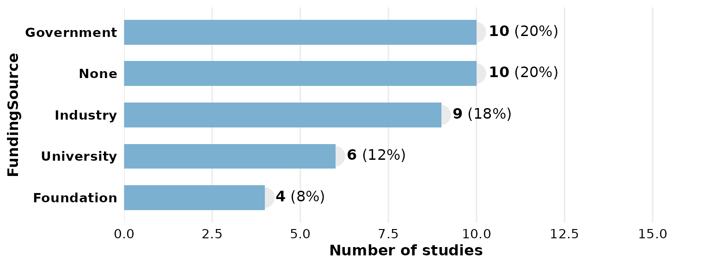

Keep the missing rows as their own category with `na.rm = FALSE`;
`na_label` sets its name:

``` r

reviewBar(studies, FundingSource, na.rm = FALSE, na_label = "Not reported")
```

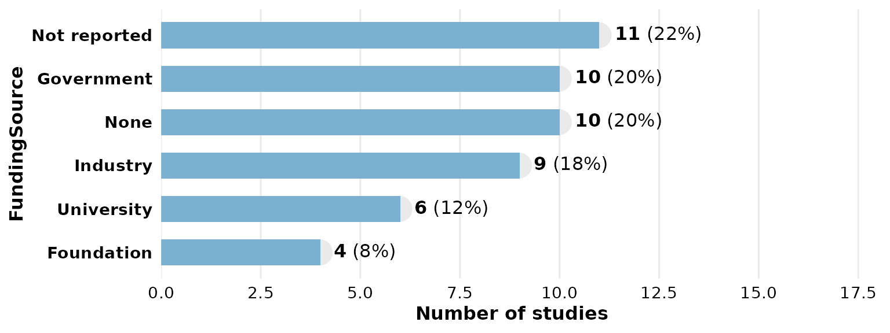

With `na_in_percent = FALSE` the denominator excludes missing rows, so
the reported categories sum to 100%:

``` r

reviewBar(studies, FundingSource, na.rm = FALSE, na_in_percent = FALSE)
```

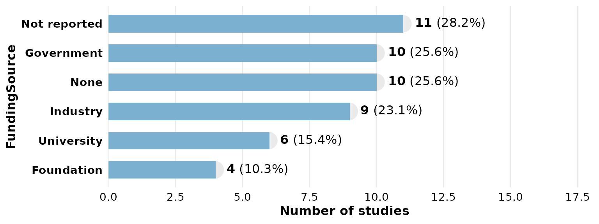

`na_last = TRUE` forces the missing-value bar to the end (bottom)
regardless of its frequency:

``` r

reviewBar(studies, FundingSource, na.rm = FALSE, na_last = TRUE)
```

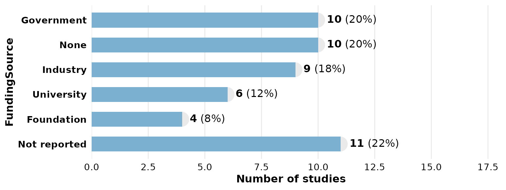

## Composing with ggplot2

Every `review*()` function returns a plain ggplot, so you can keep
adding layers, scales, and labels with `+`:

``` r

reviewBar(studies, Design, fill = "#59a14f") +
  labs(title = "Study designs", subtitle = "n = 50 studies",
       caption = "Source: example dataset") +
  theme(plot.title.position = "plot")
```

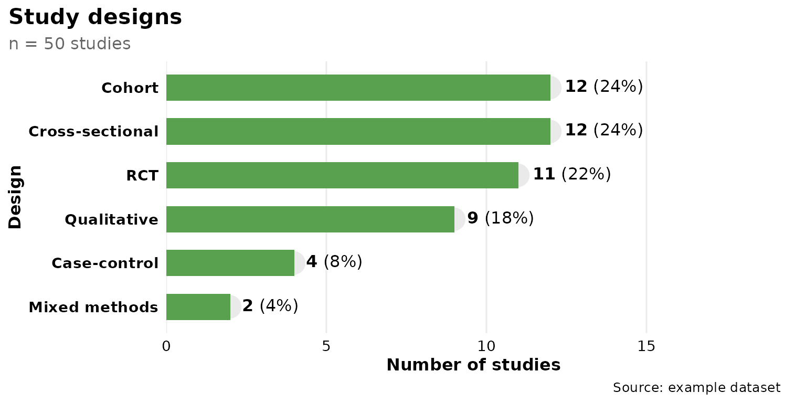
