# Histograms

``` r

library(litReview)
library(ggplot2)
data(studies)
```

[`reviewHistogram()`](https://sonsoles.me/litReview/reference/reviewHistogram.md)
bins a single **numeric** column and plots the frequency of each bin. It
optionally stacks the bars by a categorical grouping column. It is the
counterpart of
[`reviewBar()`](https://sonsoles.me/litReview/articles/bar.md) for
continuous variables. This article walks through **every argument** of

``` r

reviewHistogram(data, col, fill_by = NULL, bins = 30, binwidth = NULL,
                fill = "#7BB0D1", colors = PALETTE, sep = "\r\n",
                base_size = 12, na.rm = TRUE, na_label = "Not reported")
```

## Default

Pass the data frame and a numeric column. Column names may be bare or
quoted. Values are split into `bins` (30 by default) and the height of
each bar is the number of studies falling in that bin.

``` r

reviewHistogram(studies, SampleSize)
```

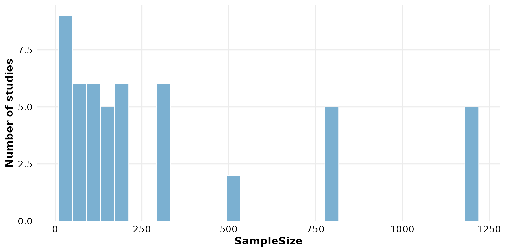

## `col`: the column to bin

Any numeric column works. `Year` is a natural candidate — it shows the
temporal spread of the reviewed studies.

``` r

reviewHistogram(studies, Year)
```

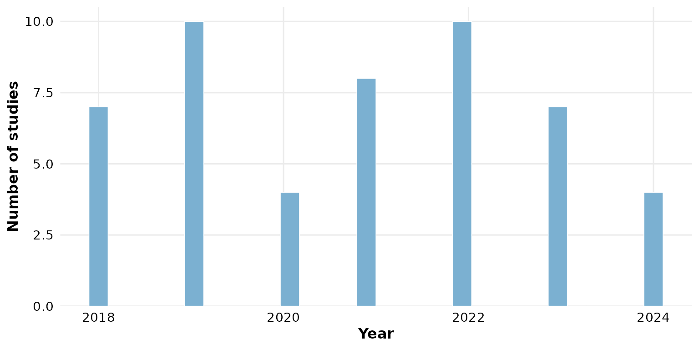

Non-numeric columns are rejected:
[`reviewHistogram()`](https://sonsoles.me/litReview/reference/reviewHistogram.md)
is for continuous variables. Use
[`reviewBar()`](https://sonsoles.me/litReview/articles/bar.md) for
categorical ones.

## `fill_by`: stack by a grouping column

Supply a categorical column to `fill_by` and the histogram becomes a
**stacked** histogram: each bin is split into colored segments, one per
group. This shows how the composition of a numeric variable varies
across categories.

``` r

reviewHistogram(studies, SampleSize, fill_by = Design)
```

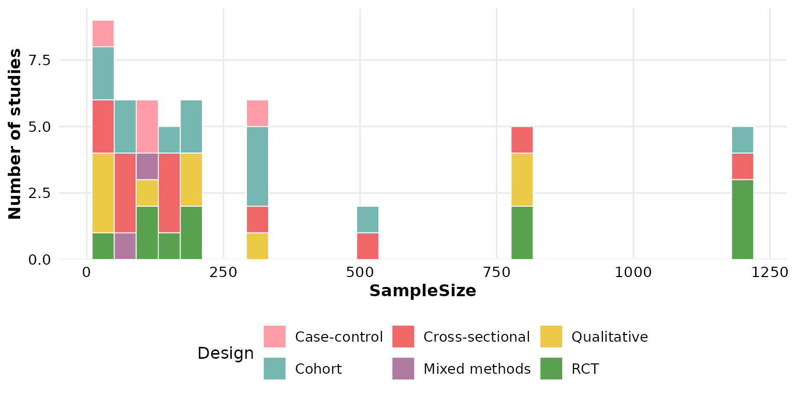

`InterventionType` works just as well:

``` r

reviewHistogram(studies, SampleSize, fill_by = InterventionType)
```

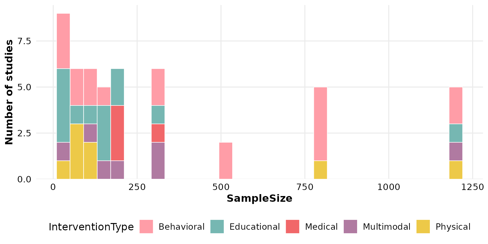

When `fill_by` is set the bars are colored from the
[`colors`](#colors-the-palette-for-grouped-bars) palette and the single
[`fill`](#fill-bar-color) color is ignored.

## `bins`: number of bins

`bins` controls how finely the range is divided (default `30`). A small
value gives broad, coarse bars:

``` r

reviewHistogram(studies, SampleSize, bins = 6)
```

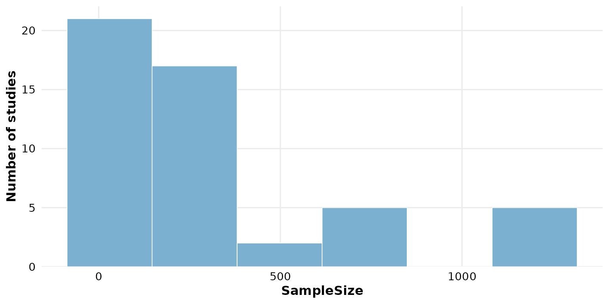

A large value gives many narrow bars, revealing finer structure:

``` r

reviewHistogram(studies, SampleSize, bins = 40)
```

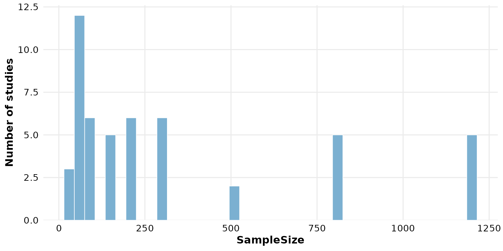

## `binwidth`: fixed bin width

Set `binwidth` to fix the width of each bin in the units of the data.
This **overrides** `bins` when supplied. Here each bar spans 100
participants:

``` r

reviewHistogram(studies, SampleSize, binwidth = 100)
```

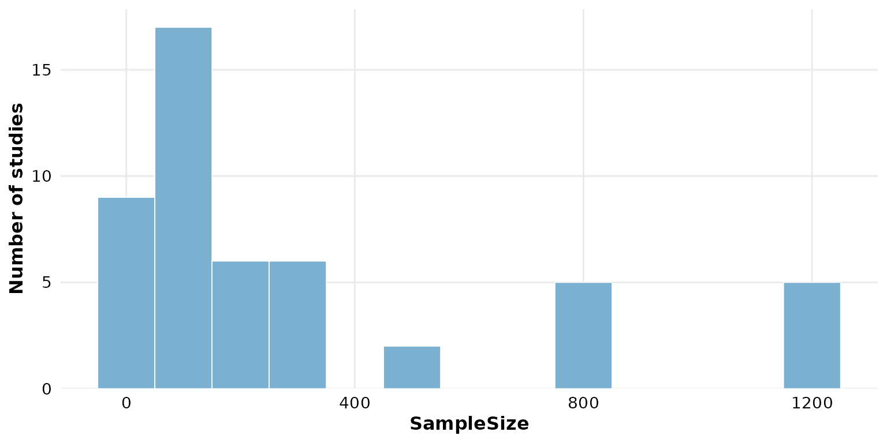

Because `binwidth` takes precedence, `bins` has no effect once it is
set:

``` r

reviewHistogram(studies, SampleSize, binwidth = 250, bins = 40)
```

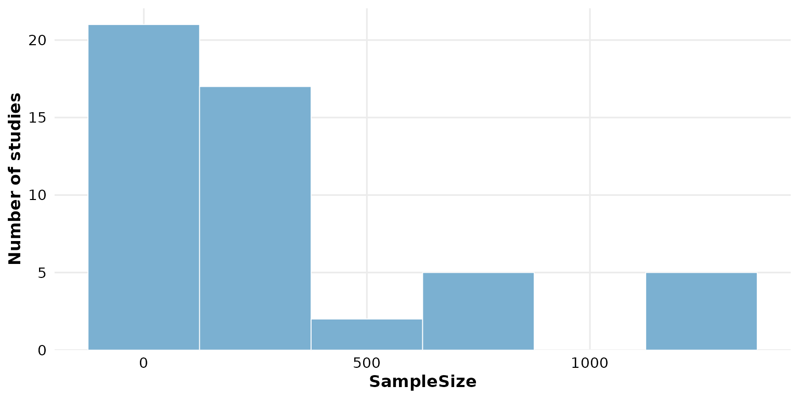

## `fill`: bar color

When `fill_by` is `NULL`, a single hex color paints every bar:

``` r

reviewHistogram(studies, SampleSize, fill = "#59a14f")
```

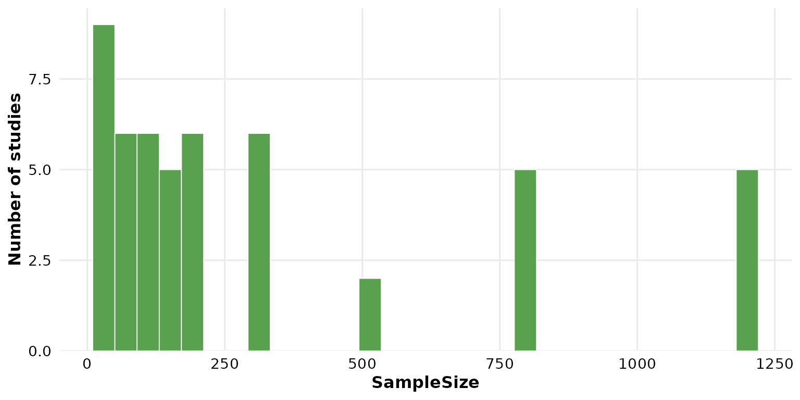

Use one of the package
[`PALETTE`](https://sonsoles.me/litReview/reference/PALETTE.md) colors:

``` r

reviewHistogram(studies, SampleSize, fill = PALETTE[4])
```

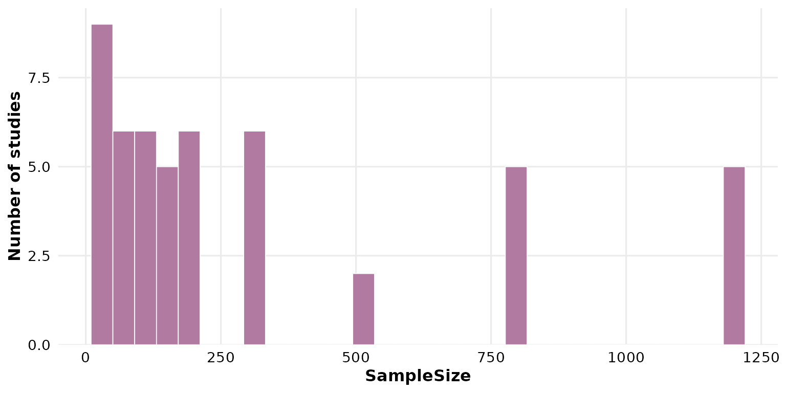

## `colors`: the palette for grouped bars

`colors` supplies the fill colors cycled across groups when `fill_by` is
set (it has no effect otherwise). The default is the package `PALETTE`:

``` r

reviewHistogram(studies, SampleSize, fill_by = Design, colors = PALETTE)
```


Pass your own vector to recolor the groups; it is recycled if shorter
than the number of categories:

``` r

reviewHistogram(studies, SampleSize, fill_by = Design,
                colors = c("#f16769", "#7ea9c7", "#edc948"))
```

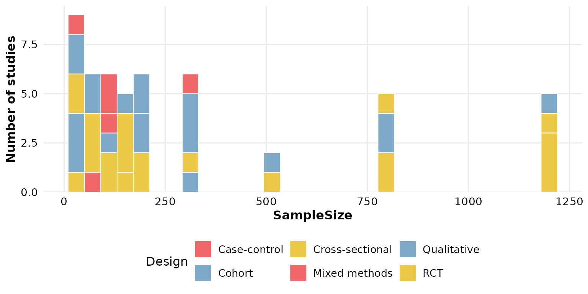

A **named** vector pins specific colors to specific groups:

``` r

reviewHistogram(studies, SampleSize, fill_by = Design,
                colors = c("RCT" = "#f16769", "Cohort" = "#7ea9c7"))
```

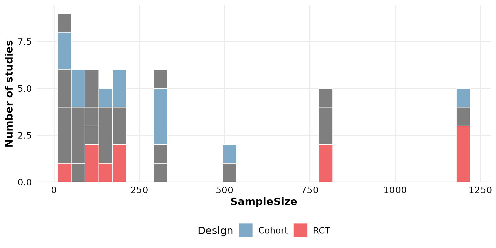

## `sep`: multi-value separator

`sep` only matters when `fill_by` holds multi-value cells (several
values per row, newline-separated by default). Numeric columns are
single-valued, and the usual grouping columns (`Design`,
`InterventionType`) are too, so this argument is rarely needed here. It
mirrors the [`sep` of
`reviewBar()`](https://sonsoles.me/litReview/articles/bar.html#sep-multi-value-separator):
change it if your grouping column uses a different delimiter, e.g.
`sep = "; "`.

## `base_size`: overall text and element scaling

A single knob scales all text and spacing proportionally. Smaller, for
multi-panel figures:

``` r

reviewHistogram(studies, SampleSize, base_size = 9)
```

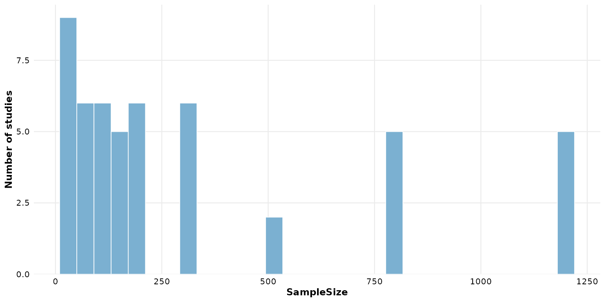

Larger, for slides or posters:

``` r

reviewHistogram(studies, SampleSize, base_size = 18)
```

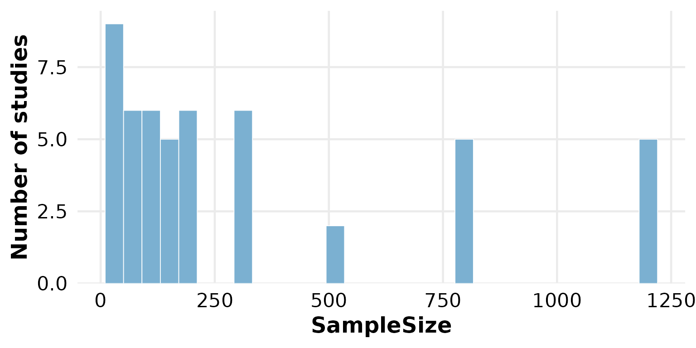

## Missing data: `na.rm` and `na_label`

These two arguments control how `NA` cells are treated. We use a column
that actually has missing values — `FollowUpWeeks`.

By default `na.rm = TRUE` silently drops rows whose value in `col` (and,
when grouping, in `fill_by`) is missing:

``` r

reviewHistogram(studies, FollowUpWeeks)
```

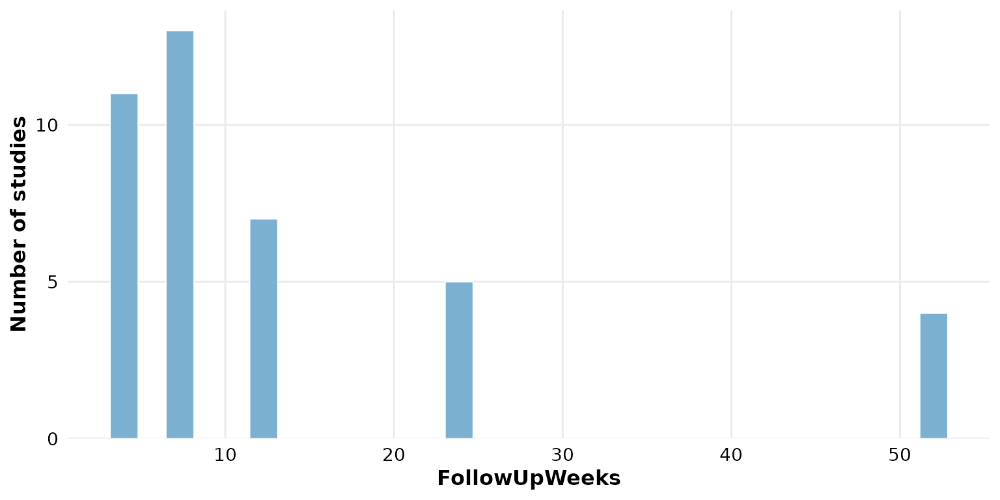

`na_label` names the missing-value group when a `fill_by` column
contains `NA` and `na.rm = FALSE`. It labels those rows as their own
stacked segment rather than dropping them:

``` r

reviewHistogram(studies, SampleSize, fill_by = FundingSource,
                na.rm = FALSE, na_label = "Not reported")
```

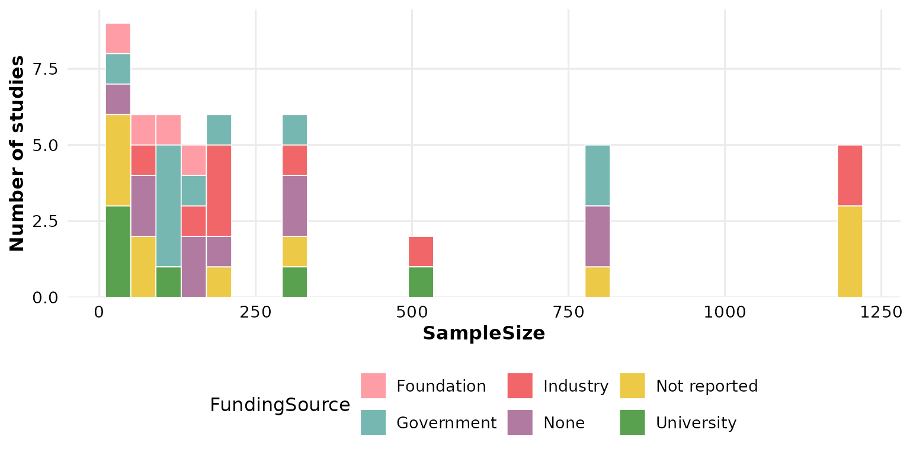

Note that `na_label` applies to missing values in `fill_by`, not in
`col`: numeric bins have no bar for `NA`.

## Composing with ggplot2

Every `review*()` function returns a plain ggplot, so you can keep
adding layers, scales, and labels with `+`:

``` r

reviewHistogram(studies, SampleSize, fill = "#59a14f") +
  labs(title = "Sample sizes", subtitle = "n = 50 studies",
       caption = "Source: example dataset") +
  theme(plot.title.position = "plot")
```

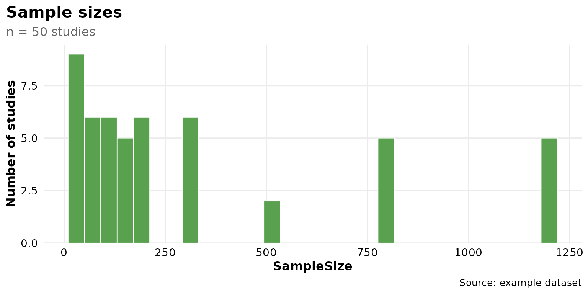
