# Getting Started with litReview

## Overview

`litReview` helps you summarize and visualize categorical data extracted
during a literature review. Every plot function returns a standard
ggplot that you can customize with `+`. Column names can be passed bare
or quoted.

``` r

library(litReview)
data(studies)
head(studies)
#>   StudyID       bibKey         Author Year
#> 1     S01 author1_2018  Garcia et al. 2020
#> 2     S02 author2_2022    Chen et al. 2024
#> 3     S03 author3_2018 Mueller et al. 2018
#> 4     S04 author4_2018   Patel et al. 2022
#> 5     S05 author5_2019 Johnson et al. 2019
#> 6     S06 author6_2021     Kim et al. 2019
#>                                                        Reference
#> 1  Garcia et al. (2020). Title of study S01. Journal Name, 1-10.
#> 2    Chen et al. (2024). Title of study S02. Journal Name, 1-10.
#> 3 Mueller et al. (2018). Title of study S03. Journal Name, 1-10.
#> 4   Patel et al. (2022). Title of study S04. Journal Name, 1-10.
#> 5 Johnson et al. (2019). Title of study S05. Journal Name, 1-10.
#> 6     Kim et al. (2019). Title of study S06. Journal Name, 1-10.
#>                             Country          Design SampleSize FollowUpWeeks
#> 1                             Egypt     Qualitative         50             8
#> 2                             Italy          Cohort        300             8
#> 3                    Nigeria\nGhana     Qualitative        300             4
#> 4 Saudi Arabia\nTurkey\nSwitzerland Cross-sectional        150             8
#> 5                            Mexico   Mixed methods         75            12
#> 6         Belgium\nSingapore\nIndia             RCT       1200            NA
#>               AgeGroup      Setting     Intervention
#> 1               Adults Primary care              CBT
#> 2             Children    Community        Education
#> 3         Older adults       Online         Combined
#> 4               Adults        Mixed         Combined
#> 5               Adults        Mixed         Exercise
#> 6 Adults\nOlder adults     Hospital CBT\nMindfulness
#>                           Outcome    AnalysisApproach RiskOfBias FundingSource
#> 1                        Function   Thematic analysis        Low          <NA>
#> 2                 Quality of life               ANOVA   Moderate          None
#> 3                 Quality of life               ANOVA        Low    University
#> 4 Pain\nFunction\nQuality of life Narrative synthesis        Low    Foundation
#> 5                            Pain               ANOVA       High          None
#> 6       Function\nQuality of life       Mixed methods        Low      Industry
#>   OpenAccess InterventionType    PubType Randomization Blinding
#> 1         No       Behavioral Conference          <NA>     <NA>
#> 2        Yes      Educational    Journal          <NA>     <NA>
#> 3         No       Multimodal Conference          <NA>     <NA>
#> 4         No       Multimodal Conference          <NA>     <NA>
#> 5         No         Physical    Journal          <NA>     <NA>
#> 6         No       Behavioral Conference             P        F
#>   SampleJustification AttritionReported EthicsApproval Preregistration
#> 1                   F                 F              P            <NA>
#> 2                <NA>              <NA>              F            <NA>
#> 3                   P                 F              F            <NA>
#> 4                   P              <NA>           <NA>               P
#> 5                   M                 P           <NA>            <NA>
#> 6                   F                 M              F               P
#>   EffectSize LimitationsDiscussed
#> 1       <NA>                    P
#> 2          M                    P
#> 3          M                    F
#> 4          F                    P
#> 5          F                    P
#> 6          F                    P
```

## Bar chart

[`reviewBar()`](https://sonsoles.me/litReview/reference/reviewBar.md)
produces a horizontal bar chart with frequency and percentage labels.

``` r

reviewBar(studies, Design)
```

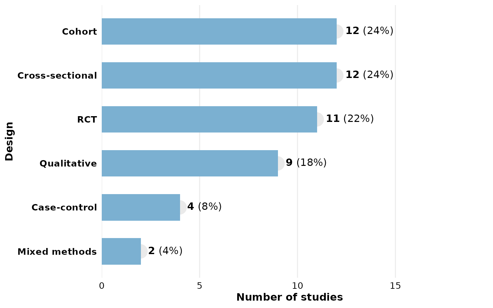

Customize with `+` like any ggplot:

``` r

library(ggplot2)
reviewBar(studies, Design, fill = "#59a14f") +
  labs(title = "Study Designs", subtitle = "n = 12 studies")
```

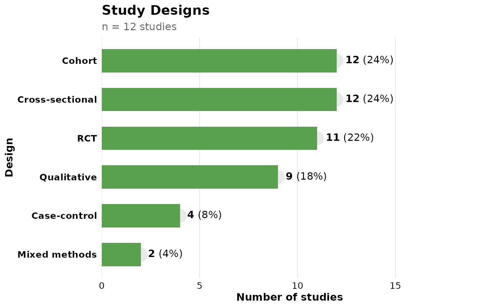

### Study labels on bars

Set `studlabs = TRUE` to overlay the contributing study IDs on each bar:

``` r

reviewBar(studies, Design, fill = PALETTE[2], studlabs = TRUE)
```

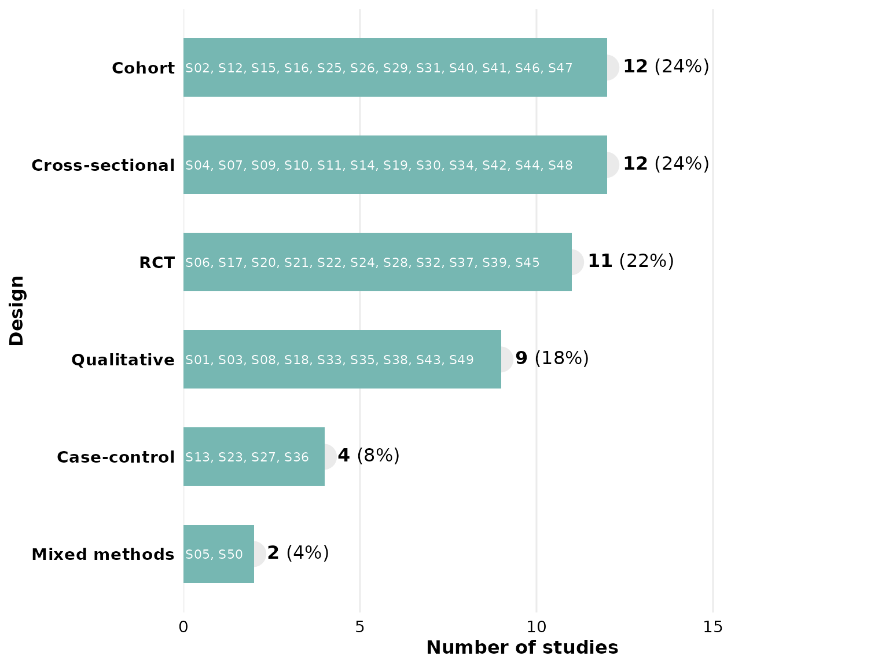

### Multi-value columns

The `Outcome` column contains multiple values per cell separated by
`"\r\n"`:

``` r

reviewBar(studies, Outcome, fill = PALETTE[4], width = 0.6)
```

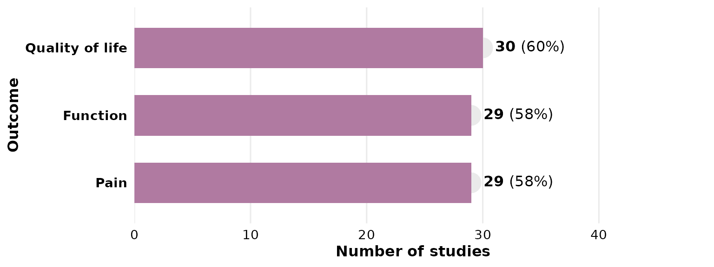

### Adjusting label space

If labels are clipped, increase `label_space` (default 1.6):

``` r

reviewBar(studies, Country, fill = PALETTE[6], label_space = 2)
```


## Stacked / grouped bar chart

[`reviewStackedBar()`](https://sonsoles.me/litReview/reference/reviewStackedBar.md)
cross-tabulates a primary category against a second grouping variable,
drawing one horizontal bar per category split by group. By default
(`position = "fill"`) each bar is scaled to 100%, so you can compare
composition across categories:

``` r

reviewStackedBar(studies, Design, RiskOfBias)
```

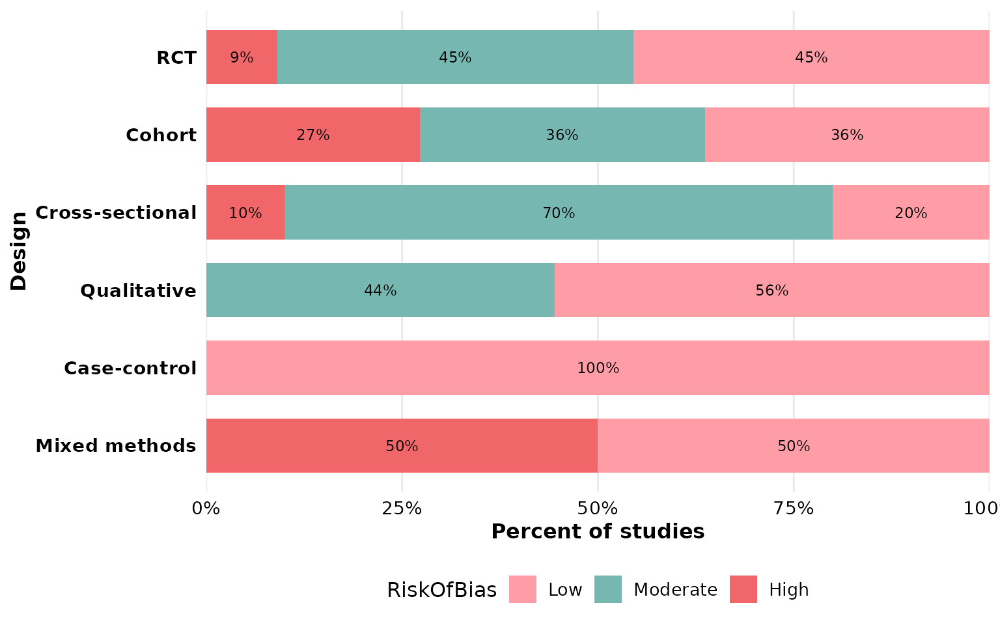

Use `position = "stack"` to show raw counts instead:

``` r

reviewStackedBar(studies, Design, RiskOfBias, position = "stack")
```

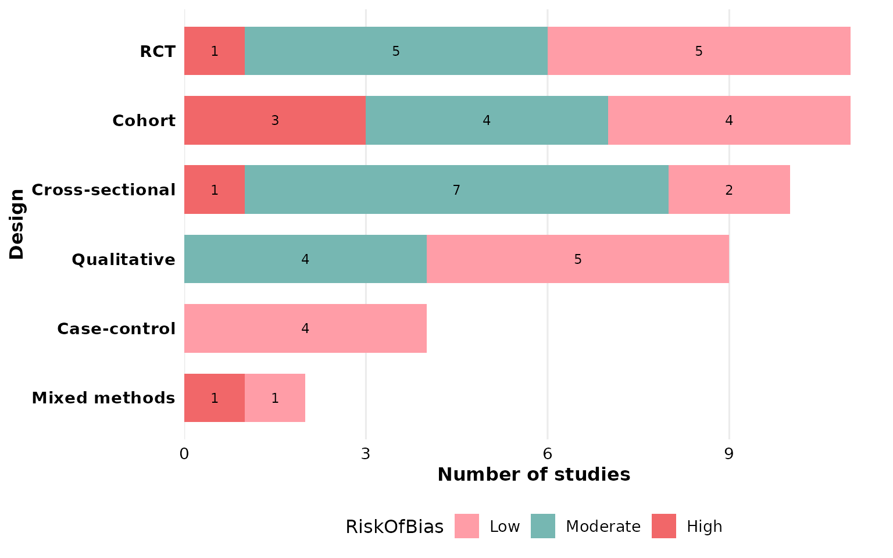

Both `col` and `group` may contain multi-value cells, which are split
before counting. Hide the in-segment labels with `labels = FALSE`.

## Waffle chart

Each square represents one study occurrence:

``` r

reviewWaffle(studies, Outcome, ncol = 11)
```

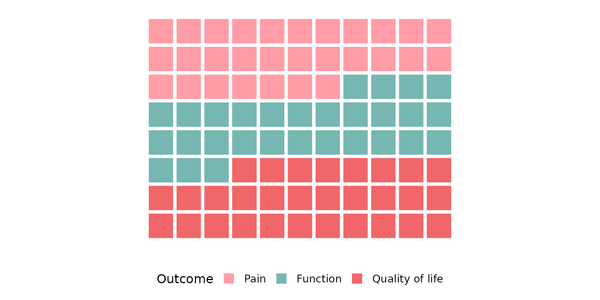

## Donut / pie chart

``` r

reviewPie(studies, Design)
```

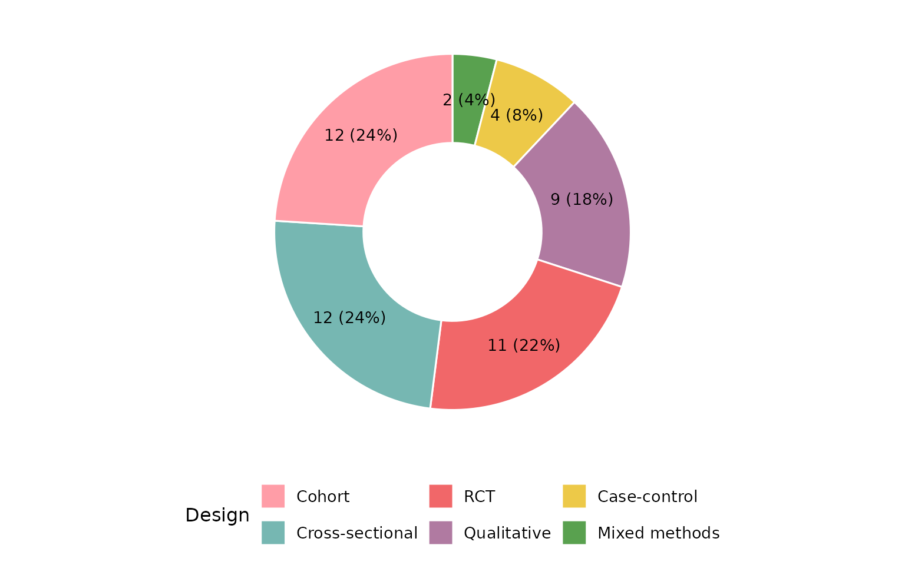

Set `donut = FALSE` for a classic pie:

``` r

reviewPie(studies, Design, donut = FALSE)
```

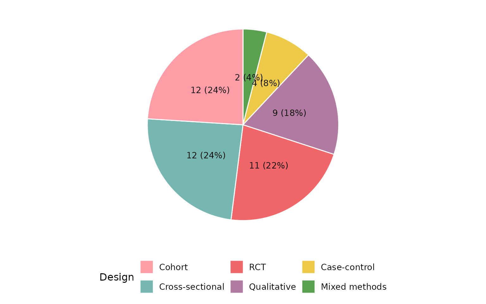

## Co-occurrence heatmap

[`reviewOverlap()`](https://sonsoles.me/litReview/reference/reviewOverlap.md)
shows how two columns co-occur across studies:

``` r

reviewOverlap(studies, Design, Outcome, fill = PALETTE[3])
```

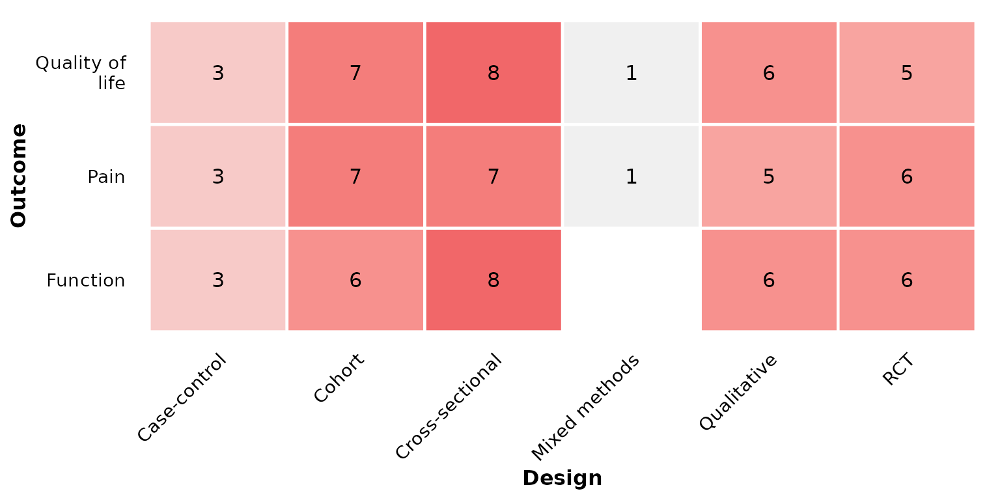

## UpSet plot

[`reviewUpset()`](https://sonsoles.me/litReview/reference/reviewUpset.md)
visualizes how the values of a multi-value column co-occur across
studies. Each study contributes the set of distinct values it reports,
and each bar counts the studies sharing that exact combination — a
scalable alternative to the pairwise heatmap when three or more values
can co-occur. Requires the `ggupset` package.

``` r

reviewUpset(studies, Outcome)
```


Sort combinations by set size (`"degree"`) instead of frequency, and cap
how many are shown with `n_intersections`:

``` r

reviewUpset(studies, Intervention, sort_by = "degree", n_intersections = 10)
```

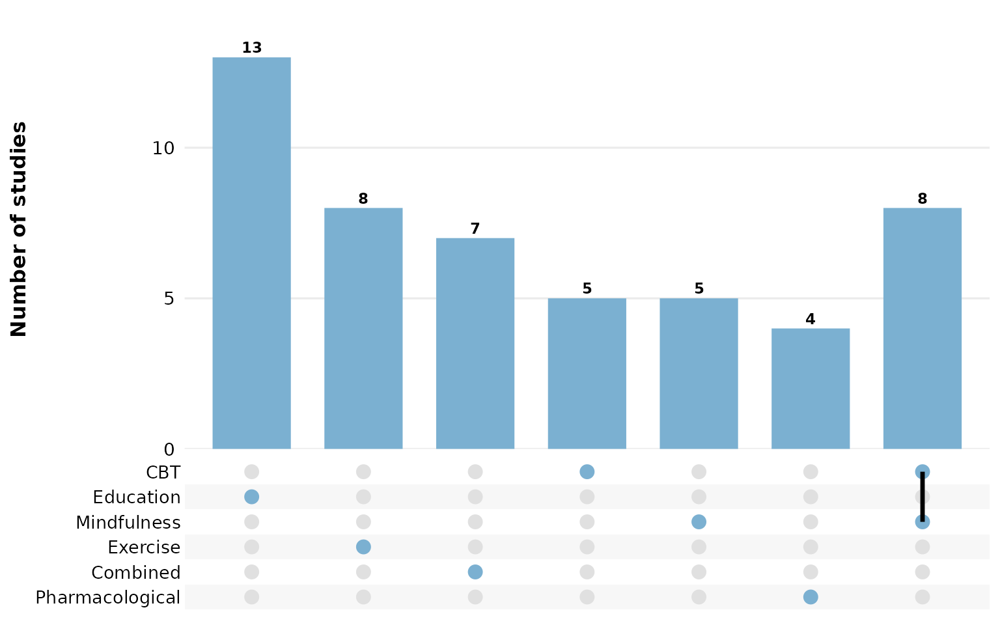

## Alluvial plot

[`reviewAlluvial()`](https://sonsoles.me/litReview/reference/reviewAlluvial.md)
shows co-occurrence and flow between categories across multiple columns.
Each study traces a path through the strata. Requires the `ggalluvial`
package.

``` r

reviewAlluvial(studies, c("Design", "Outcome"))
```


Add proportion or count labels on each stratum:

``` r

reviewAlluvial(studies, c("Design", "Outcome"), labels = "prop")
```


Show flow counts between strata:

``` r

reviewAlluvial(studies, c("Design", "Outcome"), labels = "none",
               flow_labels = TRUE)
```


Custom axis labels:

``` r

reviewAlluvial(studies, c("Design", "Outcome","AgeGroup"),
               axis_labels = c("Study Design", "Reported Outcome", "Age group"))
```

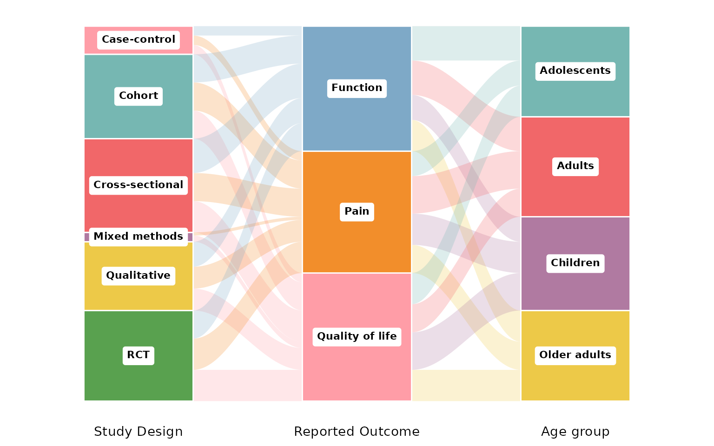

## Treemap

[`reviewTreemap()`](https://sonsoles.me/litReview/reference/reviewTreemap.md)
displays category frequencies as nested rectangles whose area is
proportional to the count. Requires the `treemapify` package.

``` r

reviewTreemap(studies, Design)
```


Use `color_by` to add a hierarchical grouping. Here we show
interventions colored by their higher-order type:

``` r

reviewTreemap(studies, Intervention, color_by = InterventionType)
```


Show study IDs inside each rectangle:

``` r

reviewTreemap(studies, Design, studlabs = TRUE)
```

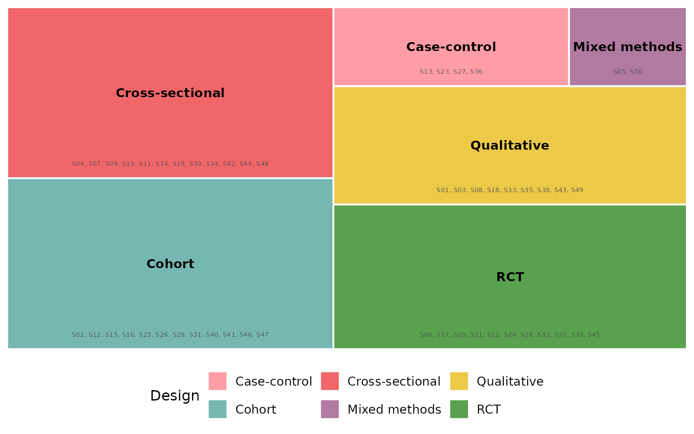

## Year trend

[`reviewTrend()`](https://sonsoles.me/litReview/reference/reviewTrend.md)
shows how categories distribute across publication years:

``` r

reviewTrend(studies, Design)
```

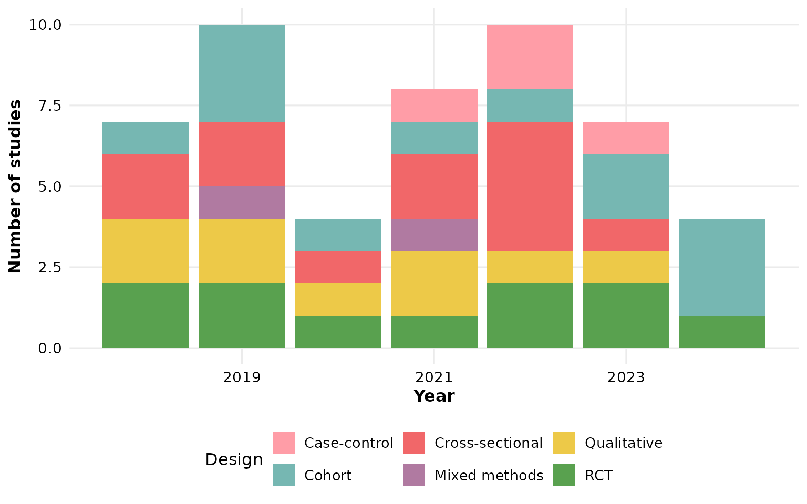

Add counts, within-year percentages, or both on each segment:

``` r

reviewTrend(studies, Design, labels = "count")
```


``` r

reviewTrend(studies, Design, labels = "percent")
```


``` r

reviewTrend(studies, Design, labels = "both")
```


Or overlay study IDs:

``` r

reviewTrend(studies, Design, labels = "studies")
```


## World map

[`reviewMap()`](https://sonsoles.me/litReview/reference/reviewMap.md)
shades countries by the number of studies. Common aliases like “United
States” or “United Kingdom” are resolved automatically. Requires the
`maps` package (`install.packages("maps")`):

``` r

reviewMap(studies)
```


## Summary table

[`reviewTable()`](https://sonsoles.me/litReview/reference/reviewTable.md)
returns a formatted `gt` table:

``` r

reviewTable(studies, Design)
```

| Design | Studies | Frequency | Percent |
|----|----|----|----|
| RCT | S06, S17, S20, S21, S22, S24, S28, S32, S37, S39, S45 | 11 | 22% |
| Qualitative | S01, S03, S08, S18, S33, S35, S38, S43, S49 | 9 | 18% |
| Mixed methods | S05, S50 | 2 | 4% |
| Cross-sectional | S04, S07, S09, S10, S11, S14, S19, S30, S34, S42, S44, S48 | 12 | 24% |
| Cohort | S02, S12, S15, S16, S25, S26, S29, S31, S40, S41, S46, S47 | 12 | 24% |
| Case-control | S13, S23, S27, S36 | 4 | 8% |

## Handling missing data

Literature review datasets often have missing values. All functions
accept `na.rm`, `na_label`, and `na_in_percent` to control how NAs are
handled.

Let’s create example data with some missing values:

``` r

df_na <- data.frame(
  StudyID = paste0("S", 1:10),
  Design  = c("RCT", "Cohort", NA, "RCT", "Case-control",
              NA, "RCT", "Cohort", NA, "RCT"),
  stringsAsFactors = FALSE
)
```

### Drop NAs, percentages of total (default)

NAs are dropped, but the denominator is all 10 studies. Percentages
reflect the share of the full sample, so they do not sum to 100%:

``` r

summarize_data(df_na, Design)
#> # A tibble: 3 × 4
#>   Design       Studies         Frequency Percent
#>   <chr>        <chr>               <int>   <dbl>
#> 1 Case-control S5                      1      10
#> 2 Cohort       S2, S8                  2      20
#> 3 RCT          S1, S4, S7, S10         4      40
```

### Drop NAs, percentages of reported only

Set `na_in_percent = FALSE` so that the denominator only counts the 7
studies that reported a design. Percentages sum to 100%:

``` r

summarize_data(df_na, Design, na_in_percent = FALSE)
#> # A tibble: 3 × 4
#>   Design       Studies         Frequency Percent
#>   <chr>        <chr>               <int>   <dbl>
#> 1 Case-control S5                      1    14.3
#> 2 Cohort       S2, S8                  2    28.6
#> 3 RCT          S1, S4, S7, S10         4    57.1
```

### Keep NAs, percentages of total

Set `na.rm = FALSE` to include a “Not reported” category. All
percentages sum to 100%:

``` r

summarize_data(df_na, Design, na.rm = FALSE)
#> # A tibble: 4 × 4
#>   Design       Studies         Frequency Percent
#>   <chr>        <chr>               <int>   <dbl>
#> 1 Case-control S5                      1      10
#> 2 Cohort       S2, S8                  2      20
#> 3 Not reported S3, S6, S9              3      30
#> 4 RCT          S1, S4, S7, S10         4      40
```

### Keep NAs with a custom label, percentages of reported

Combine all three parameters. Here “Missing” replaces `NA`, and the
denominator excludes missing rows:

``` r

summarize_data(df_na, Design, na.rm = FALSE, na_label = "Missing",
               na_in_percent = FALSE)
#> # A tibble: 4 × 4
#>   Design       Studies         Frequency Percent
#>   <chr>        <chr>               <int>   <dbl>
#> 1 Case-control S5                      1    14.3
#> 2 Cohort       S2, S8                  2    28.6
#> 3 Missing      S3, S6, S9              3    42.9
#> 4 RCT          S1, S4, S7, S10         4    57.1
```

### Using NA options in plots

The same parameters work in every plot function:

``` r

reviewBar(df_na, Design, na.rm = FALSE, na_label = "Missing", na_in_percent = FALSE)
```

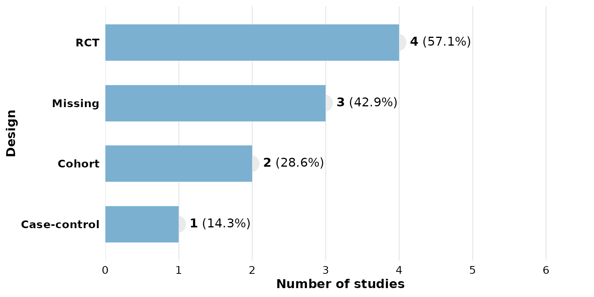

``` r

reviewPie(df_na, Design, na.rm = FALSE)
```

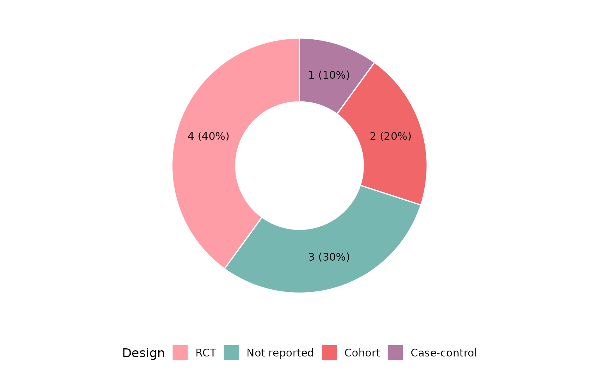

## Custom study ID column

All functions default to `study_id = StudyID`. If your data uses a
different column, pass it:

``` r

df <- data.frame(
  ID = paste0("A", 1:5),
  Type = c("X", "Y", "X", "Z", "X"),
  stringsAsFactors = FALSE
)
reviewBar(df, Type, study_id = ID)
```

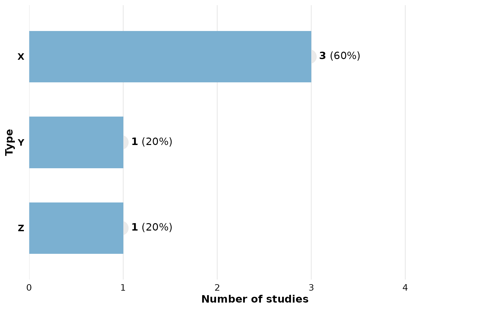

## Using `summarize_data()` directly

If you need the raw summary data frame (e.g. for further processing),
use
[`summarize_data()`](https://sonsoles.me/litReview/reference/summarize_data.md).
Note that `Percent` is numeric:

``` r

summarize_data(studies, Design)
#> # A tibble: 6 × 4
#>   Design          Studies                                      Frequency Percent
#>   <chr>           <chr>                                            <int>   <dbl>
#> 1 Mixed methods   S05, S50                                             2       4
#> 2 Case-control    S13, S23, S27, S36                                   4       8
#> 3 Qualitative     S01, S03, S08, S18, S33, S35, S38, S43, S49          9      18
#> 4 RCT             S06, S17, S20, S21, S22, S24, S28, S32, S37…        11      22
#> 5 Cross-sectional S04, S07, S09, S10, S11, S14, S19, S30, S34…        12      24
#> 6 Cohort          S02, S12, S15, S16, S25, S26, S29, S31, S40…        12      24
```

## Palette

`PALETTE` provides 8 colors you can cycle through:

``` r

PALETTE
#> [1] "#ff9da7" "#76b7b2" "#f16769" "#b07aa1" "#edc948" "#59a14f" "#7ea9c7"
#> [8] "#F28E2B"
```
