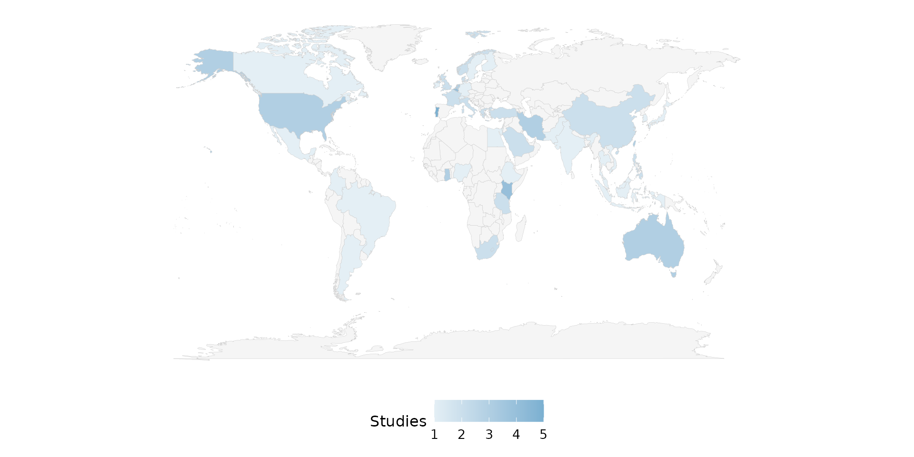
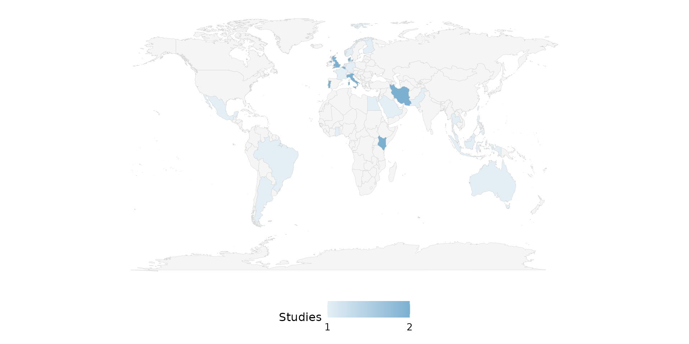
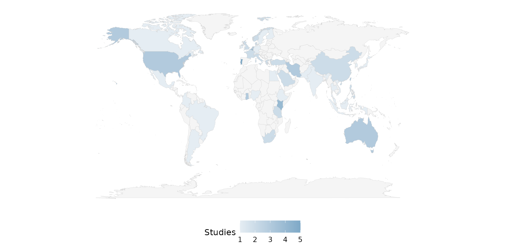
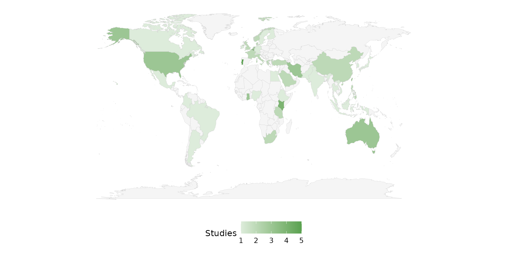
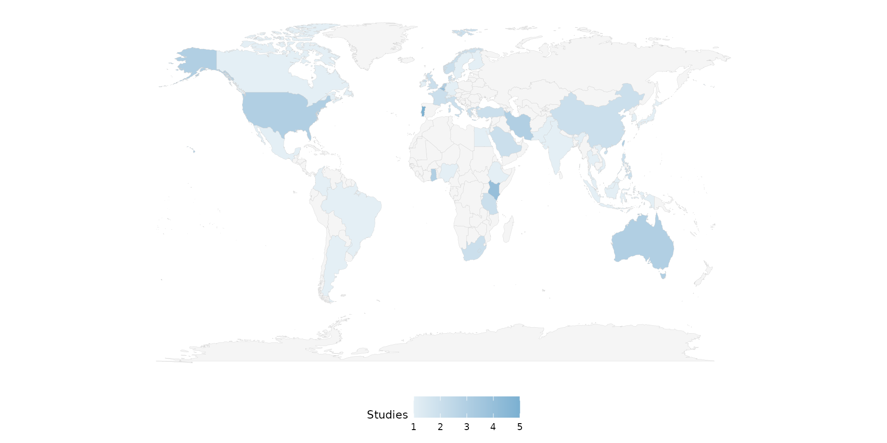
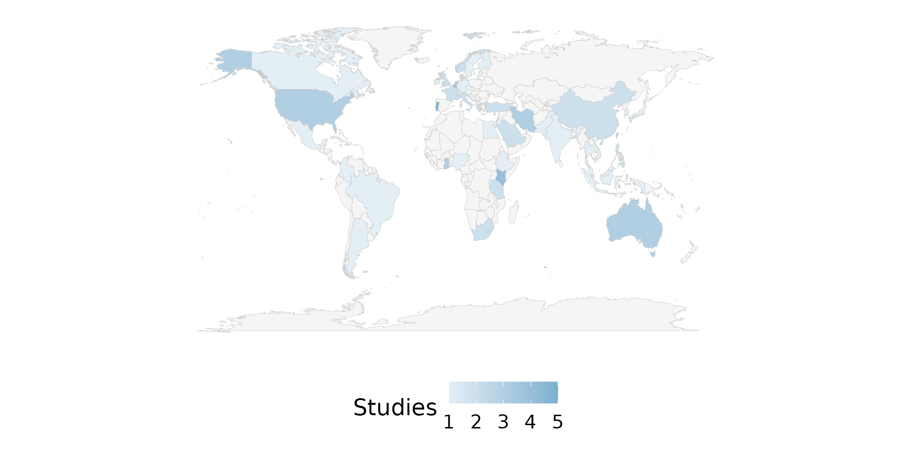
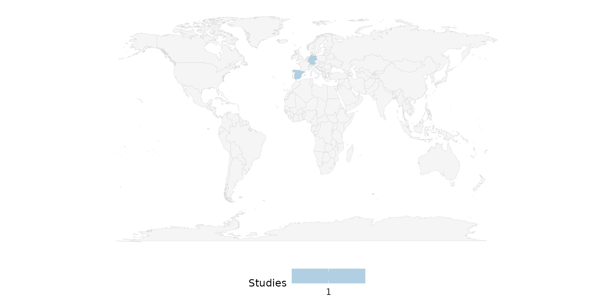
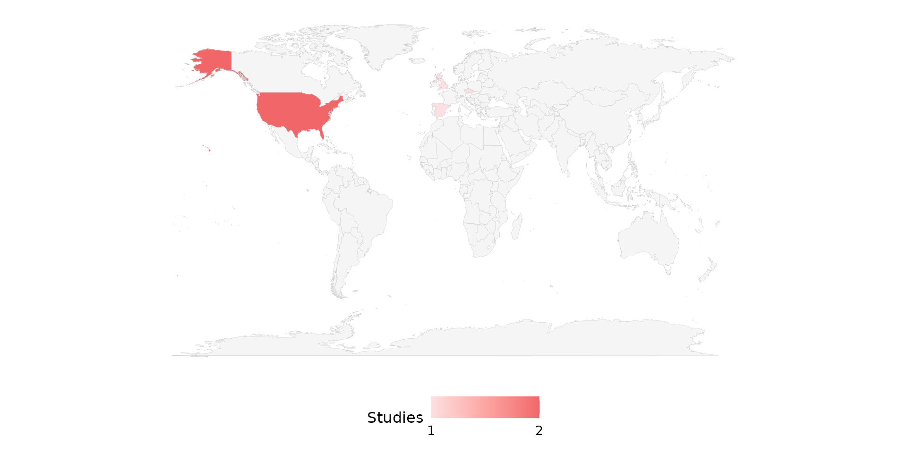
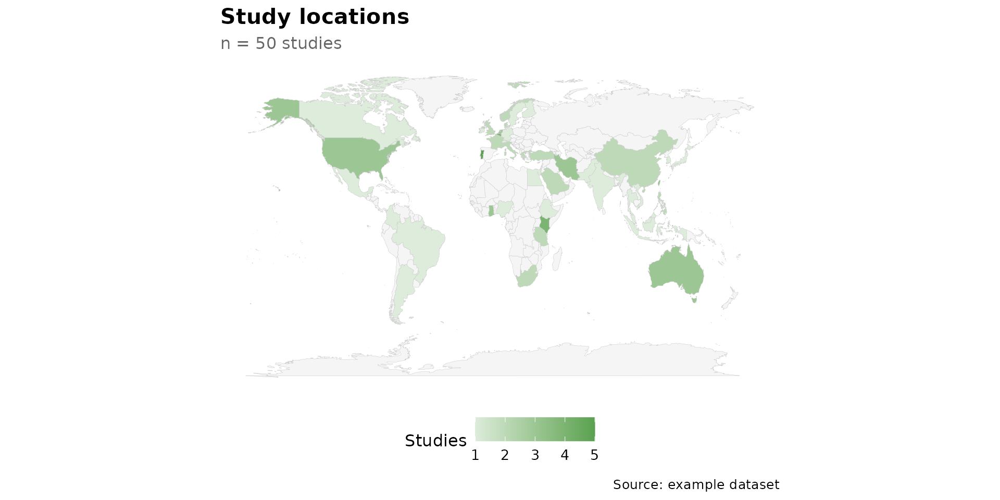

# World maps

``` r

library(litReview)
library(ggplot2)
data(studies)
```

[`reviewMap()`](https://sonsoles.me/litReview/reference/reviewMap.md)
draws a world choropleth, shading each country by the number of studies
conducted there. It is the geographic counterpart to
[`reviewBar()`](https://sonsoles.me/litReview/reference/reviewBar.md).
This article walks through **every argument** of

``` r

reviewMap(data, country_col = Country, sep = "\r\n", fill = "#7BB0D1",
          base_size = 12, na.rm = TRUE)
```

The function relies on the **maps** package to supply country polygons;
all map examples below are skipped when it is not installed.

## Default

Pass the data frame — `country_col` defaults to `Country`. Countries are
counted and the world is shaded from a light tint (few studies) to
`fill` (many studies). Unvisited countries stay a neutral grey.

``` r

reviewMap(studies)
```


## `country_col`: the country column

The default is `Country`, a multi-value column in `studies` where each
cell lists every country a study covers, separated by newlines. Column
names may be bare or quoted; passing it explicitly is equivalent to the
default:

``` r

reviewMap(studies, country_col = Country)
```



## `sep`: multi-value separator

A single cell may name several countries. In `studies`, `Country` uses
newline separators (`"\r\n"`, the default), so a multi-country study
contributes one count to each of its countries:

``` r

reviewMap(studies, sep = "\r\n")
```


If your data uses a different delimiter, set `sep`. Here we rebuild a
semicolon-separated column to demonstrate:

``` r

studies_semi <- studies
studies_semi$Country <- gsub("\r\n", "; ", studies_semi$Country)
reviewMap(studies_semi, sep = "; ")
```



## `fill`: high end of the color gradient

`fill` sets the **high** color of the gradient (the low end is a fixed
light tint of the same hue). A single hex color works:

``` r

reviewMap(studies, fill = "#59a14f")
```


Use one of the package
[`PALETTE`](https://sonsoles.me/litReview/reference/PALETTE.md) colors:

``` r

reviewMap(studies, fill = PALETTE[7])
```



A different palette entry shifts the whole ramp:

``` r

reviewMap(studies, fill = PALETTE[6])
```



## `base_size`: overall text and element scaling

A single knob scales all text and spacing proportionally. Smaller, for
multi-panel figures:

``` r

reviewMap(studies, base_size = 9)
```



Larger, for slides or posters:

``` r

reviewMap(studies, base_size = 18)
```



## `na.rm`: handling missing countries

[`reviewMap()`](https://sonsoles.me/litReview/reference/reviewMap.md)
supports only `na.rm` (there is no `na_label`, `na_in_percent`, or
`na_last`). By default `na.rm = TRUE` drops rows with a missing or empty
country before counting. The `studies` dataset has no missing countries,
so we build a small frame that does:

``` r

studies_na <- data.frame(
  StudyID = c("S1", "S2", "S3", "S4"),
  Country = c("Spain", "Germany", NA, ""),
  stringsAsFactors = FALSE
)
```

With the default, the two studies without a country simply do not
contribute:

``` r

reviewMap(studies_na)
```



With `na.rm = FALSE`, the missing rows are retained and grouped under an
`"Unknown"` region. `"Unknown"` matches no country polygon, so it never
appears on the map, but it *is* counted — this keeps the totals
consistent with the raw data even though it changes nothing visible
here:

``` r

reviewMap(studies_na, na.rm = FALSE)
```


## Automatic country-alias resolution

Country names in your data need not match the exact spelling used by
`maps::map_data("world")`. Common aliases are resolved automatically —
for example `"United States"` -\> `USA`, `"United Kingdom"` -\> `UK`,
and `"Czechia"` -\> `Czech Republic`. All three shade correctly below:

``` r

studies_alias <- data.frame(
  StudyID = c("S1", "S2", "S3", "S4", "S5"),
  Country = c("United States", "United States",
              "United Kingdom", "Czechia", "Spain"),
  stringsAsFactors = FALSE
)
```

``` r

reviewMap(studies_alias, fill = PALETTE[3])
```



## Composing with ggplot2

Every `review*()` function returns a plain ggplot, so you can keep
adding layers, scales, and labels with `+`:

``` r

reviewMap(studies, fill = "#59a14f") +
  labs(title = "Study locations", subtitle = "n = 50 studies",
       caption = "Source: example dataset") +
  theme(plot.title.position = "plot")
```


