# Coding matrices

``` r

library(litReview)
library(ggplot2)
data(studies)
```

[`reviewMatrix()`](https://sonsoles.me/litReview/reference/reviewMatrix.md)
draws an **evidence / coding matrix**: one row per study, one column per
criterion, and a tile wherever a study addresses a criterion. The tile
**fill** encodes an optional per-study attribute (such as publication
type) and the **letter** inside each tile is that cell’s own value — a
coding level such as `F`/`P`/`M`. Column headers can carry the number of
studies addressing each criterion. This article walks through **every
argument** of

``` r

reviewMatrix(data, cols, color_by = NULL, study_id = StudyID,
             levels = NULL, colors = PALETTE, show_counts = TRUE,
             base_size = 12, label_wrap = 20,
             empty_fill = "#FCFCE6", tile_color = "white")
```

## Input shape

The input is **wide**: one row per study, a study-id column, an optional
grouping column for the fill, and one column per criterion holding the
cell code (or `NA`/`""` where the study does not address that
criterion). The bundled `studies` data carries a block of methodological
**reporting criteria** coded exactly this way — `"F"` full, `"P"`
partial, `"M"` only mentioned, `NA` not addressed — plus a `PubType`
column to colour by:

``` r

criteria <- c("Randomization", "Blinding", "SampleJustification",
              "AttritionReported", "EthicsApproval", "Preregistration",
              "EffectSize", "LimitationsDiscussed")
studies[1:6, c("StudyID", "PubType", "Randomization", "EthicsApproval")]
#>   StudyID    PubType Randomization EthicsApproval
#> 1     S01 Conference          <NA>              P
#> 2     S02    Journal          <NA>              F
#> 3     S03 Conference          <NA>              F
#> 4     S04 Conference          <NA>           <NA>
#> 5     S05    Journal          <NA>           <NA>
#> 6     S06 Conference             P              F
```

To keep the figures legible we plot a subset of studies; pass the full
data frame to show them all.

``` r

sel <- studies[1:22, ]
```

## Default

Pass the data frame and the vector of criterion columns. Each coded cell
becomes a tile carrying its letter; blank cells stay empty. Here we also
colour by `PubType` and describe the level codes — the two most common
additions:

``` r

reviewMatrix(sel, criteria, color_by = "PubType",
             levels = c(F = "Full", P = "Partial", M = "Mention"))
```


Randomization and blinding are trial-only items, so they are blank for
the non-RCT studies — a faithful, if sparse, corner of the matrix.

## `cols`: the criterion columns

`cols` is a character vector naming the columns to place on the x-axis,
in the order given. Pass a subset to focus on particular criteria:

``` r

reviewMatrix(sel, c("EthicsApproval", "Preregistration", "EffectSize"),
             color_by = "PubType")
```

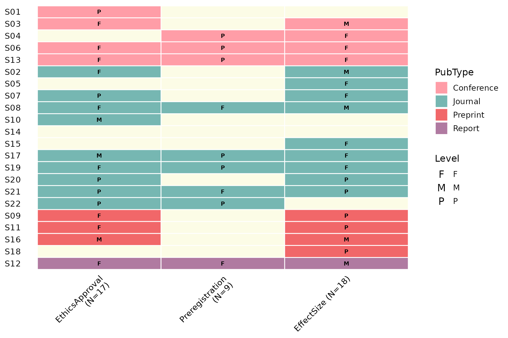

## `color_by`: tile fill

`color_by` names a per-study column mapped to the tile fill, and the
studies are grouped by it so each category clusters together. Omit it
(the default `NULL`) to fill every tile with a single colour:

``` r

reviewMatrix(sel, criteria)
```

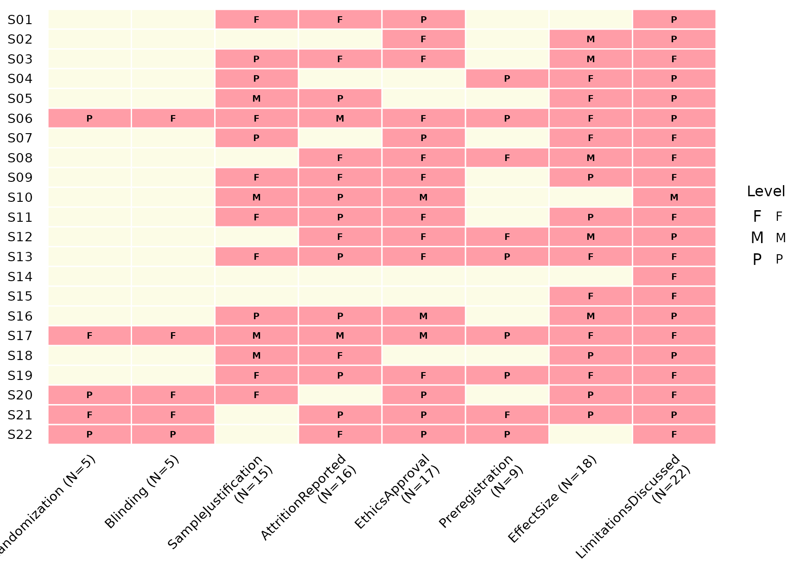

## `study_id`: row labels

`study_id` selects the column shown on the y-axis (default `StudyID`).
Label with the author instead:

``` r

reviewMatrix(sel, criteria, color_by = "PubType", study_id = Author)
```

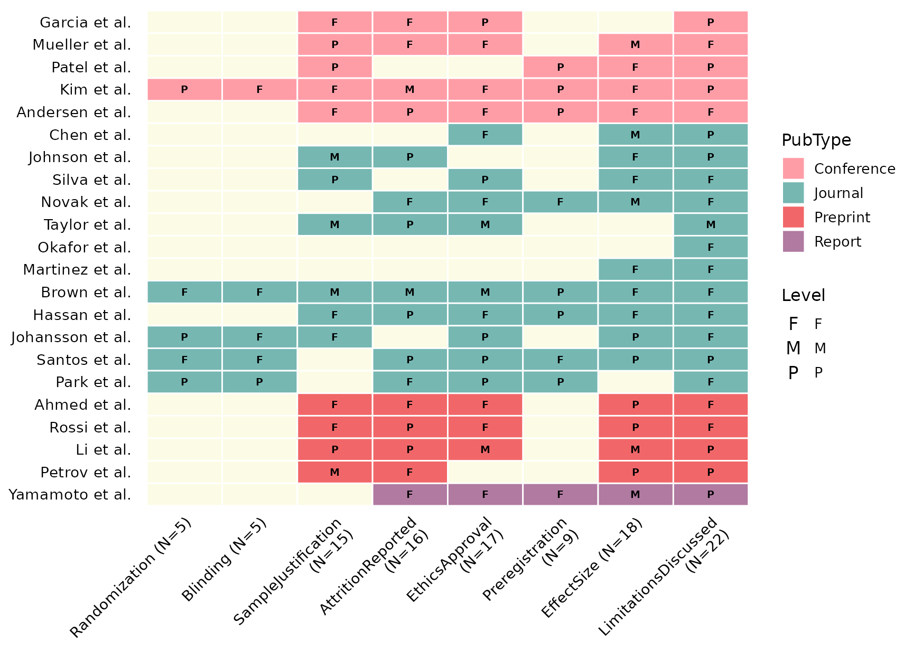

## `levels`: the Level legend

`levels` is a named vector mapping each cell code to a human-readable
description. Its names also fix the legend order. Supply it to add a
labelled **Level** legend:

``` r

reviewMatrix(sel, criteria, color_by = "PubType",
             levels = c(F = "Full", P = "Partial", M = "Mention"))
```

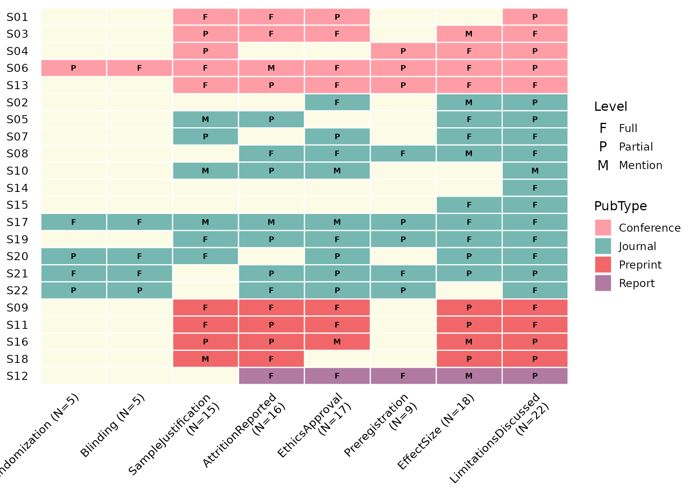

Leave it `NULL` and the legend falls back to the bare codes found in the
data.

## `colors`: fill palette

`colors` supplies the fill colours for the `color_by` categories
(default
[`PALETTE`](https://sonsoles.me/litReview/reference/PALETTE.md)). A
custom vector is matched to the categories in order:

``` r

reviewMatrix(sel, criteria, color_by = "PubType",
             colors = c("#e15759", "#4e79a7", "#59a14f", "#f28e2b"))
```

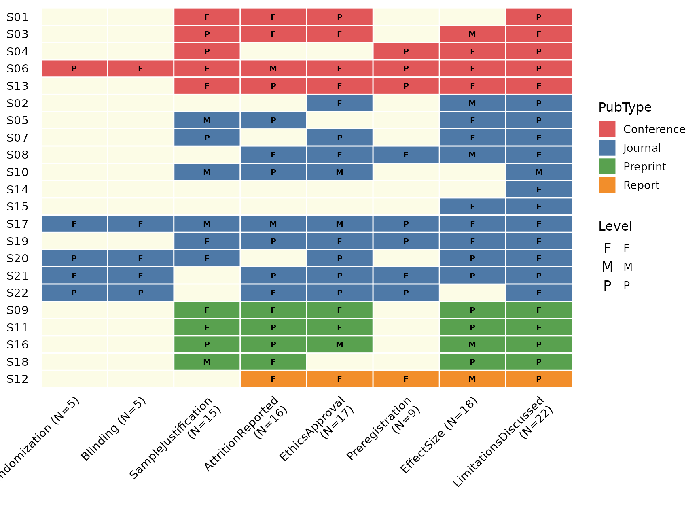

A **named** vector pins specific colours to specific categories:

``` r

reviewMatrix(sel, criteria, color_by = "PubType",
             colors = c(Journal = "#4e79a7", Conference = "#e15759",
                        Preprint = "#b07aa1", Report = "#f28e2b"))
```

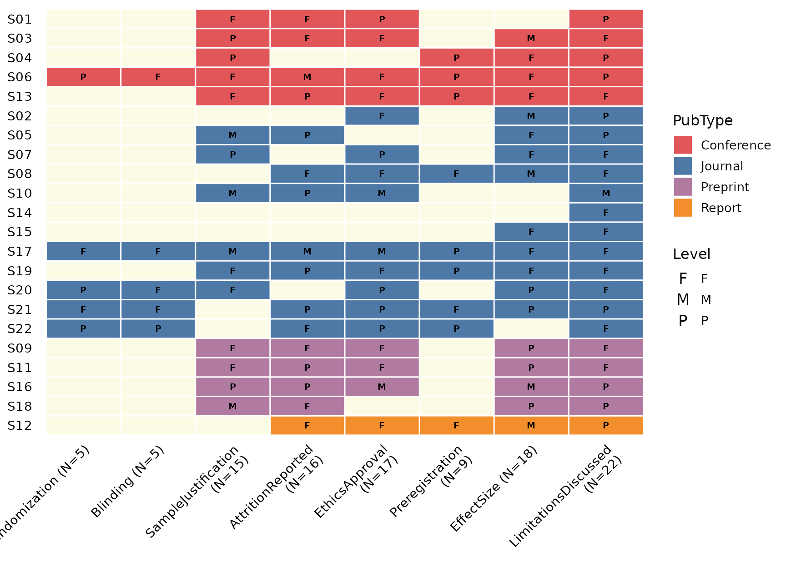

## `show_counts`: counts in headers

By default each column header gains `" (N=k)"`, where `k` is the number
of studies addressing that criterion. Turn it off for bare names:

``` r

reviewMatrix(sel, criteria, color_by = "PubType", show_counts = FALSE)
```

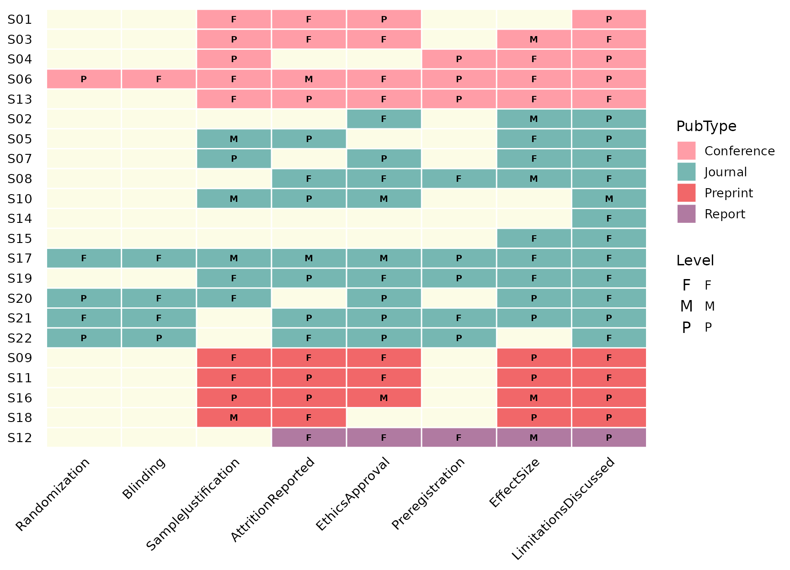

## `base_size`: overall scaling

A single knob scales text and elements proportionally:

``` r

reviewMatrix(sel, criteria, color_by = "PubType", base_size = 16)
```

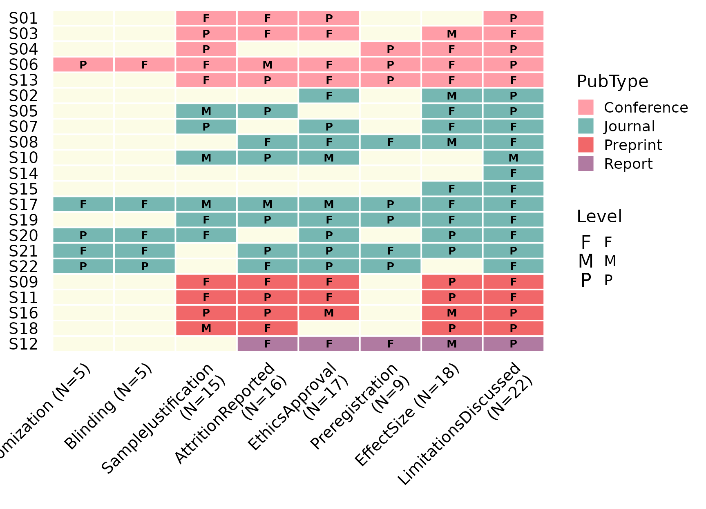

## `label_wrap`: wrap long axis labels

Long criterion or study labels wrap onto multiple lines once they exceed
`label_wrap` characters (default `20`). Lower it to wrap sooner:

``` r

reviewMatrix(sel, criteria, color_by = "PubType", label_wrap = 8)
```

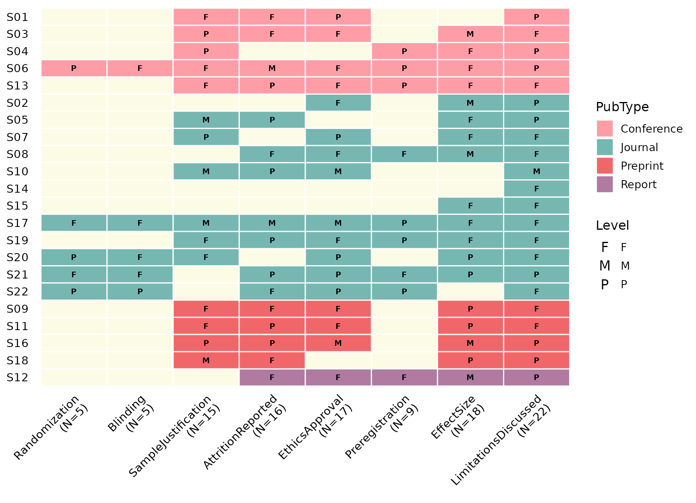

## `empty_fill` and `tile_color`

`empty_fill` is the colour of the background grid behind empty cells,
and `tile_color` is the border drawn between every tile. Together they
control how strongly the matrix grid reads:

``` r

reviewMatrix(sel, criteria, color_by = "PubType",
             empty_fill = "grey95", tile_color = "grey80")
```

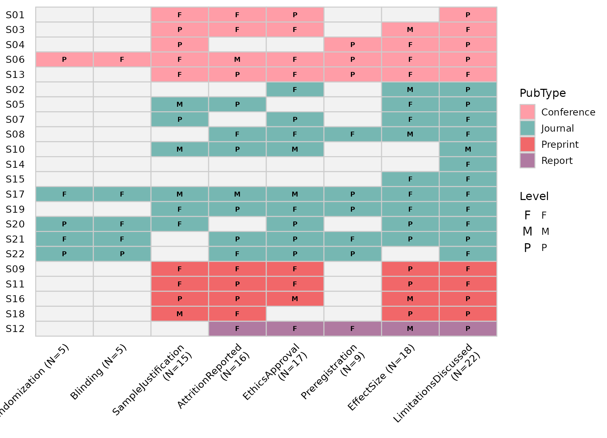

## Composing with ggplot2

[`reviewMatrix()`](https://sonsoles.me/litReview/reference/reviewMatrix.md)
returns a plain ggplot, so you can keep adding layers and labels with
`+`:

``` r

reviewMatrix(sel, criteria, color_by = "PubType",
             levels = c(F = "Full", P = "Partial", M = "Mention")) +
  labs(title = "Reporting-criteria matrix",
       subtitle = "How fully each study reports each item",
       x = "Reporting criteria", y = "Study")
```

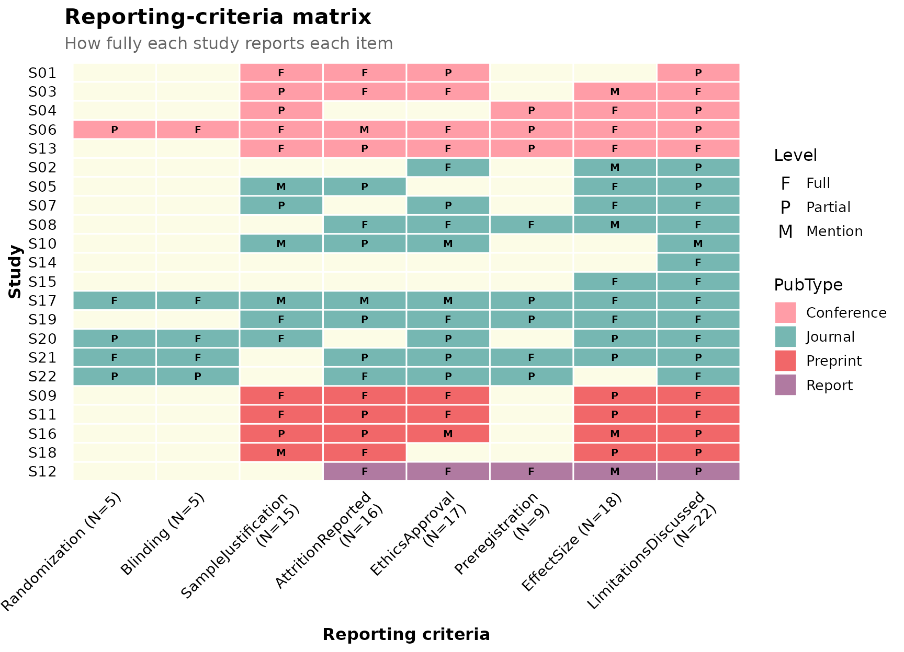
