# Co-occurrence heatmaps

``` r

library(litReview)
library(ggplot2)
data(studies)
```

[`reviewOverlap()`](https://sonsoles.me/litReview/reference/reviewOverlap.md)
cross-tabulates two columns and draws the result as a tile heatmap: each
tile counts how many studies share that particular combination of `col1`
(x-axis) and `col2` (y-axis). Tile color runs from light grey (few
studies) to `fill` (many). This article walks through **every argument**
of

``` r

reviewOverlap(data, col1, col2, sep = "\r\n", fill = "#7BB0D1",
              base_size = 12, na.rm = TRUE, na_label = "Not reported",
              studlabs = FALSE, study_id = StudyID)
```

## Default

Pass the data frame and two columns. Column names may be bare or quoted.
Every combination that occurs at least once gets a tile, annotated with
its count.

``` r

reviewOverlap(studies, Design, Setting)
```

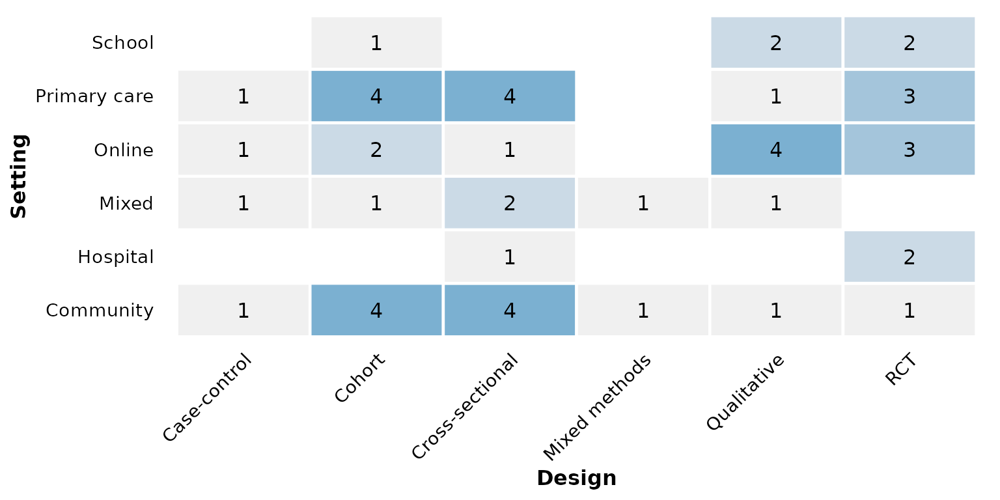

## `col1`: the x-axis column

`col1` is mapped to the horizontal axis. Prefer columns with a handful
of categories for a readable grid. Here `RiskOfBias` (three levels) sits
on x:

``` r

reviewOverlap(studies, RiskOfBias, Setting)
```

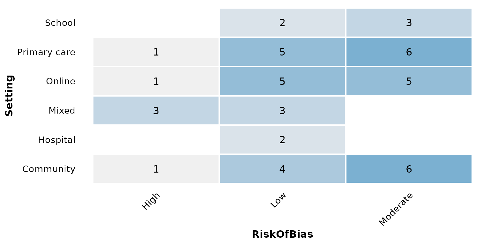

## `col2`: the y-axis column

`col2` is mapped to the vertical axis. Either column may be
**multi-value** — a cell holding several values split by `sep`. In
`studies`, `AgeGroup` lists one or more age bands per study, so each
band is counted independently:

``` r

reviewOverlap(studies, Design, AgeGroup)
```

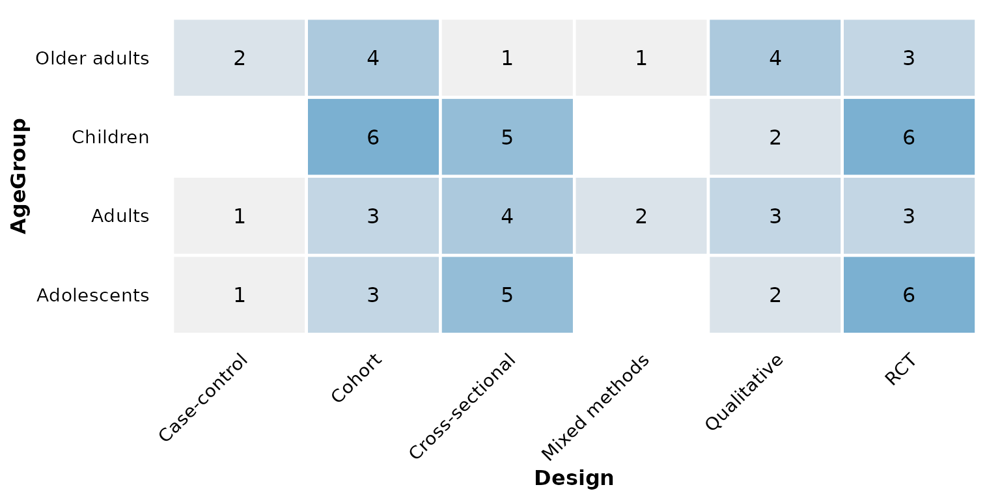

When both columns have several categories the grid grows; the pairing
below crosses intervention type with age group:

``` r

reviewOverlap(studies, InterventionType, AgeGroup)
```

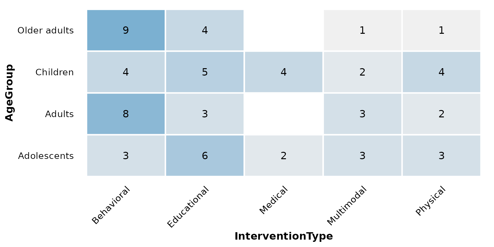

## `sep`: multi-value separator

Multi-value cells are split on `sep` (default `"\r\n"`) before counting.
`AgeGroup` uses the default, so no extra argument is needed above. If
your data uses a different delimiter, set `sep`. Here we rebuild a
semicolon-separated column to demonstrate:

``` r

studies_semi <- studies
studies_semi$AgeGroup <- gsub("\r?\n", "; ", studies_semi$AgeGroup)
reviewOverlap(studies_semi, Design, AgeGroup, sep = "; ")
```


## `fill`: high-end gradient color

The count gradient runs from a fixed light grey (low counts) up to
`fill` (high counts). A single hex color sets that high end:

``` r

reviewOverlap(studies, Design, Setting, fill = "#59a14f")
```

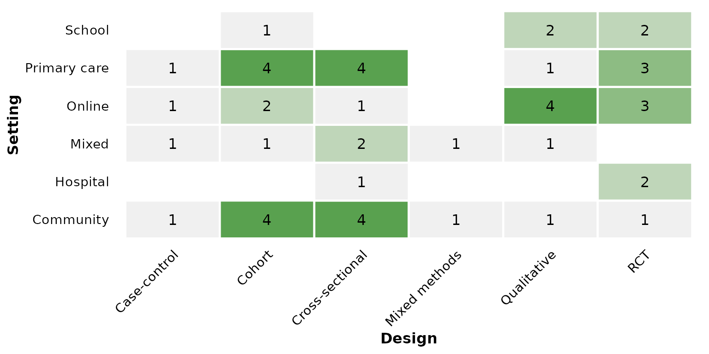

Use one of the package
[`PALETTE`](https://sonsoles.me/litReview/reference/PALETTE.md) colors —
a green high end:

``` r

reviewOverlap(studies, Design, Setting, fill = PALETTE[3])
```

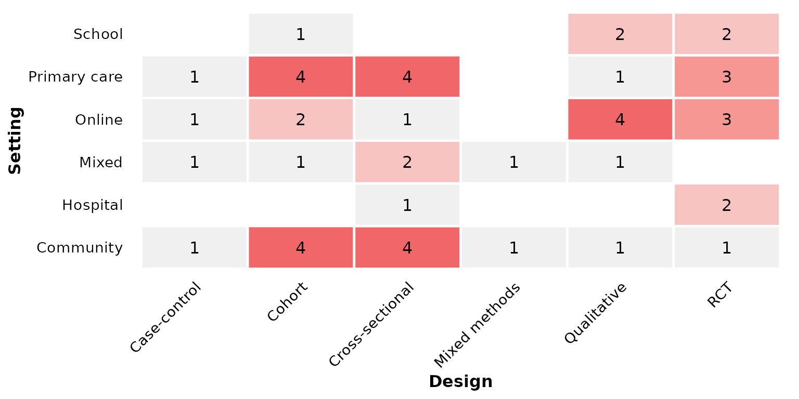

Or a warm orange high end:

``` r

reviewOverlap(studies, Design, Setting, fill = PALETTE[7])
```


## `base_size`: overall text and element scaling

A single knob scales all text, tile borders, and spacing proportionally.
Smaller, for multi-panel figures:

``` r

reviewOverlap(studies, Design, Setting, base_size = 9)
```

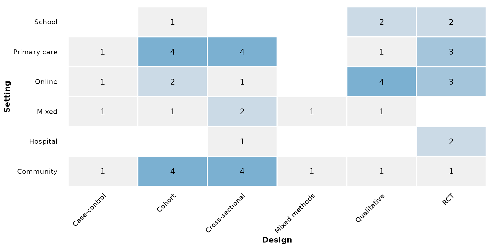

Larger, for slides or posters:

``` r

reviewOverlap(studies, Design, Setting, base_size = 18)
```

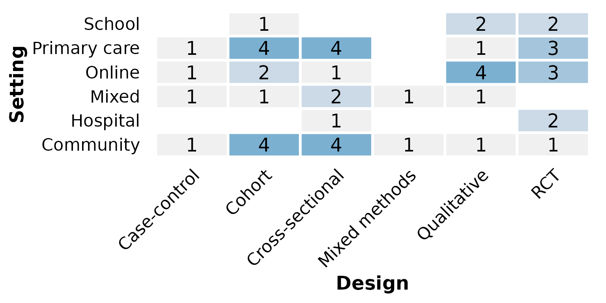

## Missing data: `na.rm` and `na_label`

These two arguments control how `NA` (and empty) cells are treated. We
use a column that actually has missing values — `RiskOfBias` has a few
unreported studies.

By default `na.rm = TRUE` drops rows missing either column, so no tile
represents them:

``` r

reviewOverlap(studies, RiskOfBias, Setting)
```


Keep the missing values as their own row/column with `na.rm = FALSE`;
`na_label` names the resulting category:

``` r

reviewOverlap(studies, RiskOfBias, Setting, na.rm = FALSE)
```

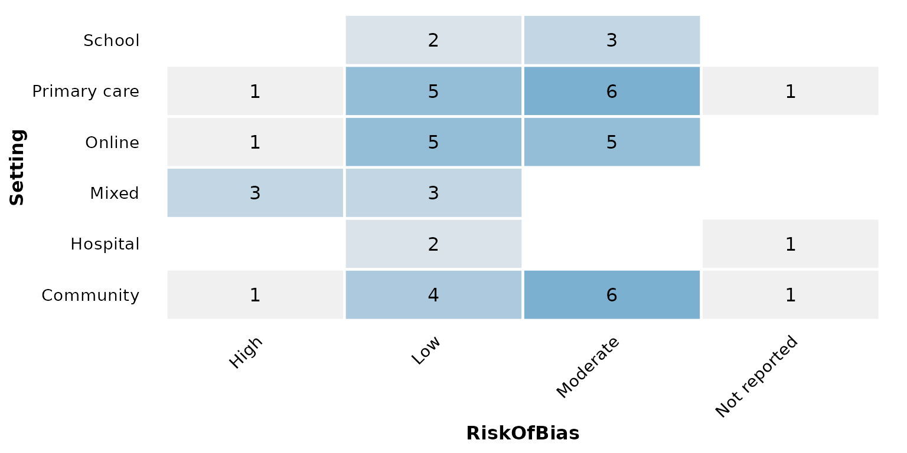

`na_label` sets a custom label for those cells:

``` r

reviewOverlap(studies, RiskOfBias, Setting,
              na.rm = FALSE, na_label = "Unclear")
```

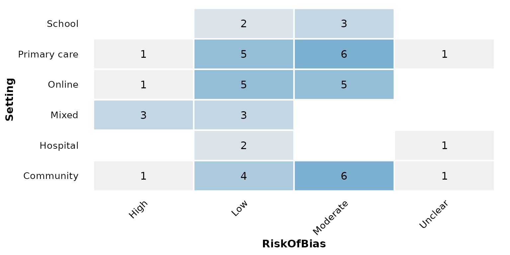

## `studlabs` and `study_id`: label tiles with study IDs

Set `studlabs = TRUE` to write the contributing study identifiers inside
each tile, beneath the count:

``` r

reviewOverlap(studies, Design, RiskOfBias, studlabs = TRUE)
```

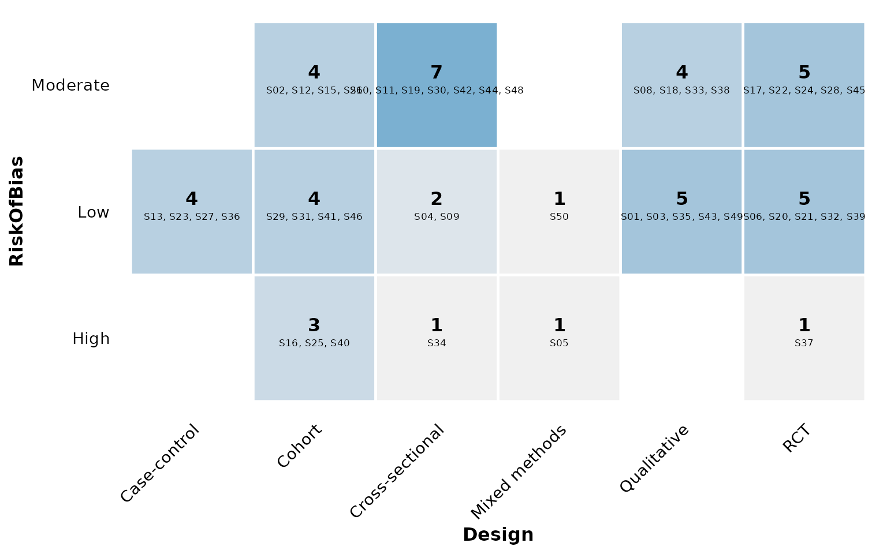

`study_id` selects which column supplies those identifiers (default
`StudyID`). Here we label with the author instead:

``` r

reviewOverlap(studies, Design, RiskOfBias,
              studlabs = TRUE, study_id = Author)
```

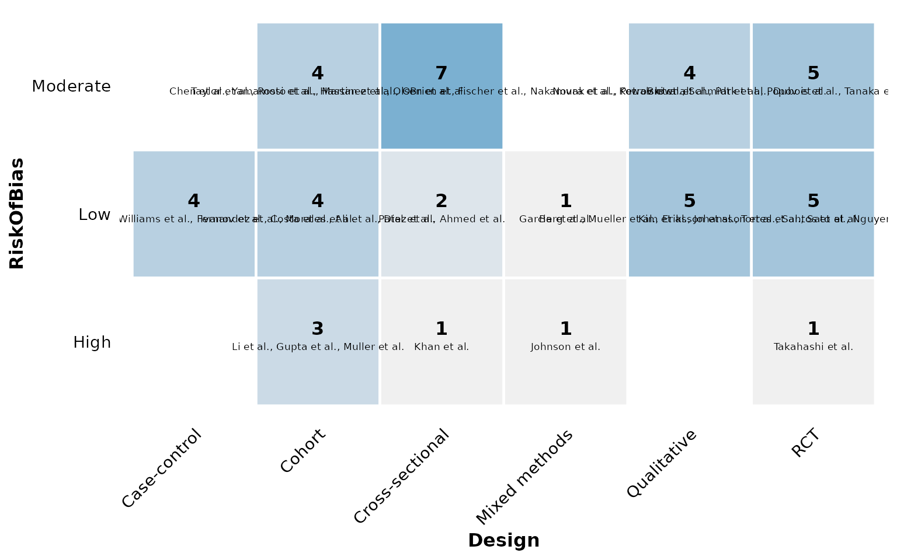

## `label_wrap`: wrap long axis labels

Category names on the axes are wrapped onto multiple lines once they
exceed `label_wrap` characters (default `15`), so long labels stay
readable instead of running off the plot. Lower the width to wrap more
aggressively:

``` r

reviewOverlap(studies, AnalysisApproach, Setting, label_wrap = 10)
```

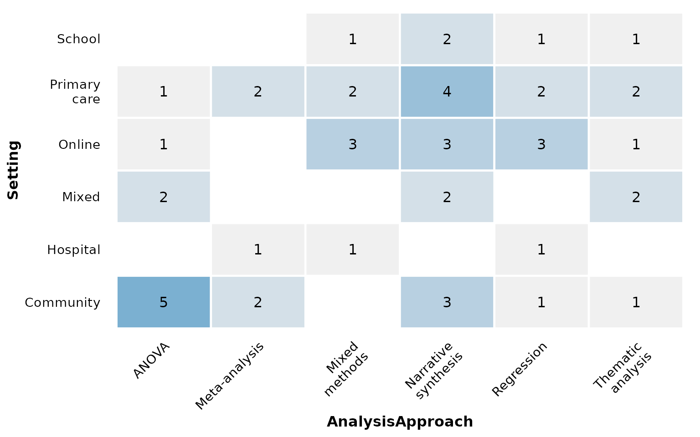

Set `label_wrap = NULL` (or `Inf`) to disable wrapping and keep every
label on a single line:

``` r

reviewOverlap(studies, AnalysisApproach, Setting, label_wrap = NULL)
```

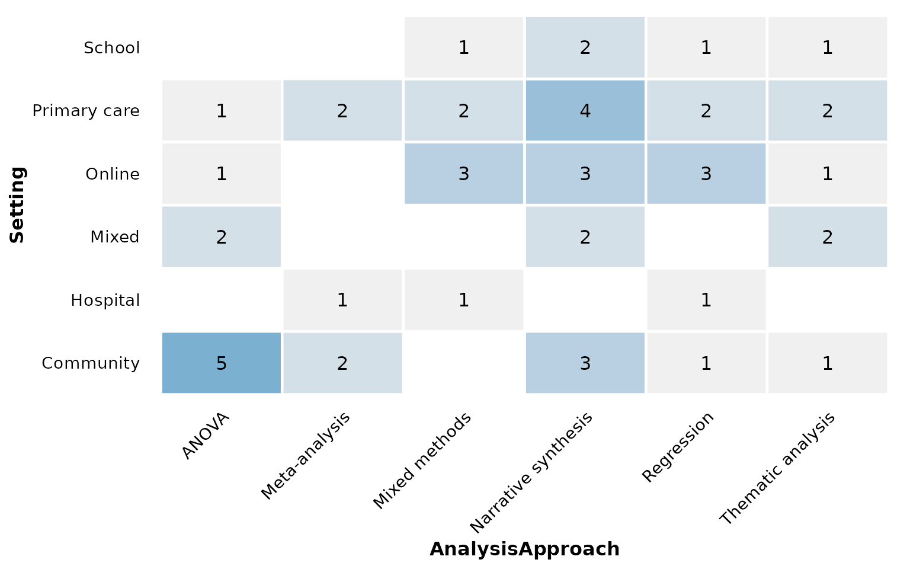

## Composing with ggplot2

Every `review*()` function returns a plain ggplot, so you can keep
adding layers, scales, and labels with `+`:

``` r

reviewOverlap(studies, Design, Setting, fill = "#59a14f") +
  labs(title = "Design by setting", subtitle = "n = 50 studies",
       caption = "Source: example dataset") +
  theme(plot.title.position = "plot")
```

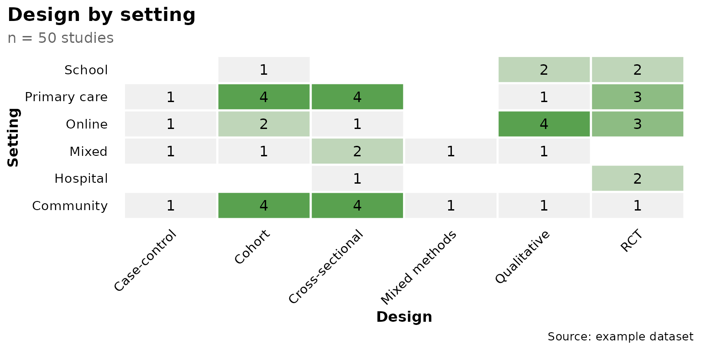
