# Pie and donut charts

``` r

library(litReview)
library(ggplot2)
data(studies)
```

[`reviewPie()`](https://sonsoles.me/litReview/reference/reviewPie.md)
summarizes a single column as a donut (default) or pie chart, with each
slice annotated by its count and percentage. It is the categorical
counterpart to
[`reviewBar()`](https://sonsoles.me/litReview/articles/bar.md). This
article walks through **every argument** of

``` r

reviewPie(data, col, sep = "\r\n", colors = PALETTE, donut = TRUE,
          study_id = StudyID, base_size = 12, na.rm = TRUE,
          na_label = "Not reported", na_in_percent = TRUE, na_last = FALSE)
```

## Default

Pass the data frame and a column. Column names may be bare or quoted.
Slices are sized by frequency and labelled with their count and
percentage. By default you get a donut (a pie with a hollow center).

``` r

reviewPie(studies, Design)
```


## `col`: the column to summarize

Any categorical column works. Multi-value columns (cells holding several
values) are split first — see [`sep`](#sep-multi-value-separator) below.

``` r

reviewPie(studies, Outcome)
```

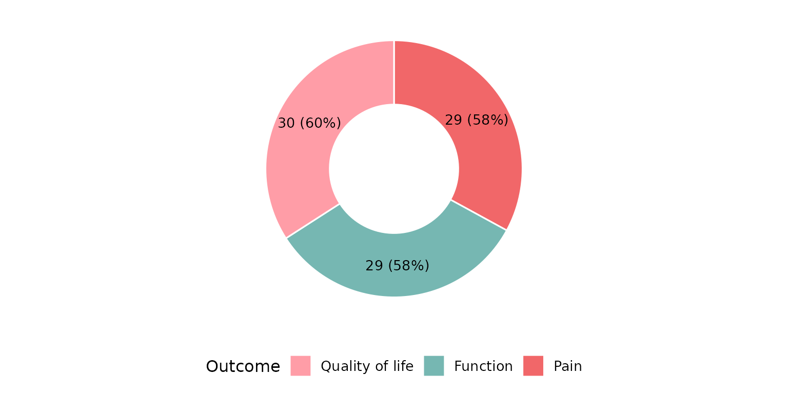

## `sep`: multi-value separator

Some cells hold several values. In `studies`, `Outcome` uses newline
separators (`"\r\n"`, the default), so each value is counted
independently. If your data uses a different delimiter, set `sep`. Here
we rebuild a semicolon-separated column to demonstrate:

``` r

studies_semi <- studies
studies_semi$Outcome <- gsub("\r\n", "; ", studies_semi$Outcome)
reviewPie(studies_semi, Outcome, sep = "; ")
```

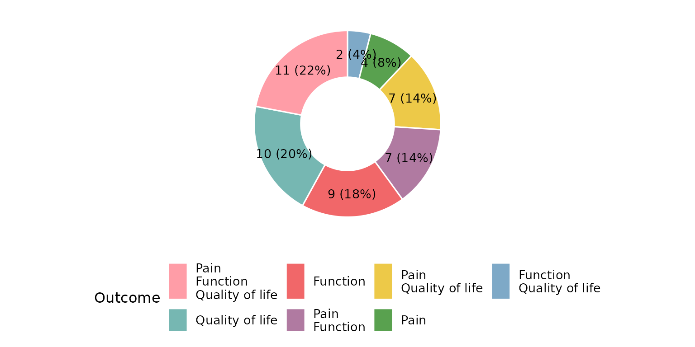

## `colors`: slice fill colors

By default slices are filled from the package
[`PALETTE`](https://sonsoles.me/litReview/reference/PALETTE.md), cycled
across categories:

``` r

reviewPie(studies, Design, colors = PALETTE)
```


Passing a **custom vector** of colors maps one color per slice (recycled
if shorter than the number of categories):

``` r

reviewPie(studies, Design, colors = c("#59a14f", "#f28e2b", "#4e79a7"))
```

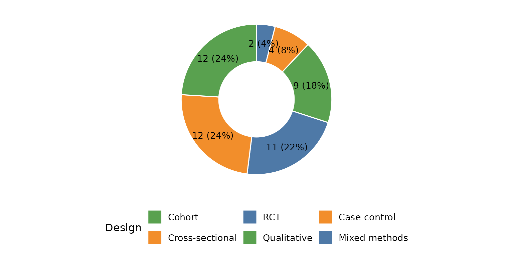

A **named** vector pins specific colors to specific categories,
regardless of slice order:

``` r

reviewPie(studies, Design,
          colors = c("RCT" = "#f16769", "Cohort" = "#7ea9c7",
                     "Case-control" = "#59a14f"))
```

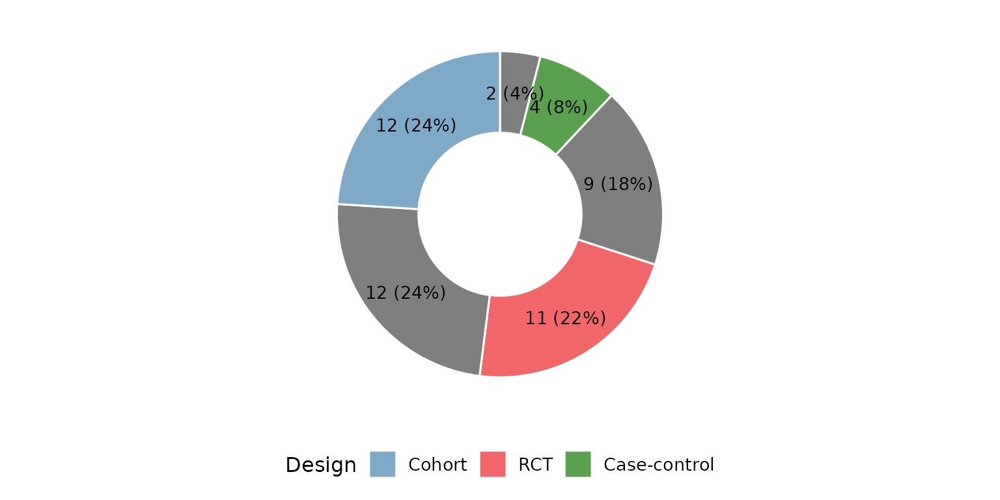

## `donut`: donut vs. full pie

`donut = TRUE` (the default) leaves a hollow center. Set `donut = FALSE`
for a solid, filled pie:

``` r

reviewPie(studies, Design, donut = FALSE)
```

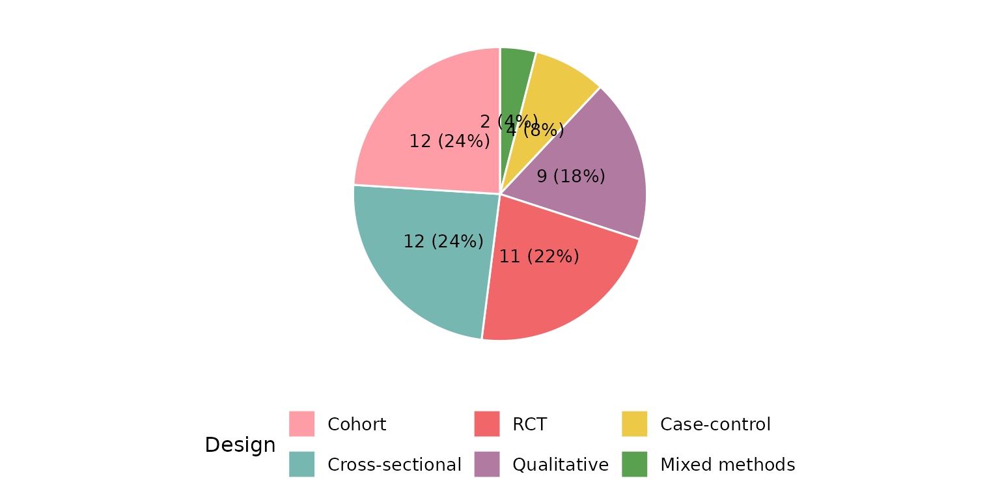

The donut form again for contrast:

``` r

reviewPie(studies, Design, donut = TRUE)
```

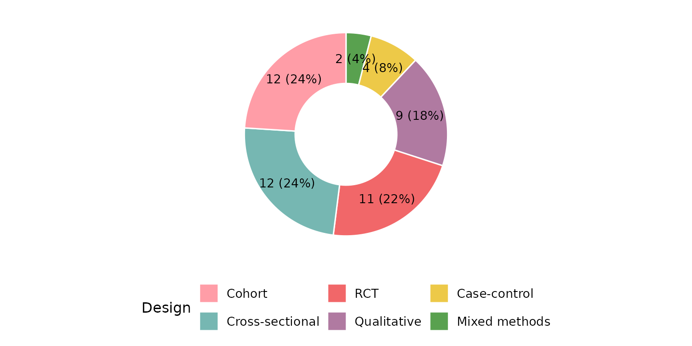

## `study_id`: the identifier column

`study_id` names the column of study identifiers used when counting rows
(default `StudyID`). It rarely needs changing, but if your identifiers
live in a differently named column, point
[`reviewPie()`](https://sonsoles.me/litReview/reference/reviewPie.md) at
it. Here `Author` serves as the identifier:

``` r

reviewPie(studies, Design, study_id = Author)
```


## `base_size`: overall text and element scaling

A single knob scales all text and spacing proportionally. Smaller, for
multi-panel figures:

``` r

reviewPie(studies, Design, base_size = 9)
```

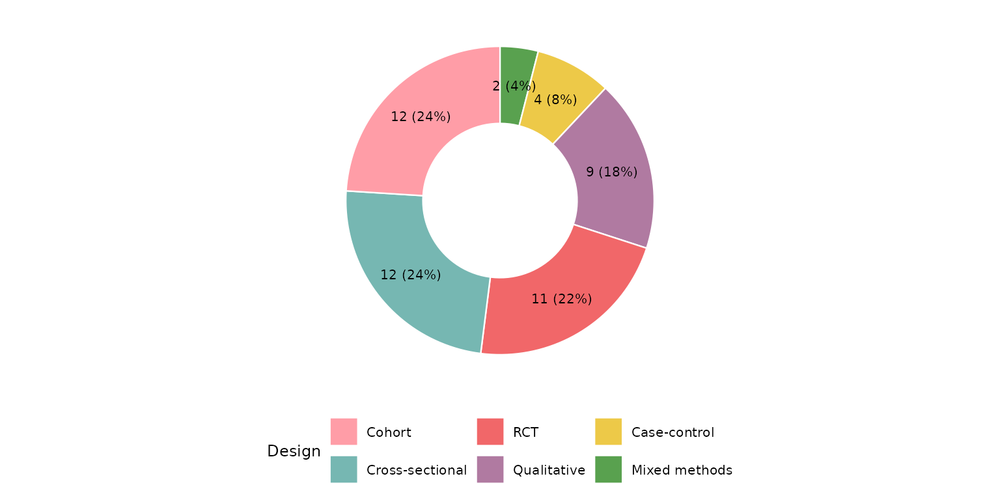

Larger, for slides or posters:

``` r

reviewPie(studies, Design, base_size = 18)
```

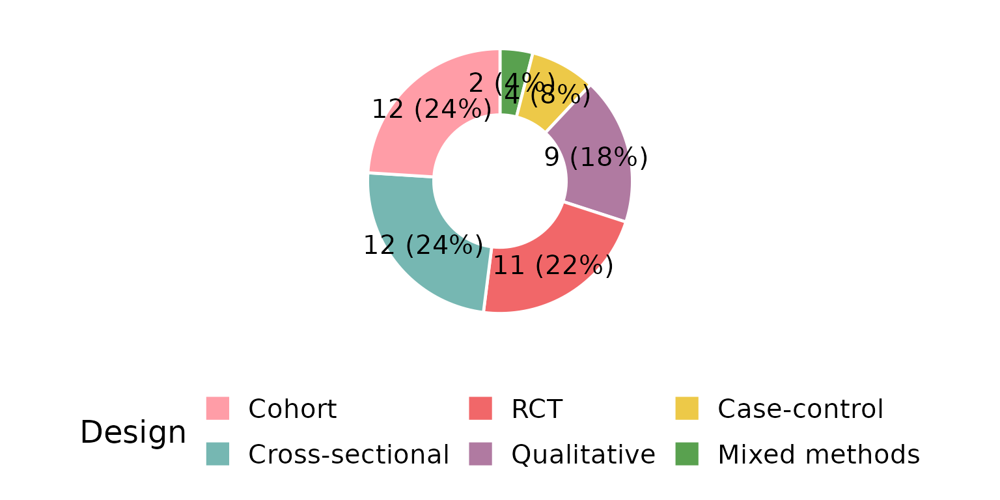

## Missing data: `na.rm`, `na_label`, `na_in_percent`, `na_last`

These four arguments control how `NA` (and empty) cells are treated. We
use a column that actually has missing values — `FundingSource`.

By default `na.rm = TRUE` drops missing rows, but the percentage
denominator is still the full sample, so the shown percentages need not
sum to 100%:

``` r

reviewPie(studies, FundingSource)
```

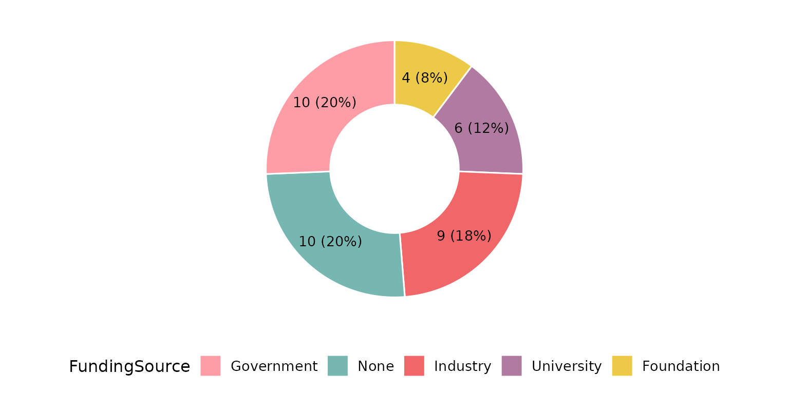

Keep the missing rows as their own slice with `na.rm = FALSE`;
`na_label` sets its name:

``` r

reviewPie(studies, FundingSource, na.rm = FALSE, na_label = "Not reported")
```

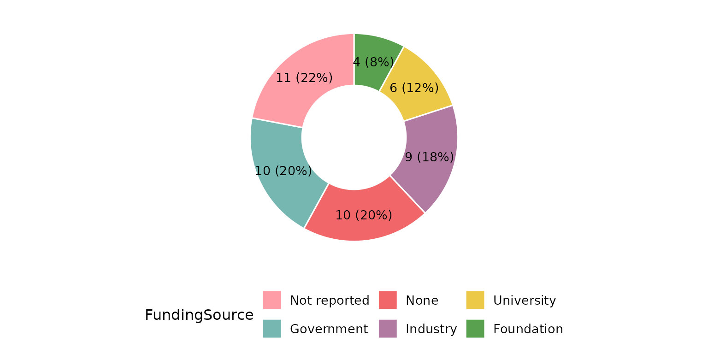

With `na_in_percent = FALSE` the denominator excludes missing rows, so
the reported categories sum to 100%:

``` r

reviewPie(studies, FundingSource, na.rm = FALSE, na_in_percent = FALSE)
```

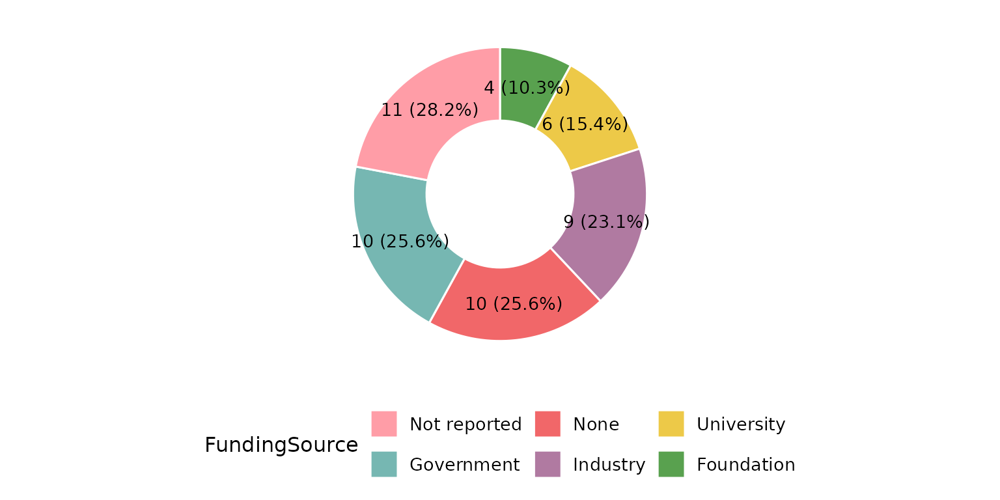

`na_last = TRUE` forces the missing-value slice to the end regardless of
its frequency:

``` r

reviewPie(studies, FundingSource, na.rm = FALSE, na_last = TRUE)
```

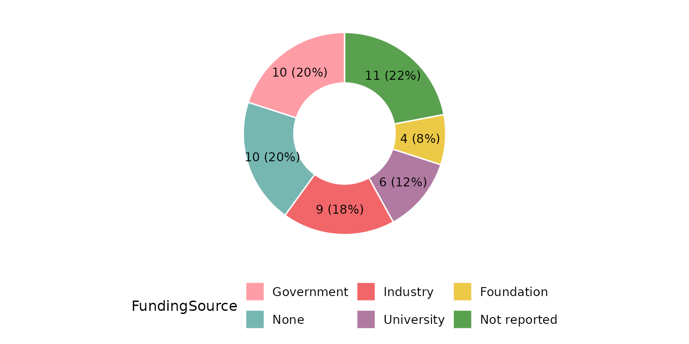

## Composing with ggplot2

Every `review*()` function returns a plain ggplot, so you can keep
adding layers, scales, and labels with `+`:

``` r

reviewPie(studies, Design, colors = PALETTE) +
  labs(title = "Study designs", subtitle = "n = 50 studies",
       caption = "Source: example dataset") +
  theme(plot.title.position = "plot")
```

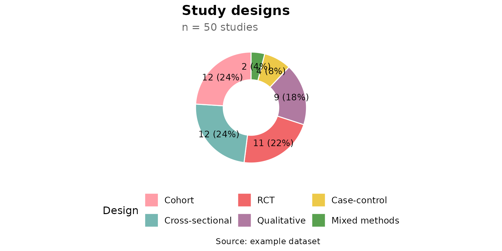
