# Stacked bar charts

``` r

library(litReview)
library(ggplot2)
data(studies)
```

[`reviewStackedBar()`](https://sonsoles.me/litReview/reference/reviewStackedBar.md)
cross-tabulates two columns: `col` defines the primary category (one bar
each) and `group` is split within every bar as the fill. It answers
questions like “how does risk of bias break down by study design?”. This
article walks through **every argument** of

``` r

reviewStackedBar(data, col, group, position = c("fill", "stack"),
                 fill = PALETTE, width = 0.7, sep = "\r\n",
                 study_id = StudyID, base_size = 12, na.rm = TRUE,
                 na_label = "Not reported", labels = TRUE)
```

## Default

Pass the data frame, the primary column, and the grouping column. Column
names may be bare or quoted. Each `col` category becomes one bar, split
by `group`; by default (`position = "fill"`) every bar is scaled to 100%
so you read proportions, and each segment is annotated with its count
and percentage.

``` r

reviewStackedBar(studies, Design, RiskOfBias)
```

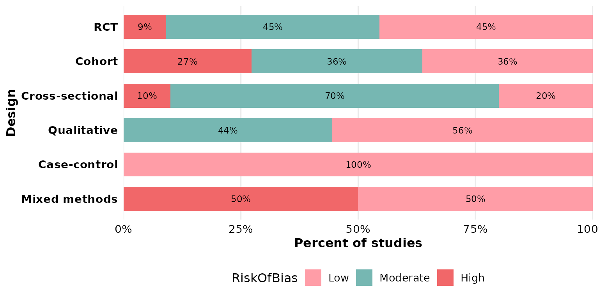

## `col`: the primary category

`col` sets one bar per level. Any categorical column works; multi-value
cells are split first — see [`sep`](#sep-multi-value-separator) below.
Here we make one bar per intervention type:

``` r

reviewStackedBar(studies, InterventionType, OpenAccess)
```

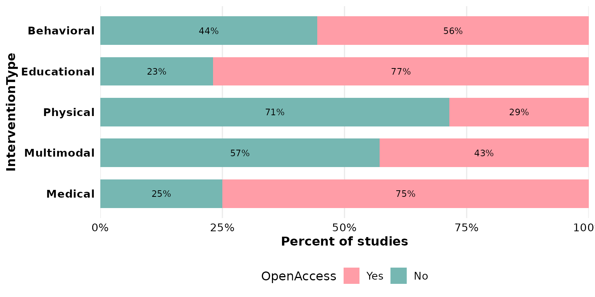

## `group`: the splitting (fill) variable

`group` is stacked within each bar and drives the legend. Swapping `col`
and `group` re-frames the same cross-tabulation — now one bar per
risk-of-bias level, split by design:

``` r

reviewStackedBar(studies, RiskOfBias, Design)
```

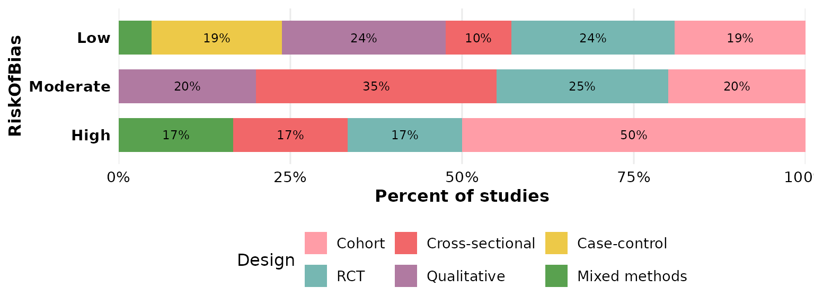

## `position`: proportions vs counts

`position = "fill"` (the default) scales each bar to 100%, so bars are
comparable regardless of how many studies fall in each `col` category:

``` r

reviewStackedBar(studies, Design, RiskOfBias, position = "fill")
```


`position = "stack"` keeps the raw counts, so bar height reflects the
number of studies and the labels report frequencies:

``` r

reviewStackedBar(studies, Design, RiskOfBias, position = "stack")
```

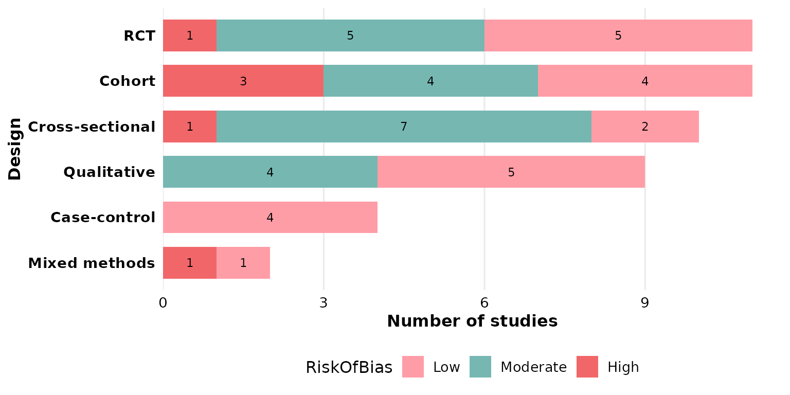

## `fill`: segment colors

The default is the package
[`PALETTE`](https://sonsoles.me/litReview/reference/PALETTE.md), applied
across the `group` levels:

``` r

reviewStackedBar(studies, Design, RiskOfBias, fill = PALETTE)
```


Pass a **vector** of colors to map one color per `group` level (recycled
if shorter than the number of levels):

``` r

reviewStackedBar(studies, Design, RiskOfBias,
                 fill = c("#59a14f", "#edc948", "#e15759"))
```


A **named** vector pins specific colors to specific `group` levels,
independent of their order — useful to keep, say, “High” red across
figures:

``` r

reviewStackedBar(studies, Design, RiskOfBias,
                 fill = c("Low" = "#59a14f",
                          "Moderate" = "#edc948",
                          "High" = "#e15759"))
```

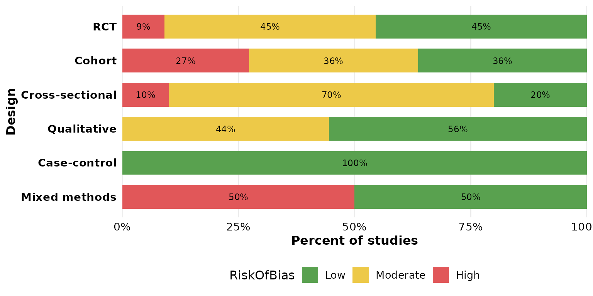

## `width`: bar thickness

`width` runs from 0 to 1 (fraction of the available band). Thin bars:

``` r

reviewStackedBar(studies, Design, RiskOfBias, width = 0.3)
```

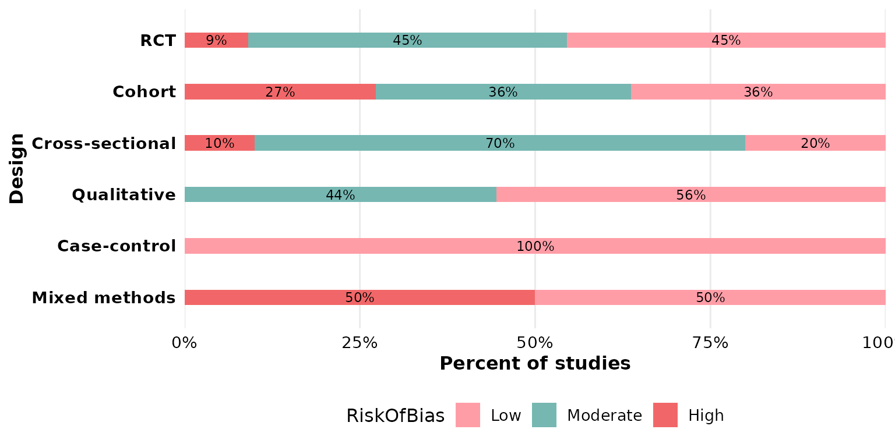

Full-width bars:

``` r

reviewStackedBar(studies, Design, RiskOfBias, width = 1)
```

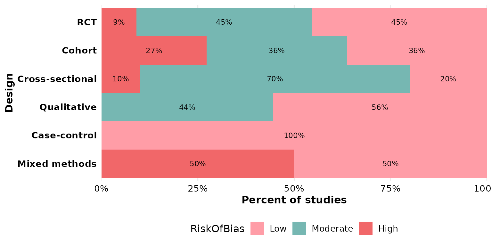

## `sep`: multi-value separator

Either `col` or `group` may hold several values per cell. In `studies`,
`Outcome` uses newline separators (`"\r\n"`, the default), so a study
reporting multiple outcomes contributes to each. Here `Outcome` is the
primary category, split by design:

``` r

reviewStackedBar(studies, Outcome, Design)
```

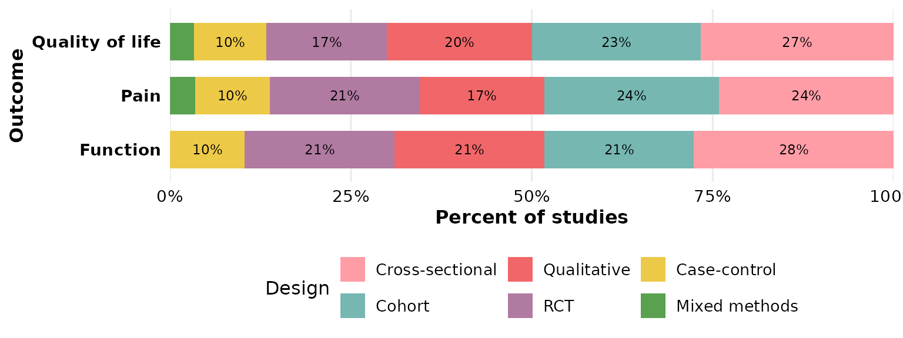

If your data uses a different delimiter, set `sep`. Here we rebuild a
semicolon-separated column to demonstrate:

``` r

studies_semi <- studies
studies_semi$Outcome <- gsub("\r\n", "; ", studies_semi$Outcome)
reviewStackedBar(studies_semi, Outcome, Design, sep = "; ")
```

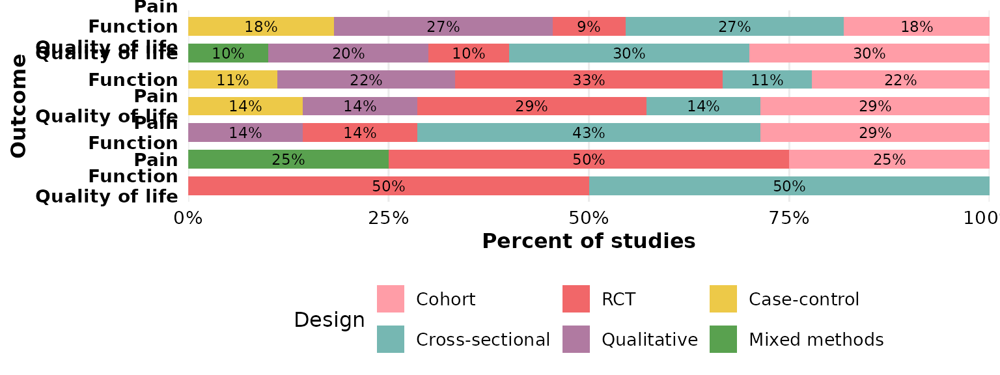

## `study_id`: which column identifies a study

`study_id` names the column used to identify studies when de-duplicating
and counting (default `StudyID`). It matters for multi-value columns,
where the same study can appear in several segments. Pointing it at
`Author` uses that column as the identifier instead:

``` r

reviewStackedBar(studies, Outcome, Design, study_id = Author)
```


## `base_size`: overall text and element scaling

A single knob scales all text and spacing proportionally. Smaller, for
multi-panel figures:

``` r

reviewStackedBar(studies, Design, RiskOfBias, base_size = 9)
```

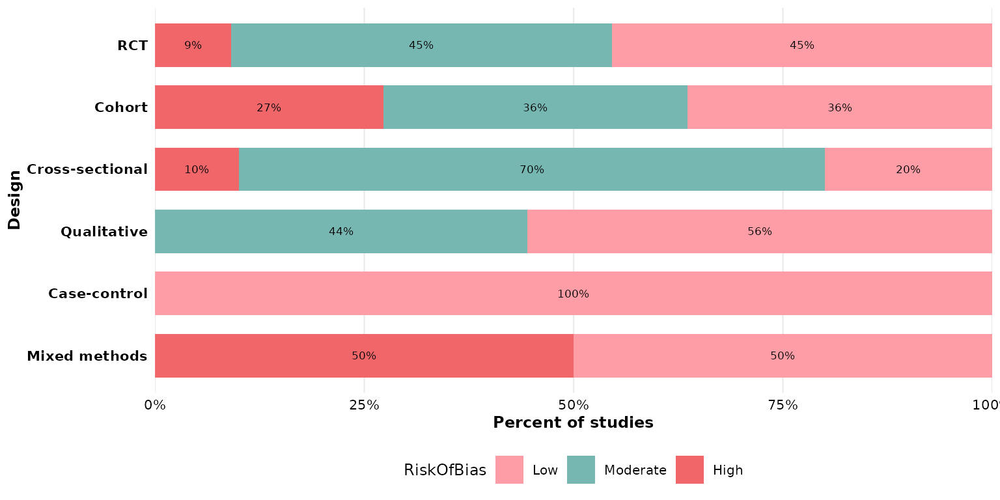

Larger, for slides or posters:

``` r

reviewStackedBar(studies, Design, RiskOfBias, base_size = 18)
```

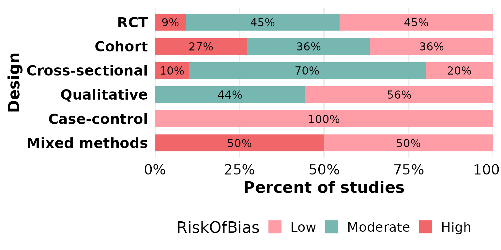

## `na.rm` and `na_label`: missing data in the group

This function exposes two missing-data controls, both acting on the
`group` column. By default `na.rm = TRUE` drops rows with a missing
`group` value. `OpenAccess` has some unreported entries, which vanish
here:

``` r

reviewStackedBar(studies, InterventionType, OpenAccess)
```


Set `na.rm = FALSE` to keep those rows as their own segment; `na_label`
sets its name:

``` r

reviewStackedBar(studies, InterventionType, OpenAccess,
                 na.rm = FALSE, na_label = "Not reported")
```

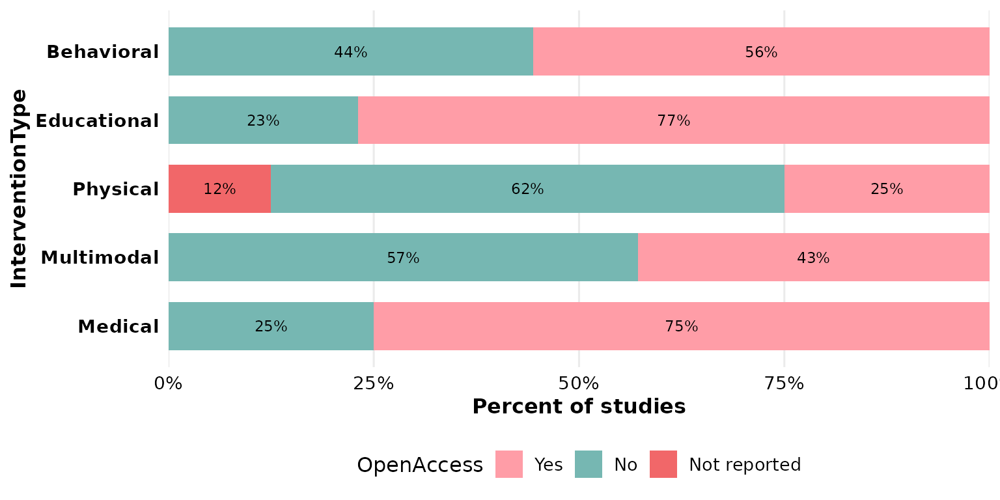

The same pair works for any group with gaps, such as `RiskOfBias`:

``` r

reviewStackedBar(studies, Design, RiskOfBias,
                 na.rm = FALSE, na_label = "Unclear")
```

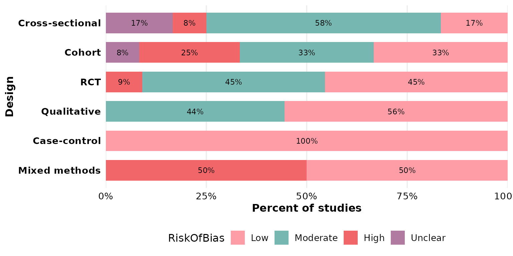

## `labels`: in-segment annotations

`labels = TRUE` (the default) prints the count/percentage inside each
segment. Turn it off for a cleaner look, leaving the legend to carry the
meaning:

``` r

reviewStackedBar(studies, Design, RiskOfBias, labels = FALSE)
```

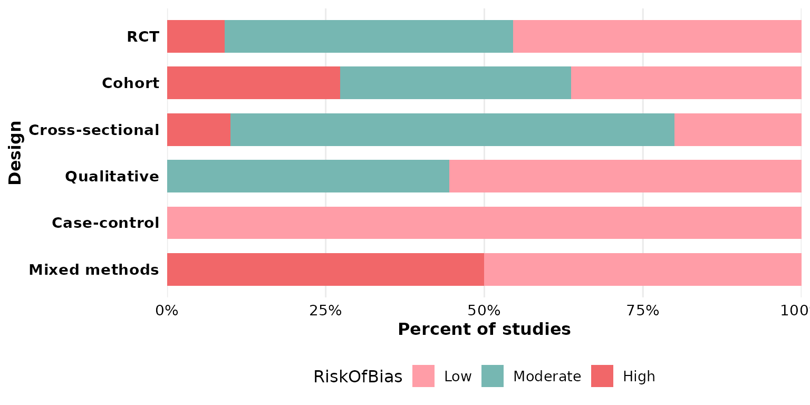

## Composing with ggplot2

Every `review*()` function returns a plain ggplot, so you can keep
adding layers, scales, and labels with `+`:

``` r

reviewStackedBar(studies, Design, RiskOfBias) +
  labs(title = "Risk of bias by study design",
       subtitle = "n = 50 studies", fill = "Risk of bias",
       caption = "Source: example dataset") +
  theme(plot.title.position = "plot")
```

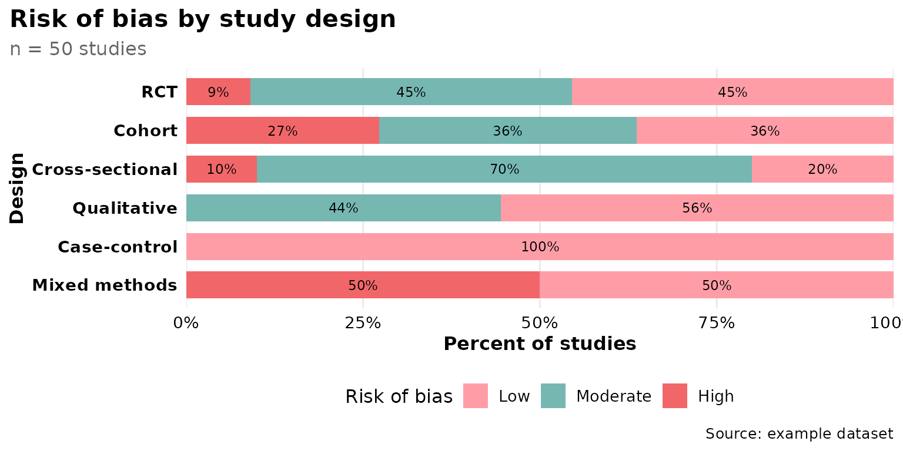
