# Tree diagrams

``` r

library(litReview)
library(ggplot2)
data(studies)
```

[`reviewTree()`](https://sonsoles.me/litReview/reference/reviewTree.md)
draws a left-to-right **hierarchical tree** from a set of columns given
*in order*: the first column forms the top-level branches, the next
their children, and so on. Every level-1 branch gets its own colour,
inherited by its descendants, and the leaves can attach a wrapped list
of the studies that reach them. This article walks through **every
argument** of

``` r

reviewTree(data, cols, study_id = StudyID, sep = "\r\n",
           show_members = TRUE, member_wrap = 36, label_wrap = 18,
           counts = "none", root_label = "All studies", colors = PALETTE,
           root_fill = "#F4F4C8", base_size = 11,
           na.rm = TRUE, na_label = "Not reported")
```

## Default

Pass the data frame and the ordered vector of columns. Here the tree
branches by `InterventionType`, then by `Intervention`, and lists the
studies (by author) at each leaf:

``` r

reviewTree(studies, c("InterventionType", "Intervention"), study_id = Author)
```

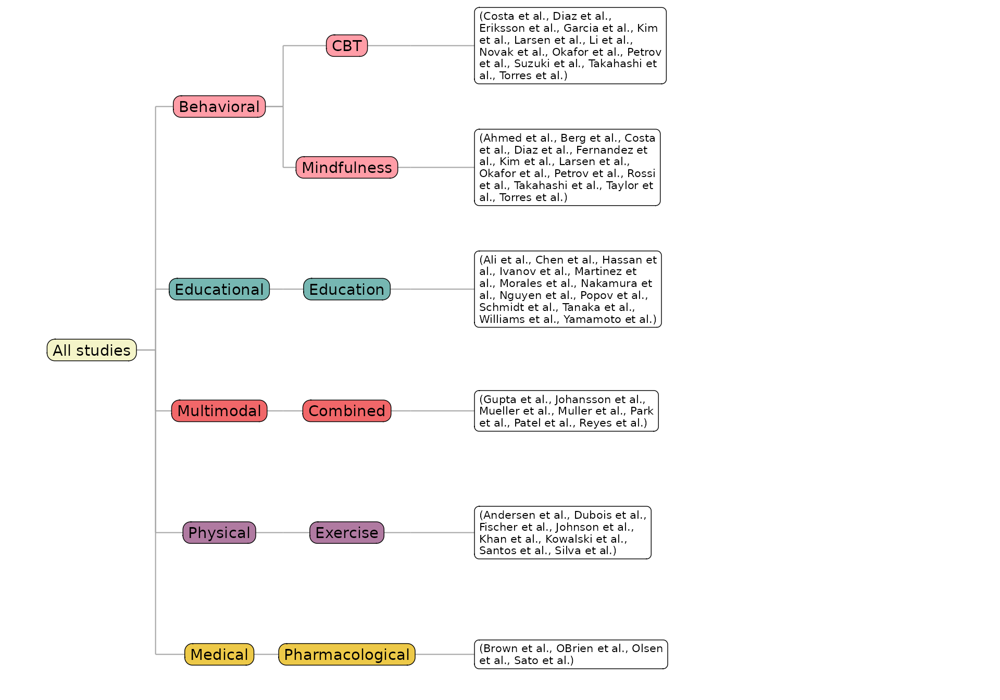

## `cols`: the hierarchy, in order

`cols` is the heart of the plot: a character vector naming the columns
from root (first) to leaf (last). A single column gives a one-level
fan-out:

``` r

reviewTree(studies, "Design", study_id = Author)
```

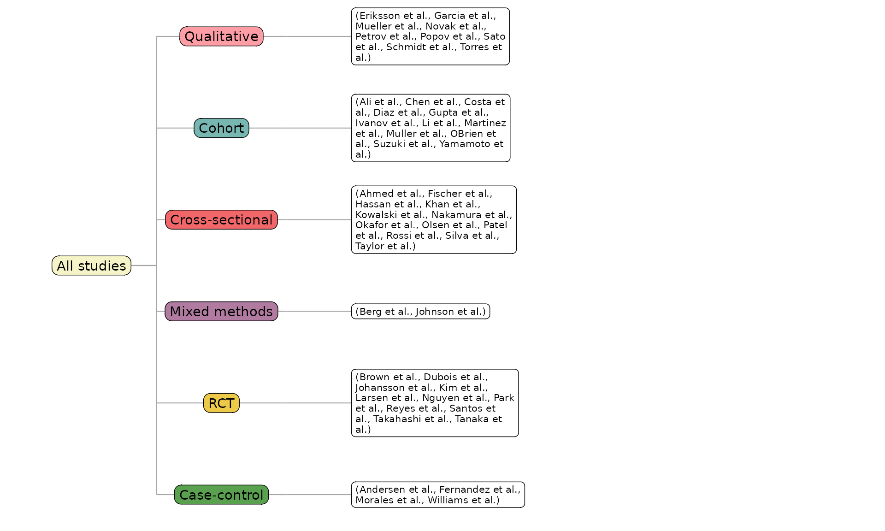

Add more columns to deepen the tree. Multi-value cells (like `Outcome`)
are split, so a study can appear under several branches:

``` r

reviewTree(studies, c("InterventionType", "Intervention", "Outcome"),
           study_id = StudyID, member_wrap = 24)
```

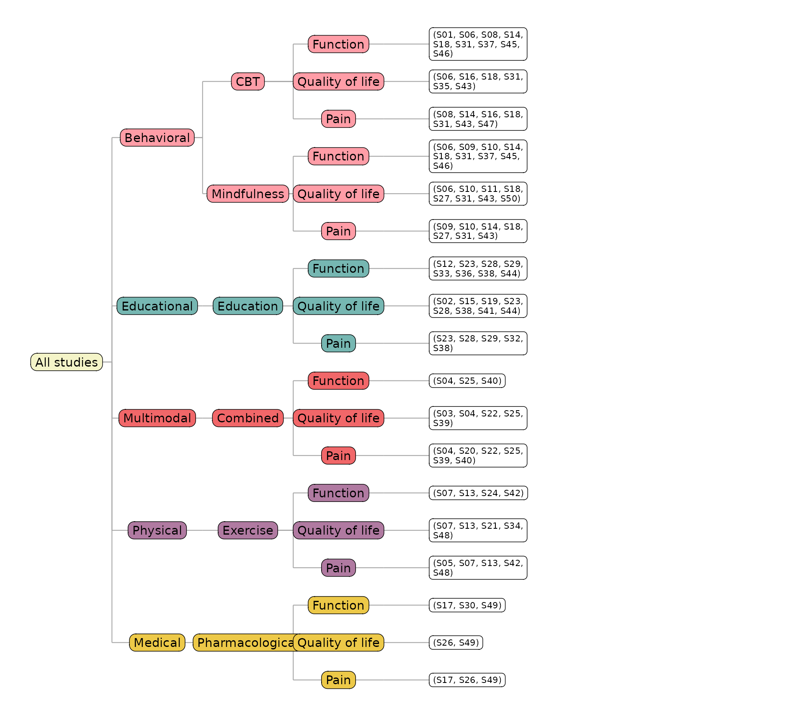

## `study_id`: what the leaves collect

`study_id` selects the column whose values are gathered into each leaf’s
member box (default `StudyID`). Use `Author` for readable citations:

``` r

reviewTree(studies, c("Setting", "Design"), study_id = Author)
```

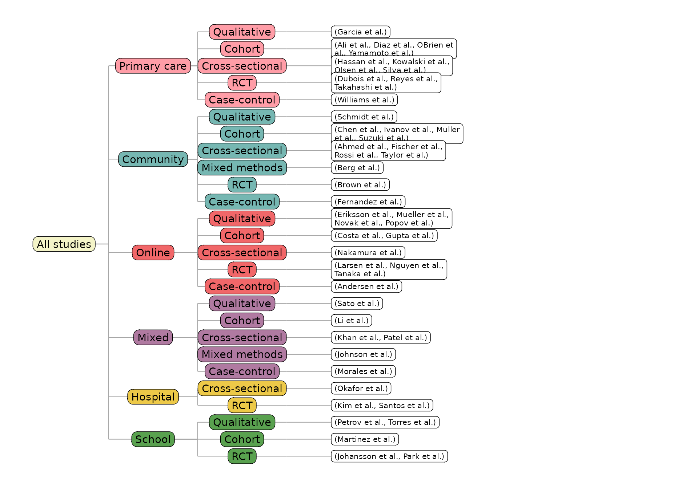

## `sep`: multi-value separator

Cells that hold several values are split on `sep` (default `"\r\n"`) at
every level. Set it to match your data — here we rebuild a
semicolon-separated column:

``` r

studies_semi <- studies
studies_semi$Outcome <- gsub("\r\n", "; ", studies_semi$Outcome)
reviewTree(studies_semi, c("Design", "Outcome"), sep = "; ", study_id = Author)
```

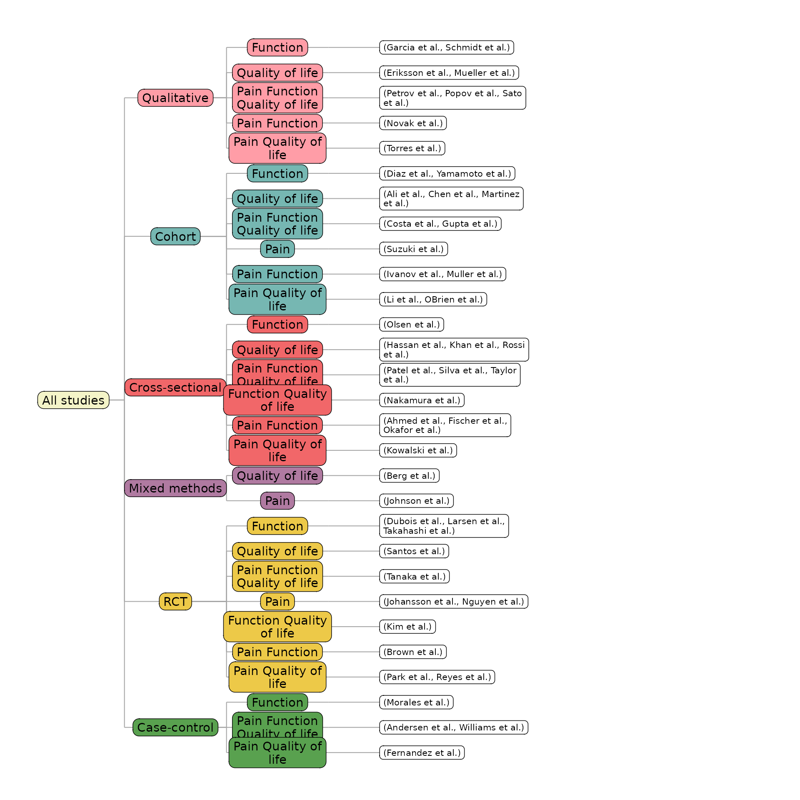

## `show_members`: leaf study lists

By default each leaf attaches a box listing its studies. Turn it off for
a bare taxonomy tree:

``` r

reviewTree(studies, c("InterventionType", "Intervention"), show_members = FALSE)
```

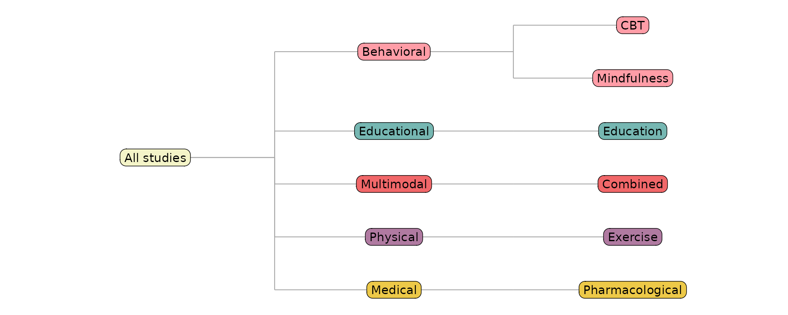

## `member_wrap`: wrap the member lists

`member_wrap` controls how many characters fit per line in the member
boxes. Narrower boxes are taller:

``` r

reviewTree(studies, c("InterventionType", "Intervention"),
           study_id = Author, member_wrap = 60)
```

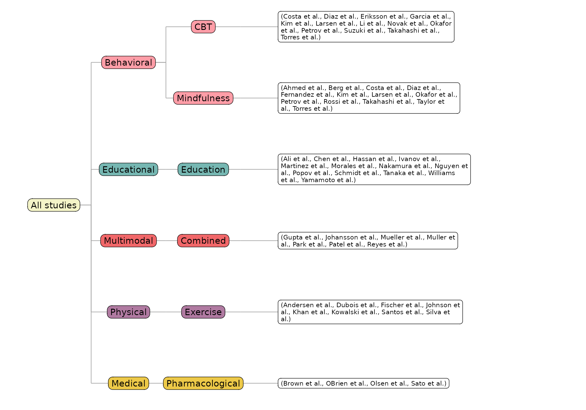

## `label_wrap`: wrap node labels

Long node labels wrap at `label_wrap` characters (default `18`):

``` r

reviewTree(studies, c("Setting", "AnalysisApproach"),
           study_id = Author, label_wrap = 10, show_members = FALSE)
```

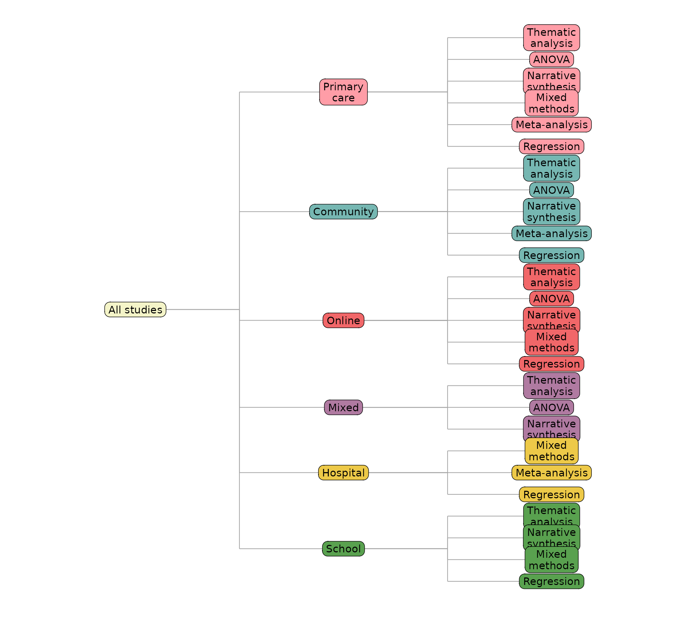

## `counts`: number and/or percentage of papers

Annotate every node with how many studies it covers. `counts = "count"`
adds the number of studies, `"percent"` the share of all studies, and
`"both"` shows each node as `count, percent`. The root itself is left
un-annotated. Because multi-value cells put a study in several branches,
sibling percentages can exceed 100%.

``` r

reviewTree(studies, c("InterventionType", "Intervention"), study_id = Author,
           counts = "both", show_members = FALSE)
```

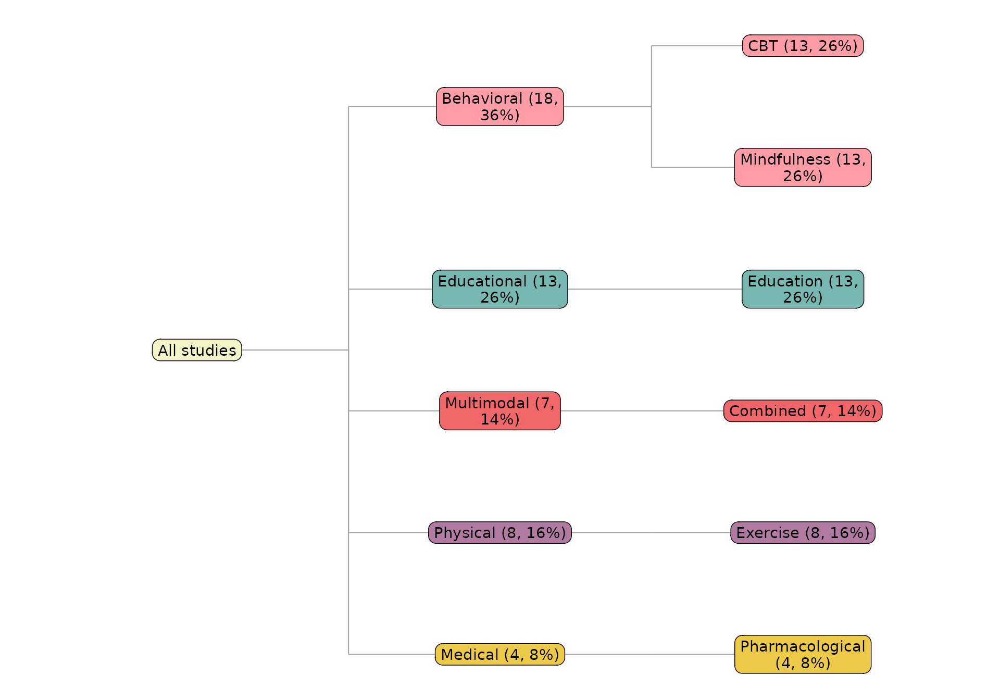

Counts and the member lists can be shown together:

``` r

reviewTree(studies, c("InterventionType", "Intervention"), study_id = Author,
           counts = "count")
```

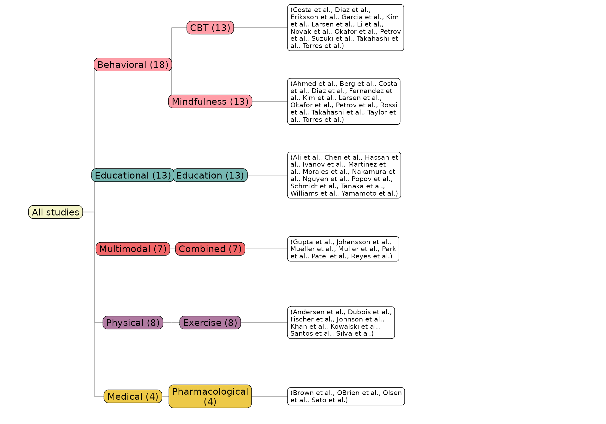

## `root_label`: name the root

``` r

reviewTree(studies, c("InterventionType", "Intervention"),
           study_id = Author, root_label = "Interventions")
```

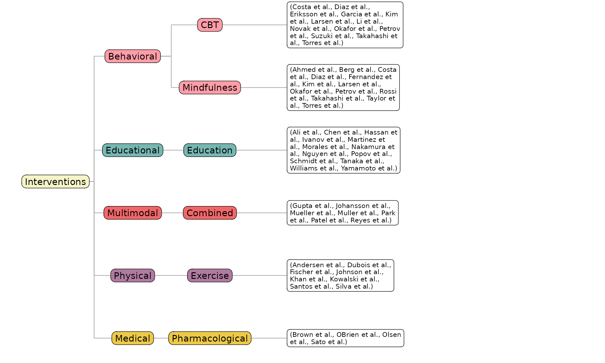

## `colors`: branch palette

`colors` supplies one colour per top-level branch (default
[`PALETTE`](https://sonsoles.me/litReview/reference/PALETTE.md));
descendants inherit it. Pass a custom vector:

``` r

reviewTree(studies, c("InterventionType", "Intervention"), study_id = Author,
           colors = c("#e15759", "#4e79a7", "#59a14f", "#b07aa1", "#f28e2b"))
```

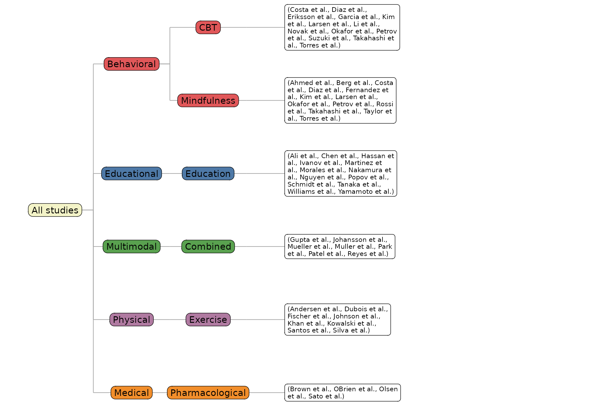

## `root_fill`: root node colour

``` r

reviewTree(studies, c("InterventionType", "Intervention"),
           study_id = Author, root_fill = "#d9d9d9")
```

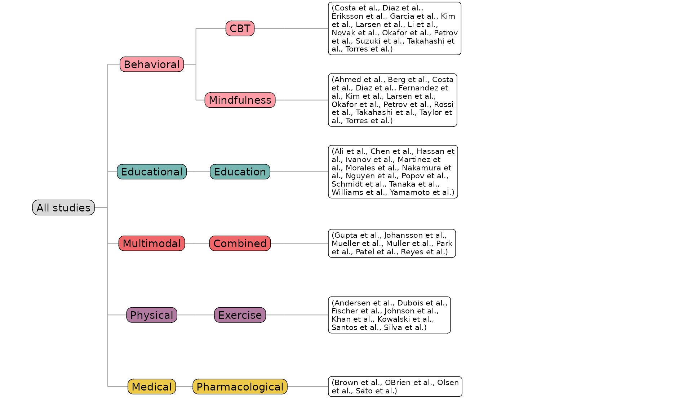

## `base_size`: overall scaling

A single knob scales the text and boxes proportionally:

``` r

reviewTree(studies, c("InterventionType", "Intervention"),
           study_id = Author, base_size = 14)
```

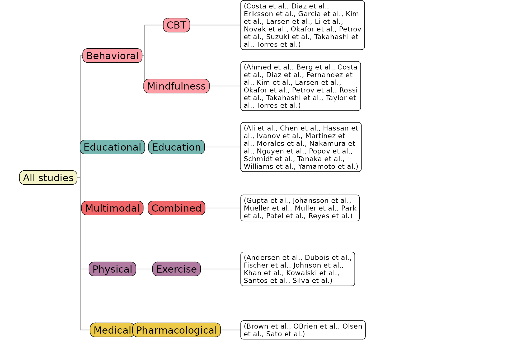

## Missing data: `na.rm` and `na_label`

By default missing values are dropped. Keep them as an explicit branch
with `na.rm = FALSE`; `na_label` names it:

``` r

reviewTree(studies, c("PubType", "FundingSource"), study_id = Author,
           na.rm = FALSE, na_label = "Not reported", show_members = FALSE)
```

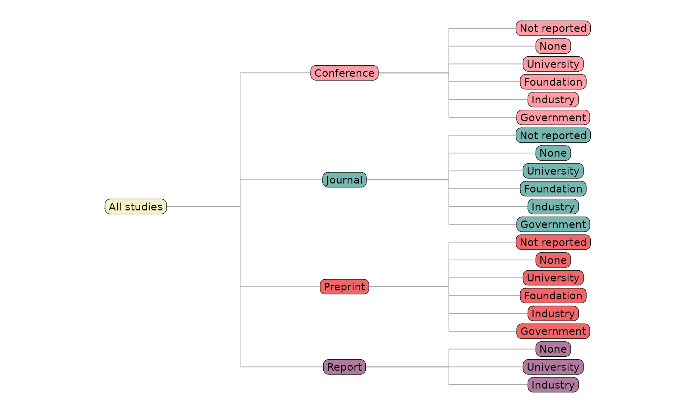

## Composing with ggplot2

[`reviewTree()`](https://sonsoles.me/litReview/reference/reviewTree.md)
returns a plain ggplot, so you can keep adding layers with `+`:

``` r

reviewTree(studies, c("InterventionType", "Intervention"), study_id = Author) +
  labs(title = "Intervention taxonomy",
       subtitle = "Studies grouped by intervention type")
```

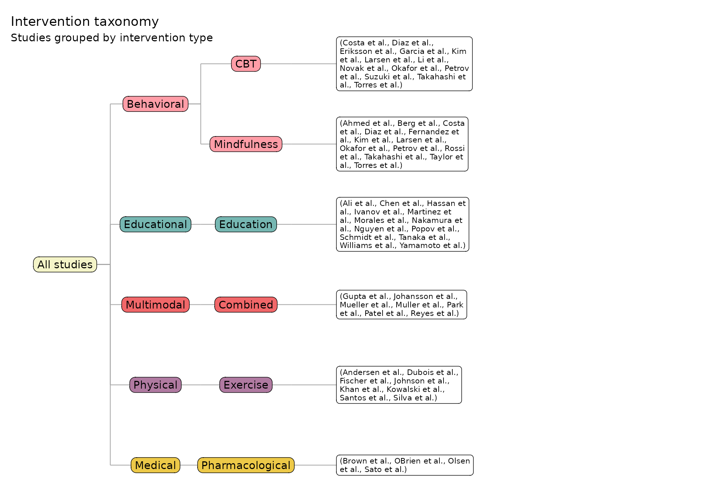
