# Treemaps

``` r

library(litReview)
library(ggplot2)
data(studies)
```

[`reviewTreemap()`](https://sonsoles.me/litReview/reference/reviewTreemap.md)
displays category frequencies as nested rectangles whose area is
proportional to the count — a compact alternative to a bar chart when
you have many categories or a second grouping level. It requires the
**treemapify** package. This article walks through **every argument** of

``` r

reviewTreemap(data, col, color_by = NULL, sep = "\r\n", colors = PALETTE,
              base_size = 12, na.rm = TRUE, na_label = "Not reported",
              study_id = StudyID, studlabs = FALSE, border_col = "white")
```

## Default

Pass the data frame and a column. Column names may be bare or quoted.
Each distinct value becomes one rectangle, sized by how often it occurs.

``` r

reviewTreemap(studies, Design)
```


## `col`: the column to summarize

Any categorical column works. Multi-value columns — cells holding
several values separated by [`sep`](#sep-multi-value-separator) — are
split first, so each value is counted independently. `Intervention` is
such a column:

``` r

reviewTreemap(studies, Intervention)
```

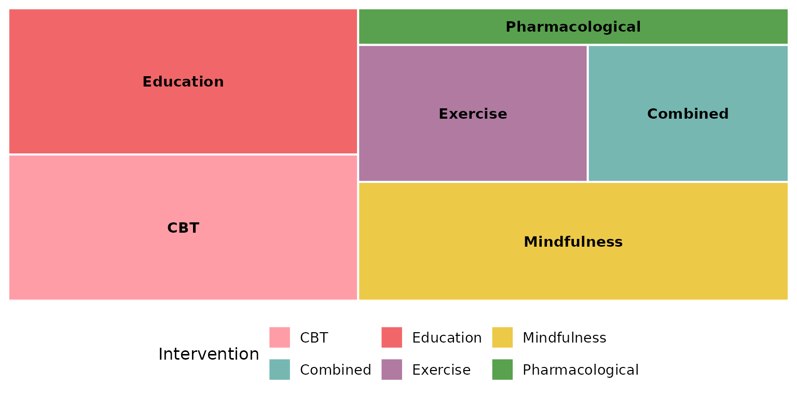

`Outcome` is another multi-value column:

``` r

reviewTreemap(studies, Outcome)
```

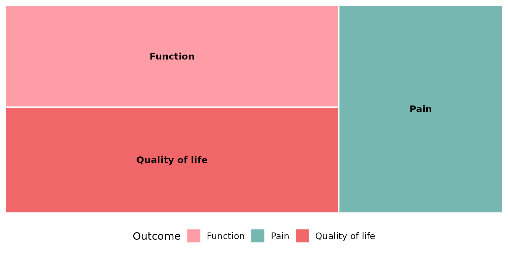

## `color_by`: hierarchical grouping

Supplying `color_by` nests `col` inside a higher-order column and colors
the tiles by that grouping, with a visible subgroup border. The classic
pairing is interventions grouped by their broader type:

``` r

reviewTreemap(studies, Intervention, color_by = InterventionType)
```


Without `color_by` (the default `NULL`), rectangles are simply colored
by `col` itself and there is no grouping:

``` r

reviewTreemap(studies, Intervention)
```

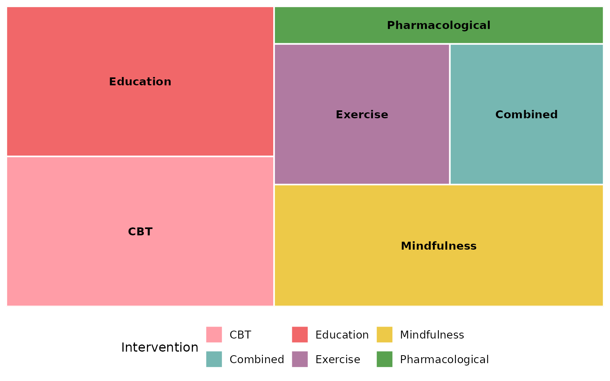

## `sep`: multi-value separator

Multi-value cells are split on `sep` before counting. The default
`"\r\n"` matches the newline-separated cells in `studies` (used above
for `Intervention` and `Outcome`). If your data uses a different
delimiter, set `sep`. Here we rebuild a semicolon-separated column to
demonstrate:

``` r

studies_semi <- studies
studies_semi$Intervention <- gsub("\r\n|\n", "; ", studies_semi$Intervention)
reviewTreemap(studies_semi, Intervention, sep = "; ")
```


## `colors`: the fill palette

By default tiles are filled from the package
[`PALETTE`](https://sonsoles.me/litReview/reference/PALETTE.md), cycled
to cover the categories:

``` r

reviewTreemap(studies, Design, colors = PALETTE)
```


Pass any **vector** of colors to use your own scheme (recycled if
shorter than the number of tiles):

``` r

reviewTreemap(studies, Design,
              colors = c("#59a14f", "#f28e2b", "#4e79a7", "#e15759", "#b07aa1"))
```

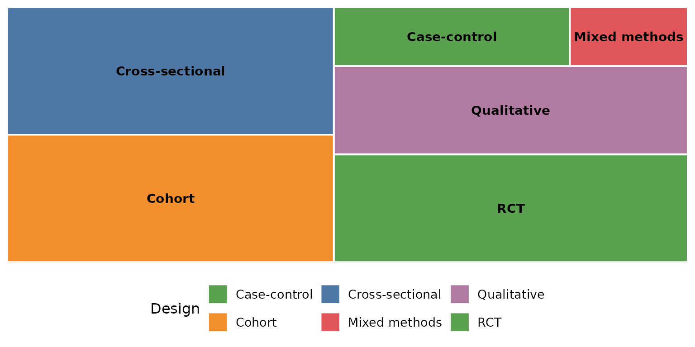

A **named** vector pins specific colors to specific categories:

``` r

reviewTreemap(studies, Design,
              colors = c("Qualitative" = "#f16769",
                         "Cohort"      = "#7ea9c7",
                         "RCT"         = "#59a14f"))
```

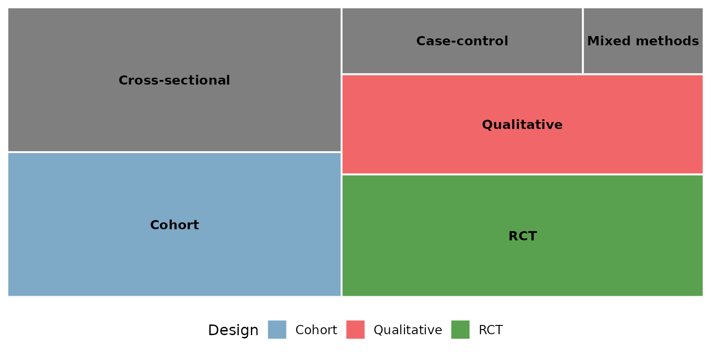

When `color_by` is set, `colors` maps onto the grouping column instead:

``` r

reviewTreemap(studies, Intervention, color_by = InterventionType,
              colors = PALETTE)
```

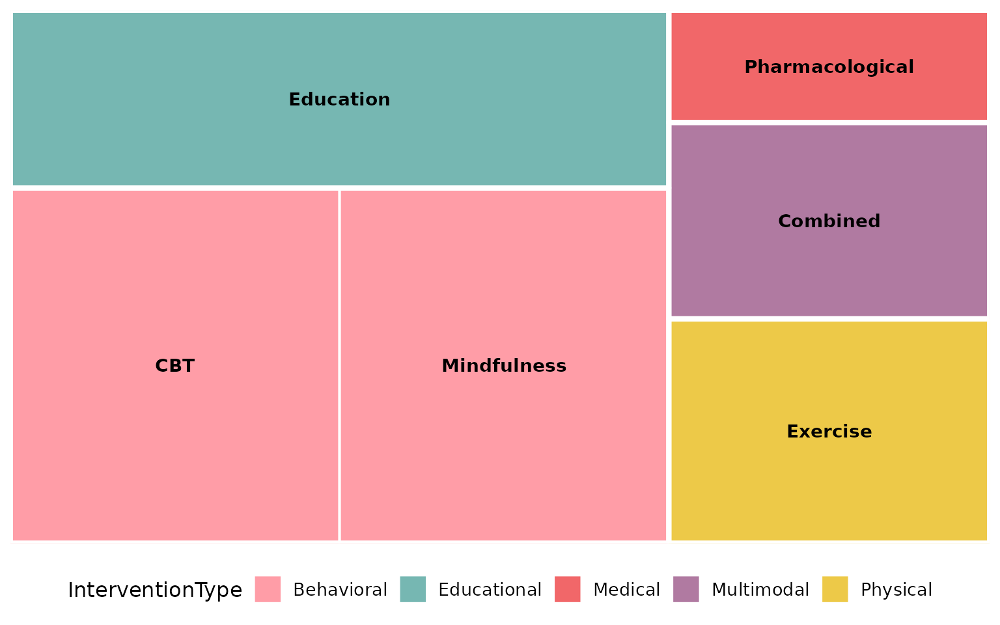

## `base_size`: overall text and element scaling

A single knob scales the text (and border thickness) proportionally.
Smaller, for multi-panel figures:

``` r

reviewTreemap(studies, Design, base_size = 9)
```

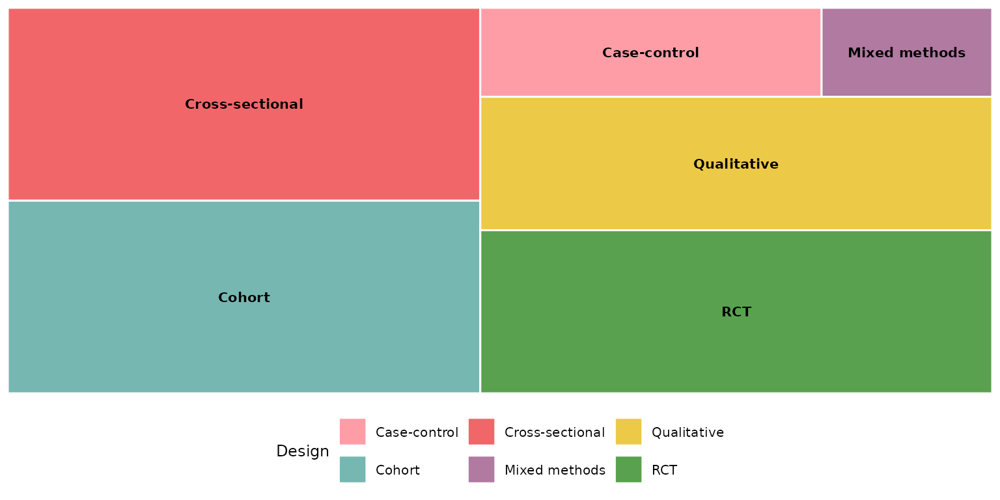

Larger, for slides or posters:

``` r

reviewTreemap(studies, Design, base_size = 18)
```

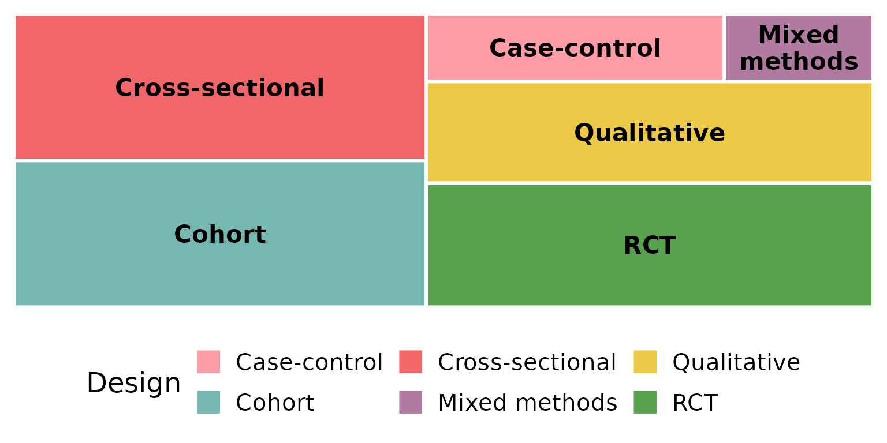

## Missing data: `na.rm` and `na_label`

These two arguments control how `NA` (and empty) cells are treated. We
use a column that actually has missing values — `FundingSource`.

By default `na.rm = TRUE` drops missing rows entirely, so they
contribute no rectangle:

``` r

reviewTreemap(studies, FundingSource)
```

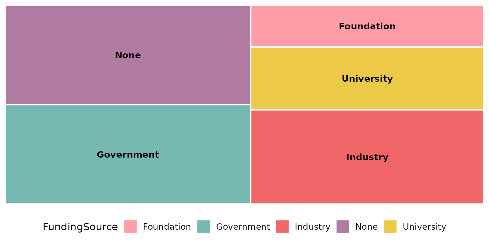

Keep the missing rows as their own tile with `na.rm = FALSE`; `na_label`
sets its name:

``` r

reviewTreemap(studies, FundingSource, na.rm = FALSE, na_label = "Not reported")
```

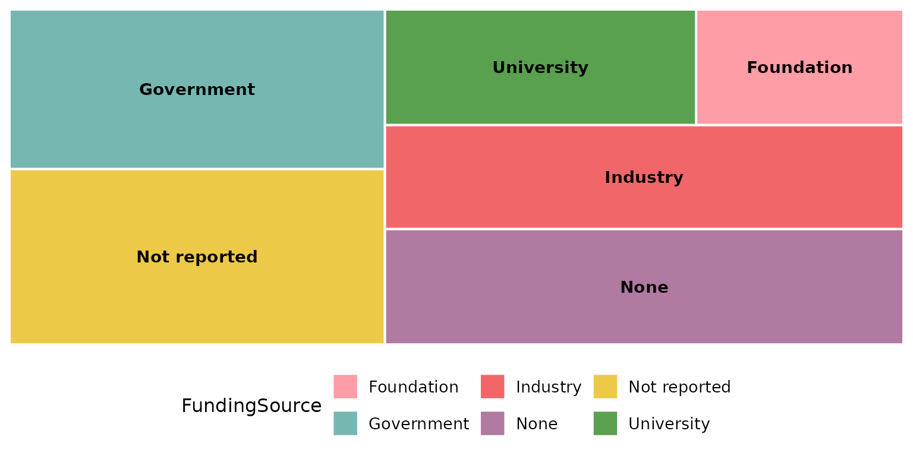

`na_label` accepts any string:

``` r

reviewTreemap(studies, FundingSource, na.rm = FALSE, na_label = "Unknown funding")
```

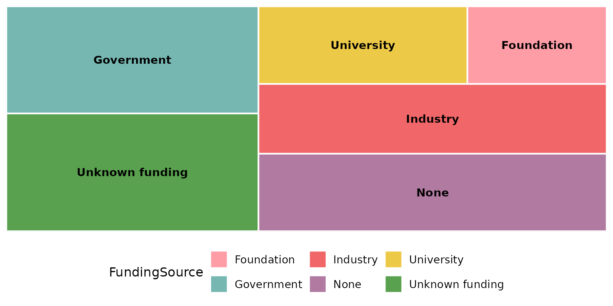

## `study_id` and `studlabs`: label tiles with study IDs

Set `studlabs = TRUE` to print the contributing study identifiers inside
each rectangle, beneath the category name. This feature relies on the
**ggfittext** package to fit the text.

``` r

reviewTreemap(studies, Design, studlabs = TRUE)
```


`study_id` selects which column supplies those identifiers (default
`StudyID`). Here we label with the author instead:

``` r

reviewTreemap(studies, Design, studlabs = TRUE, study_id = Author)
```

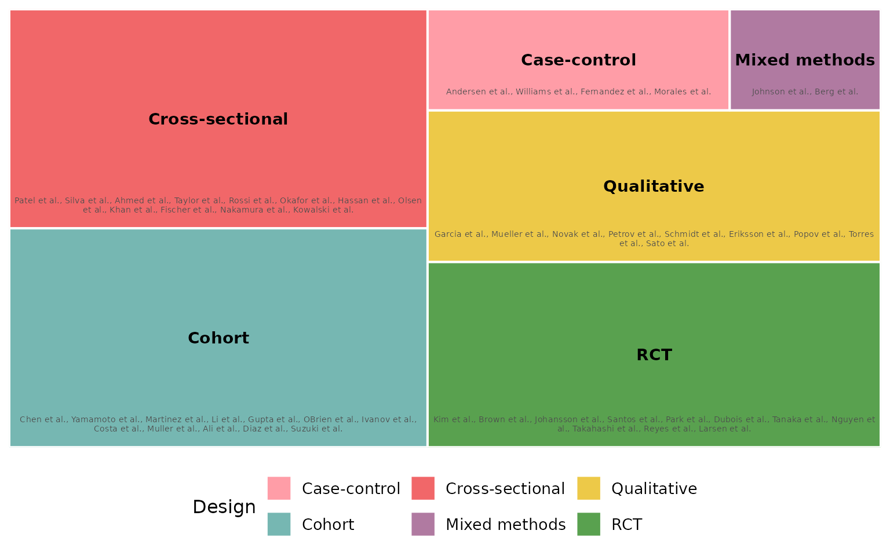

## `border_col`: rectangle border color

Borders separate adjacent tiles. The default is `"white"`:

``` r

reviewTreemap(studies, Design, border_col = "white")
```


A dark border reads well on light fills:

``` r

reviewTreemap(studies, Design, border_col = "grey20")
```

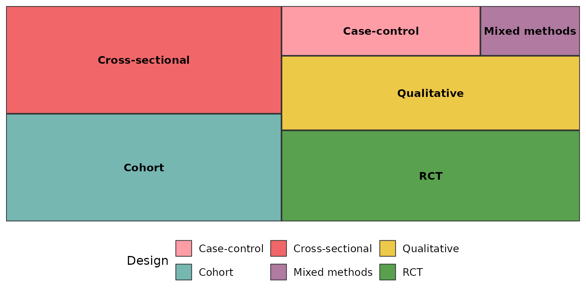

Pure black gives the strongest separation, and also outlines the
subgroups when `color_by` is used:

``` r

reviewTreemap(studies, Intervention, color_by = InterventionType,
              border_col = "black")
```

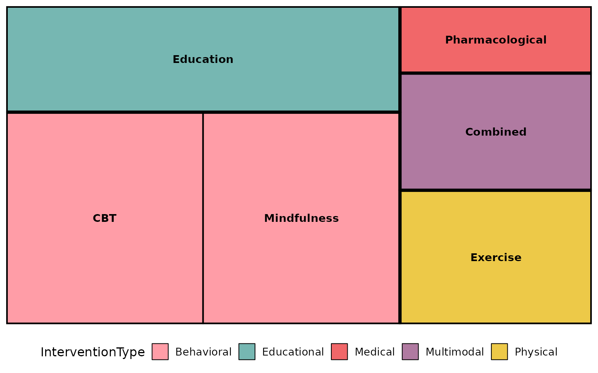

## Composing with ggplot2

Every `review*()` function returns a plain ggplot, so you can keep
adding layers, scales, and labels with `+`:

``` r

reviewTreemap(studies, Design) +
  labs(title = "Study designs", subtitle = "n = 50 studies",
       caption = "Source: example dataset") +
  theme(plot.title.position = "plot")
```

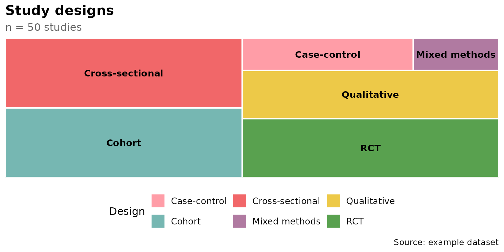
