# Trend charts

``` r

library(litReview)
library(ggplot2)
data(studies)
```

[`reviewTrend()`](https://sonsoles.me/litReview/reference/reviewTrend.md)
shows how the values of one column distribute across publication years,
drawing one stacked bar per year. It answers questions like “which study
designs have grown over time?”. This article walks through **every
argument** of

``` r

reviewTrend(data, col, year_col = Year, sep = "\r\n", colors = PALETTE,
            base_size = 12, na.rm = TRUE, na_label = "Not reported",
            labels = c("none", "count", "percent", "both", "studies"),
            study_id = StudyID)
```

## Default

Pass the data frame and a column. Column names may be bare or quoted.
Each year becomes a stacked bar whose segments are the categories of
`col`, and the y-axis counts studies.

``` r

reviewTrend(studies, Design)
```


## `col`: the column to track

Any categorical column works. Here we track the analysis setting over
time:

``` r

reviewTrend(studies, Setting)
```

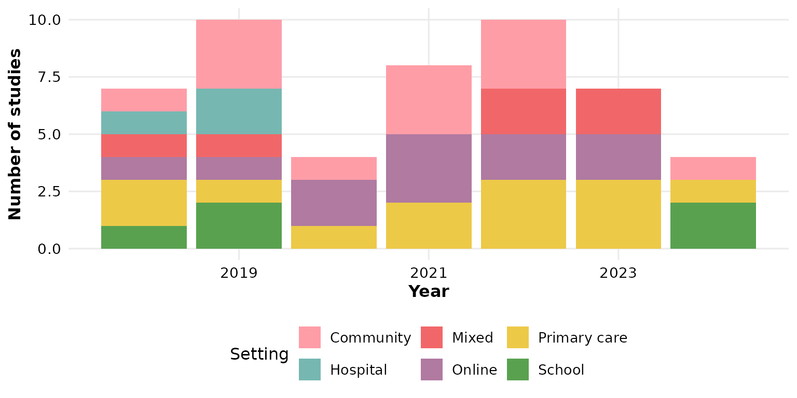

Multi-value columns (cells holding several values) are split first, so
each value is counted independently in its year — see
[`sep`](#sep-multi-value-separator) below. `Outcome` is such a column:

``` r

reviewTrend(studies, Outcome)
```

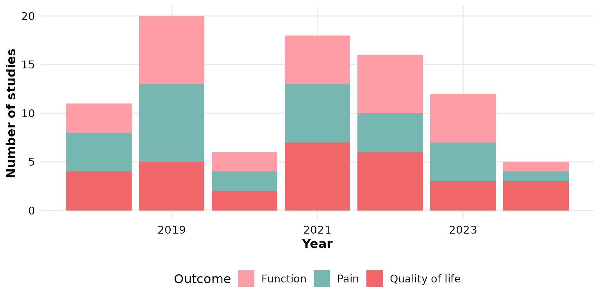

## `year_col`: the year column

By default the years come from the `Year` column. If your data names it
differently, pass `year_col`. Below we rename the column and point
[`reviewTrend()`](https://sonsoles.me/litReview/reference/reviewTrend.md)
at it explicitly:

``` r

studies_pubyear <- studies
studies_pubyear$PubYear <- studies_pubyear$Year
reviewTrend(studies_pubyear, Design, year_col = PubYear)
```


## `sep`: multi-value separator

Cells holding several values are split on `sep` before counting. In
`studies`, `Outcome` uses newline separators (`"\r\n"`, the default). If
your data uses a different delimiter, set `sep`. Here we rebuild a
semicolon-separated column to demonstrate:

``` r

studies_semi <- studies
studies_semi$Outcome <- gsub("\r\n", "; ", studies_semi$Outcome)
reviewTrend(studies_semi, Outcome, sep = "; ")
```

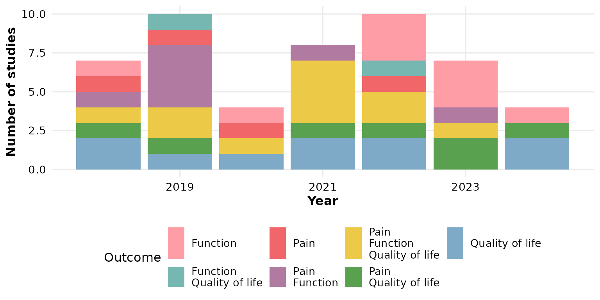

## `colors`: the fill palette

Segments are filled by cycling through `colors`, which defaults to the
package [`PALETTE`](https://sonsoles.me/litReview/reference/PALETTE.md):

``` r

reviewTrend(studies, Design, colors = PALETTE)
```


Pass a **custom vector** to restyle every category (recycled if shorter
than the number of categories):

``` r

reviewTrend(studies, Design,
            colors = c("#264653", "#2a9d8f", "#e9c46a", "#f4a261",
                       "#e76f51", "#8ab17d"))
```

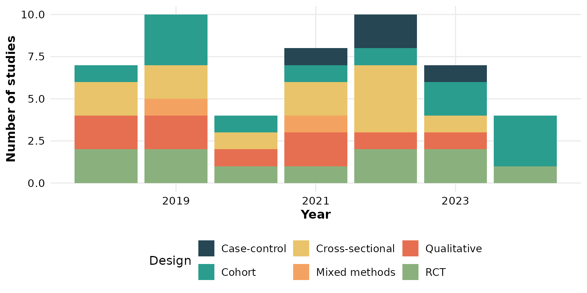

A **named** vector pins specific colors to specific categories:

``` r

reviewTrend(studies, Design,
            colors = c("RCT" = "#f16769", "Cohort" = "#7ea9c7",
                       "Qualitative" = "#59a14f", "Cross-sectional" = "#edc948",
                       "Mixed methods" = "#b07aa1", "Case-control" = "#76b7b2"))
```

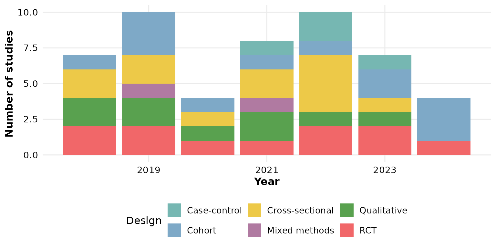

## `base_size`: overall text and element scaling

A single knob scales all text and spacing proportionally. Smaller, for
multi-panel figures:

``` r

reviewTrend(studies, Design, base_size = 9)
```

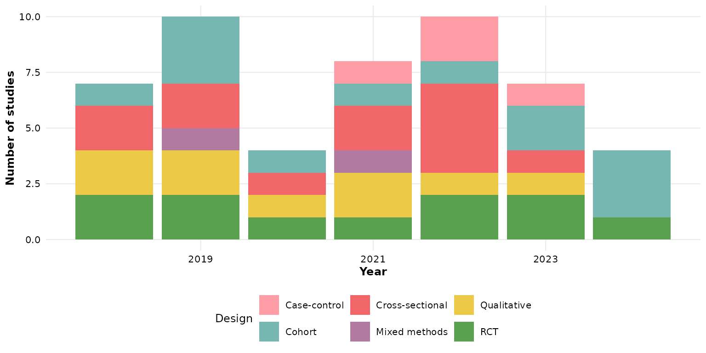

Larger, for slides or posters:

``` r

reviewTrend(studies, Design, base_size = 18)
```

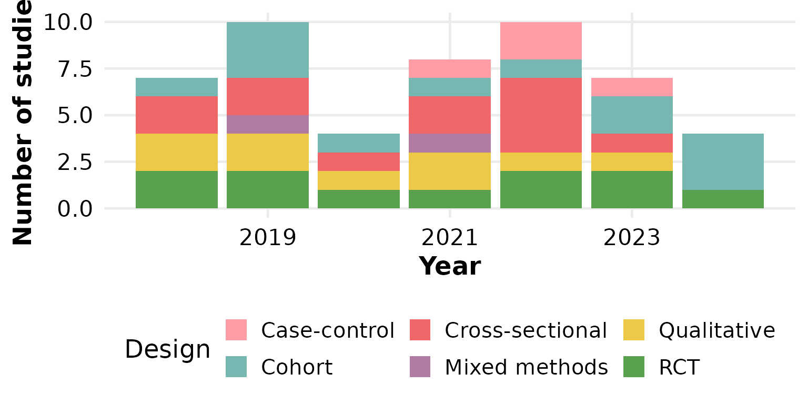

## Missing data: `na.rm` and `na_label`

These two arguments control how `NA` (and empty) cells are treated. We
use a column that actually has missing values — `FundingSource`.

By default `na.rm = TRUE` drops missing rows entirely:

``` r

reviewTrend(studies, FundingSource)
```

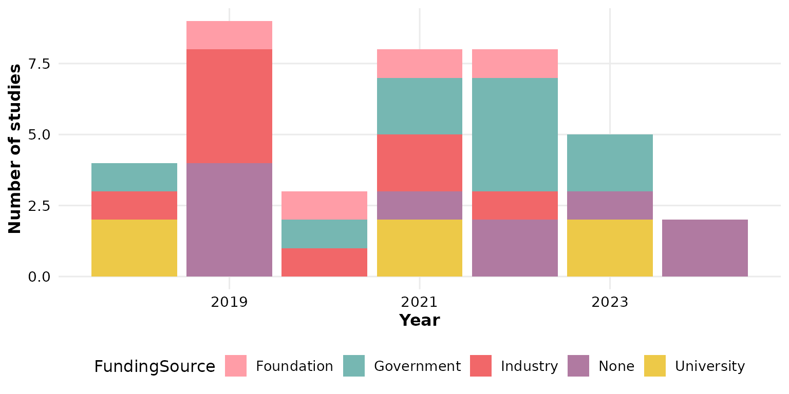

Keep the missing rows as their own category with `na.rm = FALSE`;
`na_label` sets the name of that category:

``` r

reviewTrend(studies, FundingSource, na.rm = FALSE, na_label = "Not reported")
```

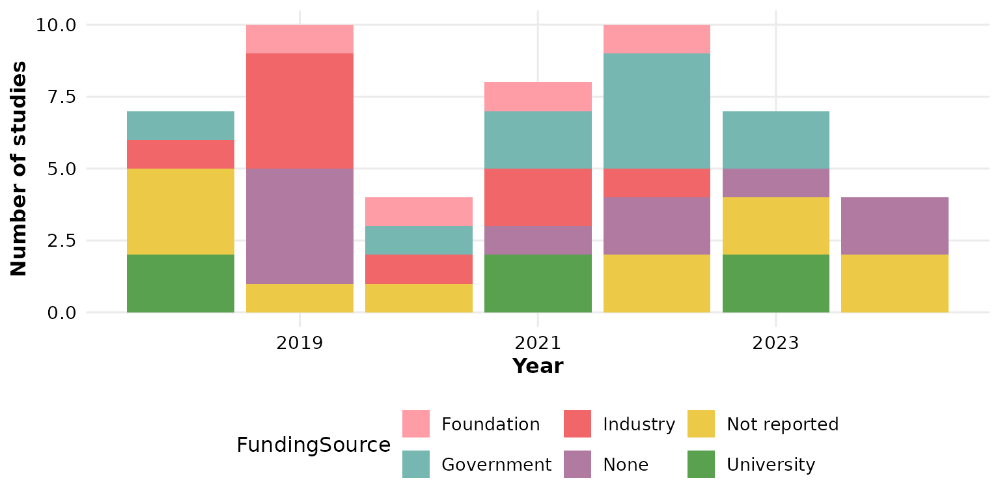

## `labels`: what to print on each segment

`labels` controls the text overlaid on each stacked segment. The default
is `"none"` — clean bars with no annotation:

``` r

reviewTrend(studies, Design, labels = "none")
```


`"count"` prints the number of studies in each segment:

``` r

reviewTrend(studies, Design, labels = "count")
```

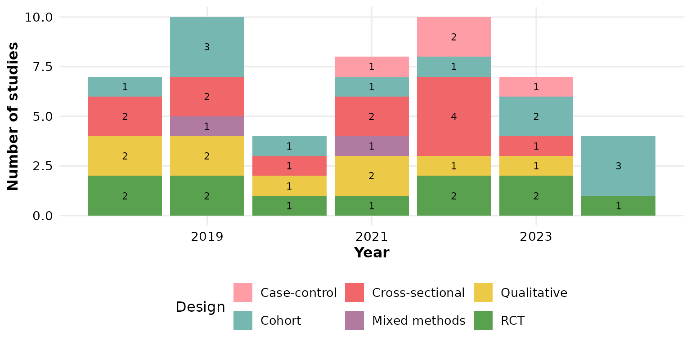

`"percent"` prints each segment’s share **within its year**, so the
segments of one bar sum to 100%:

``` r

reviewTrend(studies, Design, labels = "percent")
```


`"both"` combines the two, showing count and within-year percentage:

``` r

reviewTrend(studies, Design, labels = "both")
```

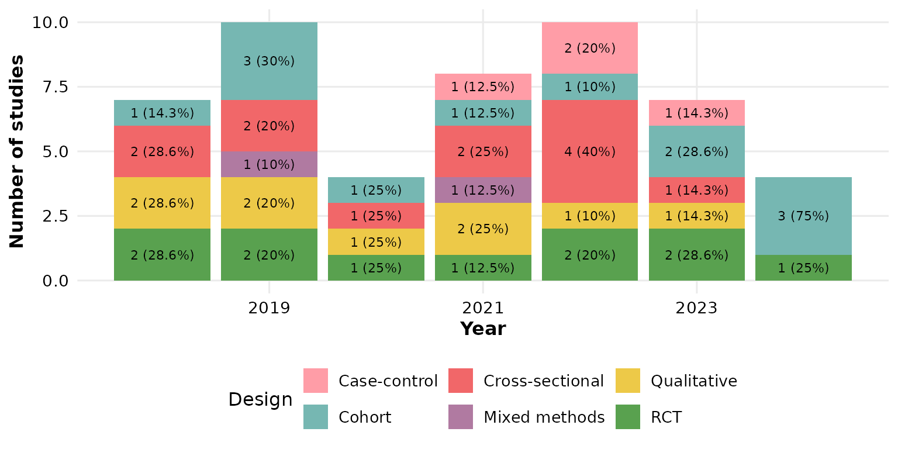

`"studies"` overlays the contributing study identifiers themselves, one
per line. This is most legible when categories are few, so give the
panel some height:

``` r

reviewTrend(studies, Design, labels = "studies")
```


## `study_id`: which column supplies the IDs

When `labels = "studies"`, the `study_id` column provides the
identifiers (default `StudyID`). Point it at any ID-like column — here
we label with the author instead:

``` r

reviewTrend(studies, Design, labels = "studies", study_id = Author)
```

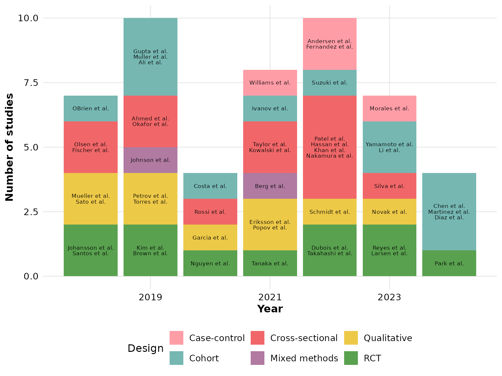

## Composing with ggplot2

Every `review*()` function returns a plain ggplot, so you can keep
adding layers, scales, and labels with `+`:

``` r

reviewTrend(studies, Design, colors = PALETTE) +
  labs(title = "Study designs over time", subtitle = "n = 50 studies",
       caption = "Source: example dataset") +
  theme(plot.title.position = "plot")
```

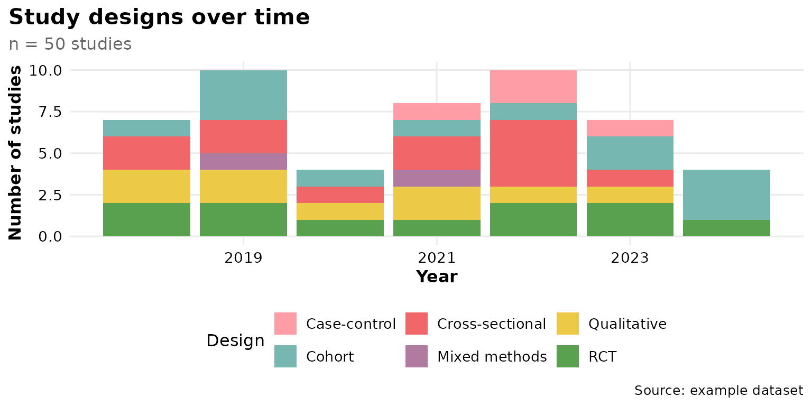
