# UpSet plots

``` r

library(litReview)
library(ggplot2)
data(studies)
```

[`reviewUpset()`](https://sonsoles.me/litReview/reference/reviewUpset.md)
visualizes how the values of a multi-value column **co-occur** across
studies. Each study contributes the *set* of distinct values it reports
in that column. Every observed combination of values becomes a bar whose
height counts how many studies share that exact set, and a dot matrix
beneath the bars marks which values make up each combination. This
generalizes the pairwise
[`reviewOverlap()`](https://sonsoles.me/litReview/reference/reviewOverlap.md)
to three or more co-occurring values. This article walks through **every
argument** of

``` r

reviewUpset(data, col, sep = "\r\n", study_id = StudyID, base_size = 12,
            na.rm = TRUE, na_label = "Not reported", n_intersections = 15,
            sort_by = c("freq", "degree"), fill = "#7BB0D1")
```

[`reviewUpset()`](https://sonsoles.me/litReview/reference/reviewUpset.md)
requires the **ggupset** package.

## Default

Pass the data frame and a multi-value column. `Outcome` records the
outcomes each study measured, newline-separated. The tallest bars are
the most common outcome combinations; the dots beneath show which
outcomes each combination contains.

``` r

reviewUpset(studies, Outcome)
```


[`reviewUpset()`](https://sonsoles.me/litReview/reference/reviewUpset.md)
shows the two panels that answer “which combinations occur, and how
often”: the intersection-size bars and the combination matrix. The
optional per-value *set-size* sidebar from some UpSet implementations is
intentionally omitted so the result stays a single,
`theme_litreview`-styled ggplot you can extend with `+`. For the
individual value totals, use
[`reviewBar()`](https://sonsoles.me/litReview/articles/bar.md) on the
same column.

## `col`: the multi-value column to analyze

Any column whose cells may hold several values works. Here we look at
how interventions co-occur:

``` r

reviewUpset(studies, Intervention)
```

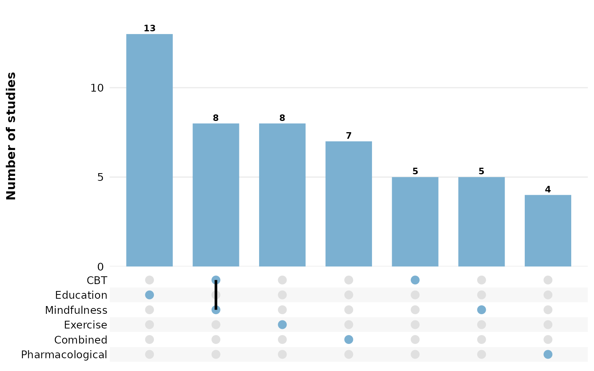

Age groups:

``` r

reviewUpset(studies, AgeGroup)
```

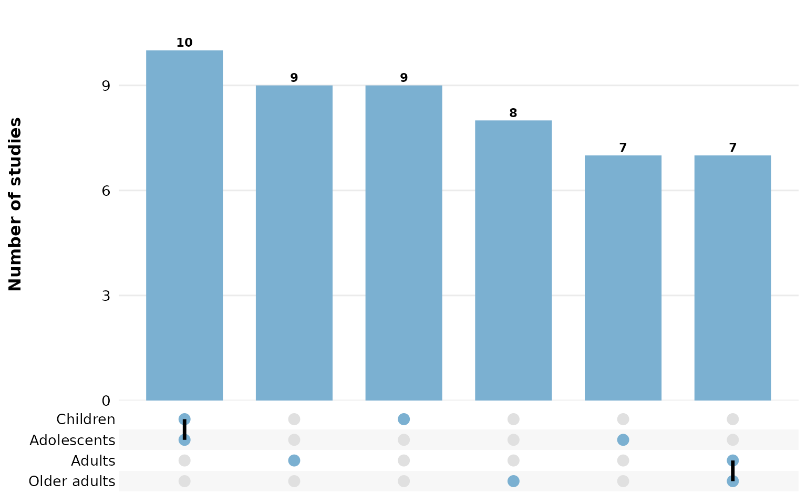

Countries — many studies span several, so their combinations are rich:

``` r

reviewUpset(studies, Country)
```

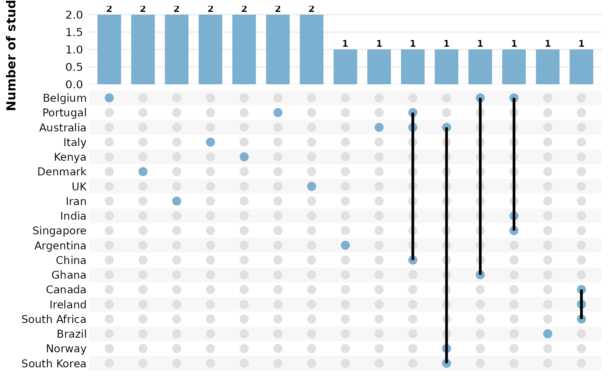

## `sep`: multi-value separator

Cells holding several values are split on `sep` before the sets are
built. In `studies`, the multi-value columns use newline separators
(`"\r\n"`, the default), so each value is treated independently. If your
data uses a different delimiter, set `sep`. Here we rebuild a
semicolon-separated column to demonstrate:

``` r

studies_semi <- studies
studies_semi$Outcome <- gsub("\r\n|\n", "; ", studies_semi$Outcome)
reviewUpset(studies_semi, Outcome, sep = "; ")
```


## `study_id`: how studies are grouped into sets

One set is formed per study, and `study_id` names the column that
identifies studies (default `StudyID`). All rows sharing an identifier
are pooled into a single combination. Point it at a different identifier
column to regroup — here we group by `Author` instead:

``` r

reviewUpset(studies, Outcome, study_id = Author)
```

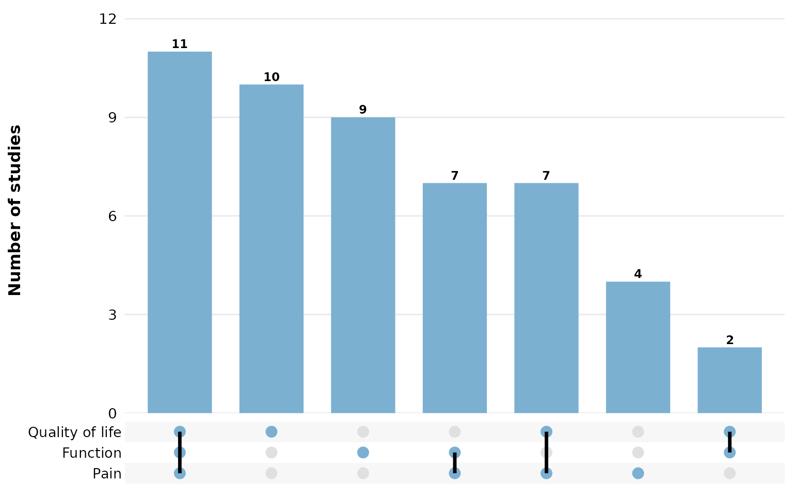

## `base_size`: overall text and element scaling

A single knob scales all text, bars, and matrix dots proportionally.
Smaller, for multi-panel figures:

``` r

reviewUpset(studies, Outcome, base_size = 9)
```

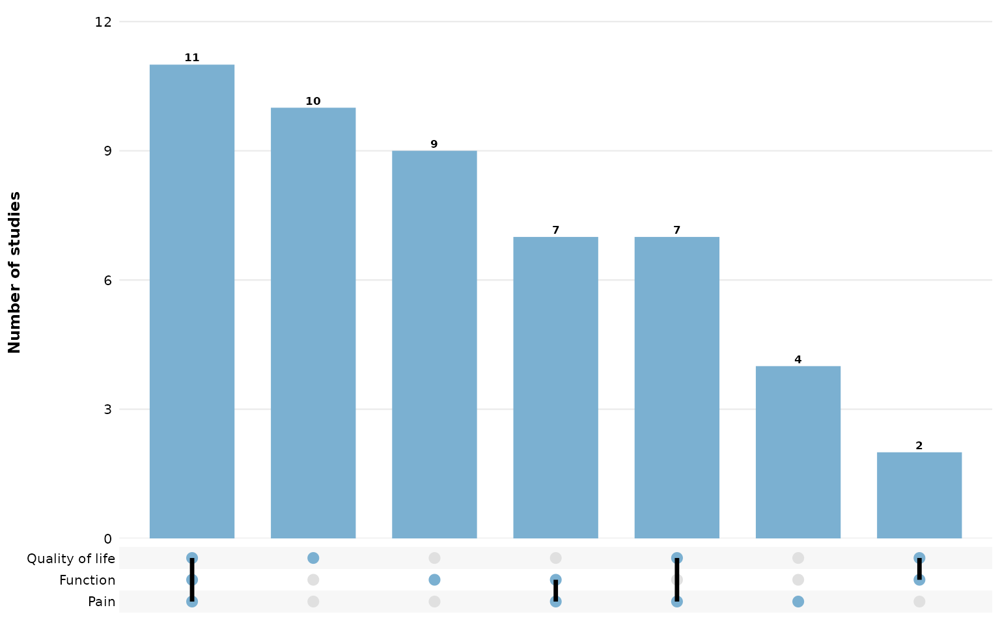

Larger, for slides or posters:

``` r

reviewUpset(studies, Outcome, base_size = 16)
```

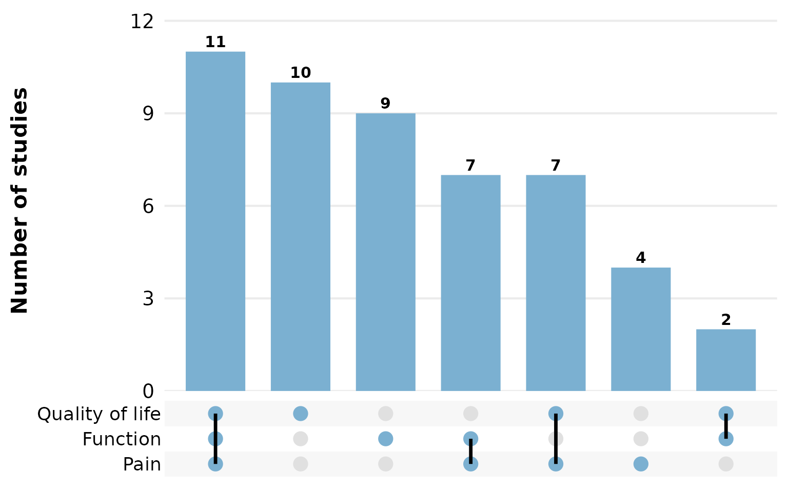

## Missing data: `na.rm` and `na_label`

These two arguments control how `NA` (and empty) cells are treated. By
default `na.rm = TRUE` drops missing values, so studies that report
nothing for the column contribute no set and vanish from the plot.

Set `na.rm = FALSE` to keep missing values as a distinct set member, and
`na_label` names it. A study reporting only a missing value then forms
its own single-element combination:

``` r

reviewUpset(studies, FundingSource, na.rm = FALSE, na_label = "Not reported")
```

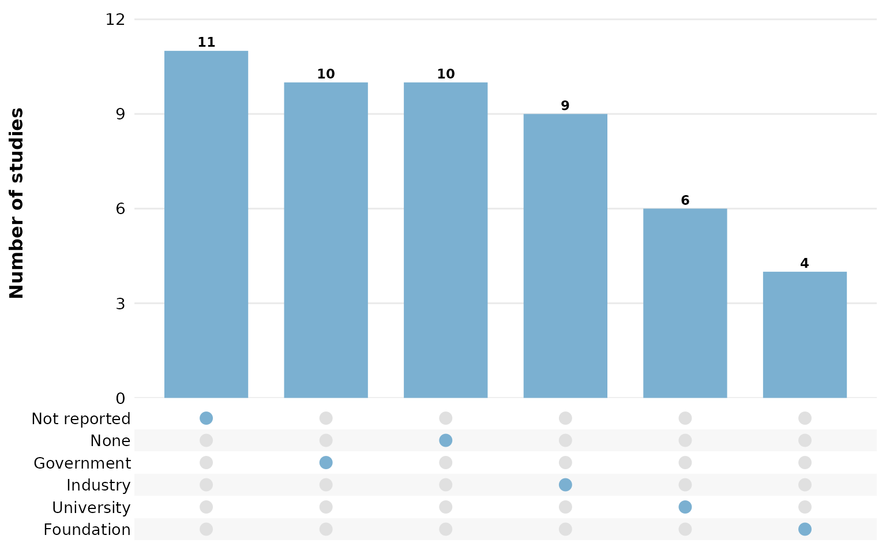

## `n_intersections`: cap on the number of combinations shown

Only the largest `n_intersections` combinations are drawn (default
`15`), keeping the plot readable when many distinct sets exist. Lower it
to focus on the few most common combinations:

``` r

reviewUpset(studies, Country, n_intersections = 6)
```

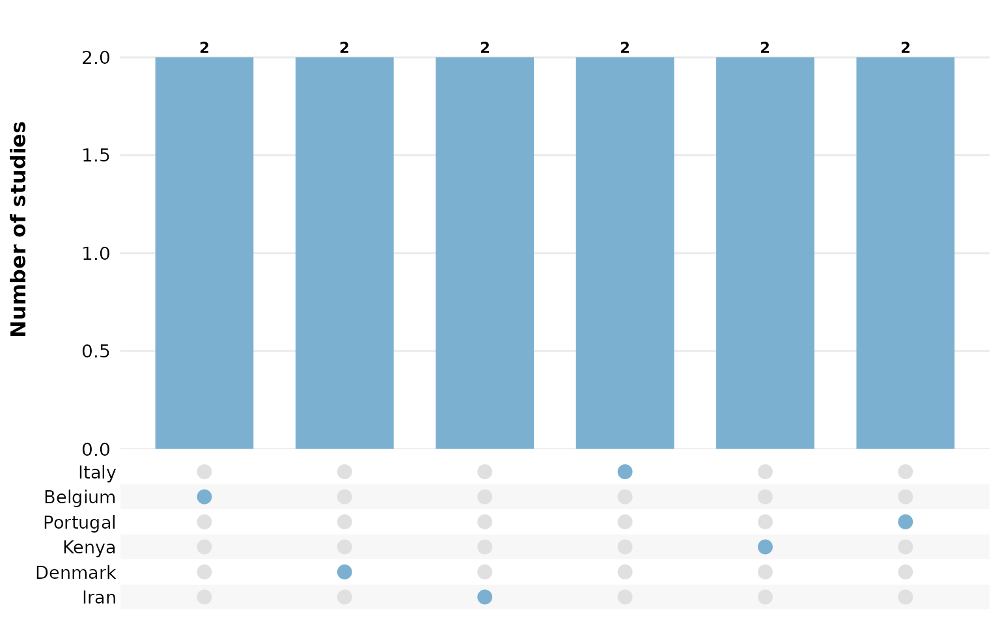

## `sort_by`: ordering the combinations

`sort_by = "freq"` (the default) orders bars by intersection size, so
the most common combinations sit on the left:

``` r

reviewUpset(studies, Outcome, sort_by = "freq")
```


`sort_by = "degree"` instead orders by the number of values in each
combination, grouping single-value sets, then pairs, then triples, and
so on:

``` r

reviewUpset(studies, Outcome, sort_by = "degree")
```

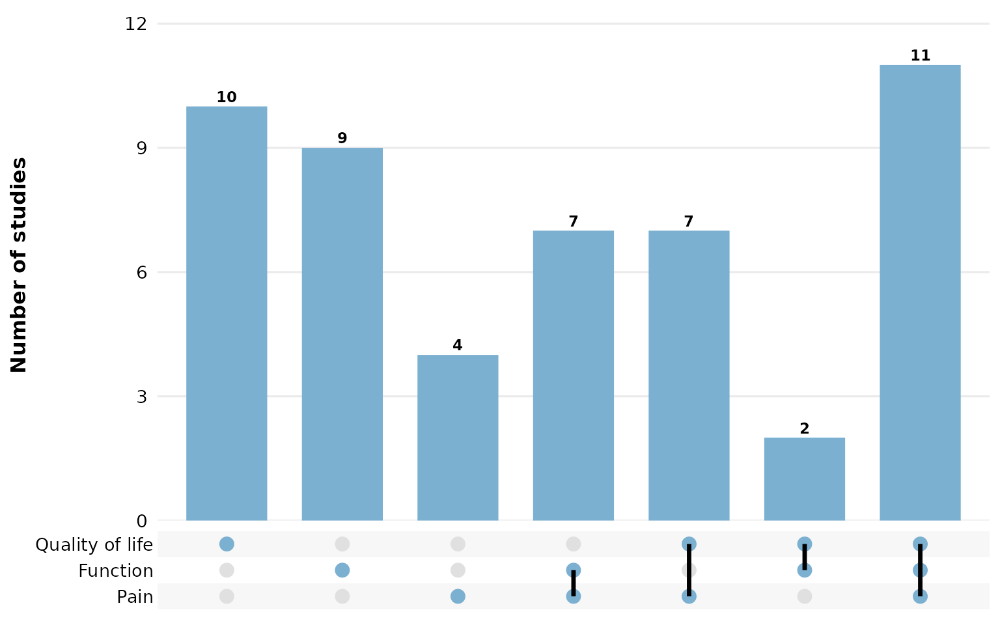

## `fill`: bar and matrix-dot color

A single hex color paints every bar and every filled matrix dot:

``` r

reviewUpset(studies, Outcome, fill = "#59a14f")
```

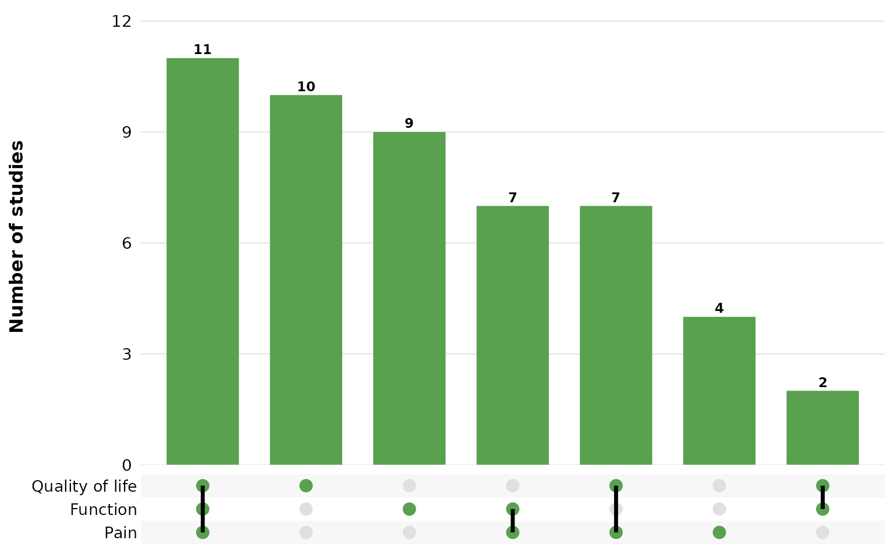

Use one of the package
[`PALETTE`](https://sonsoles.me/litReview/reference/PALETTE.md) colors:

``` r

reviewUpset(studies, Outcome, fill = PALETTE[4])
```

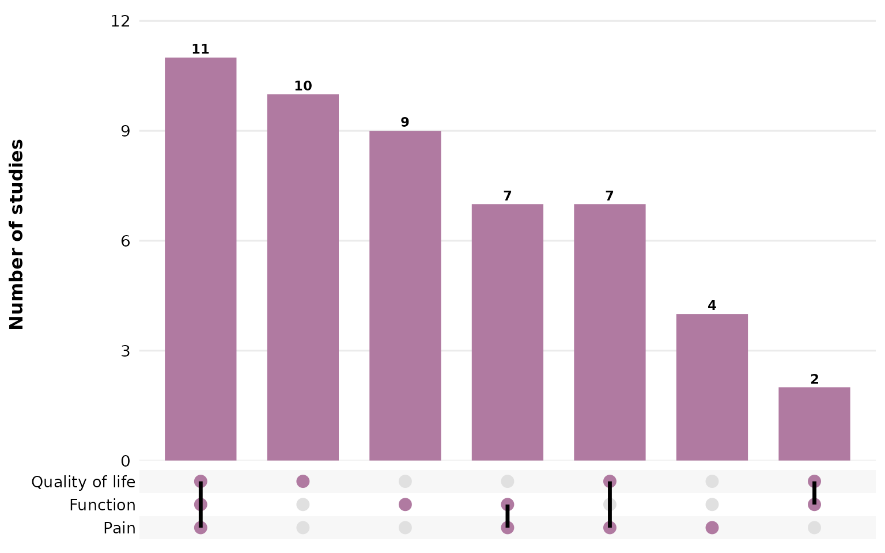

## Composing with ggplot2

Every `review*()` function returns a plain ggplot, so you can keep
adding layers, scales, and labels with `+`:

``` r

reviewUpset(studies, Outcome, fill = "#59a14f") +
  labs(title = "Outcome combinations",
       subtitle = "n = 50 studies",
       caption = "Source: example dataset") +
  theme(plot.title.position = "plot")
```

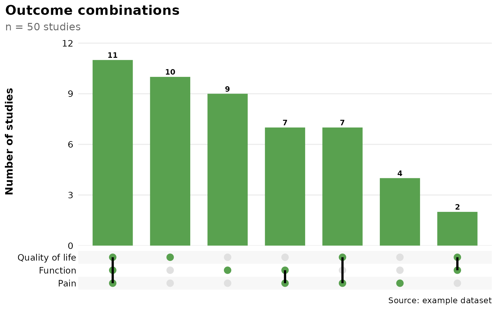
