# Waffle charts

``` r

library(litReview)
library(ggplot2)
data(studies)
```

[`reviewWaffle()`](https://sonsoles.me/litReview/reference/reviewWaffle.md)
summarizes a single column as a grid of colored squares. **Each square
represents one study occurrence of a category**, so the block of squares
for a category is proportional to its frequency. This article walks
through **every argument** of

``` r

reviewWaffle(data, col, sep = "\r\n", colors = PALETTE, ncol = 5,
             study_id = StudyID, base_size = 12, na.rm = TRUE,
             na_label = "Not reported", na_in_percent = TRUE,
             na_last = FALSE)
```

## Default

Pass the data frame and a column. Column names may be bare or quoted.
Squares are laid out row by row, ordered by frequency, and colored by
category.

``` r

reviewWaffle(studies, Design)
```

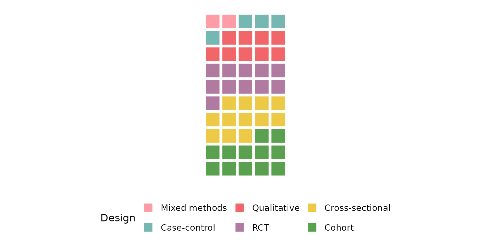

## `col`: the column to summarize

Any categorical column works. Each square is one occurrence, so a column
with more distinct categories yields a more finely divided grid.

``` r

reviewWaffle(studies, Setting)
```

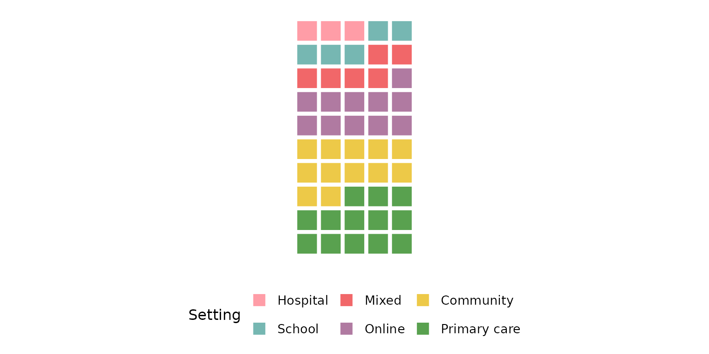

Multi-value columns (cells holding several values) are split first, and
every value contributes its own square — see
[`sep`](#sep-multi-value-separator) below. `Outcome` is such a column,
so the total number of squares exceeds the 50 studies:

``` r

reviewWaffle(studies, Outcome)
```

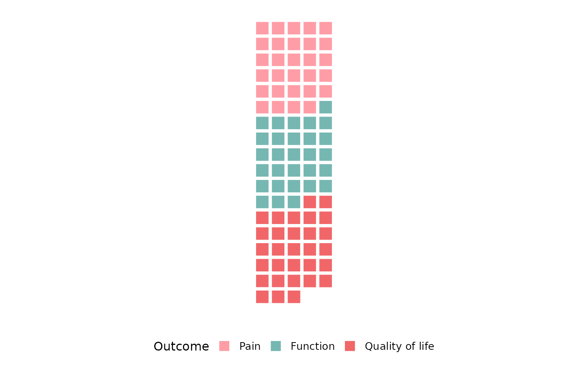

## `sep`: multi-value separator

Some cells hold several values. In `studies`, `Outcome` uses newline
separators (`"\r\n"`, the default), so each value is counted
independently and gets its own square:

``` r

reviewWaffle(studies, Outcome)
```


If your data uses a different delimiter, set `sep`. Here we rebuild a
semicolon-separated column to demonstrate:

``` r

studies_semi <- studies
studies_semi$Outcome <- gsub("\r\n", "; ", studies_semi$Outcome)
reviewWaffle(studies_semi, Outcome, sep = "; ")
```

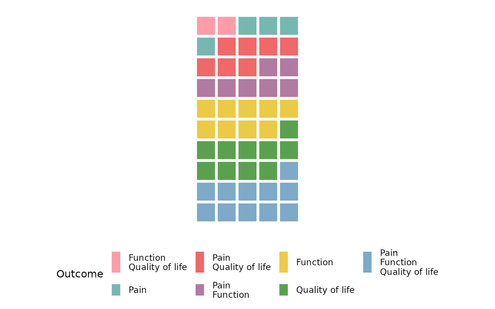

## `colors`: the fill palette

`colors` is a vector of fill colors cycled across categories. It
defaults to the package
[`PALETTE`](https://sonsoles.me/litReview/reference/PALETTE.md):

``` r

reviewWaffle(studies, Design, colors = PALETTE)
```


Pass a **custom vector** to override it. Colors are recycled if the
vector is shorter than the number of categories:

``` r

reviewWaffle(studies, Design,
             colors = c("#59a14f", "#f28e2b", "#4e79a7", "#e15759"))
```

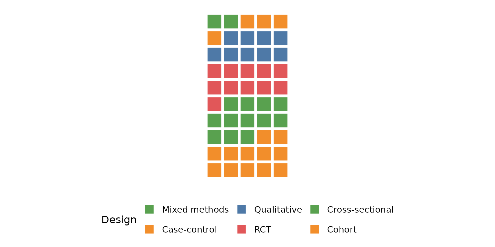

A **named** vector pins specific colors to specific categories,
regardless of their order in the grid:

``` r

reviewWaffle(studies, Design,
             colors = c("RCT" = "#f16769", "Cohort" = "#7ea9c7"))
```

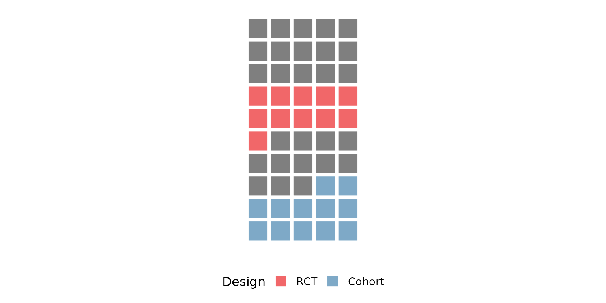

## `ncol`: number of grid columns

`ncol` sets how many squares sit in each row before wrapping to the
next. A small value makes a tall, narrow grid:

``` r

reviewWaffle(studies, Design, ncol = 3)
```

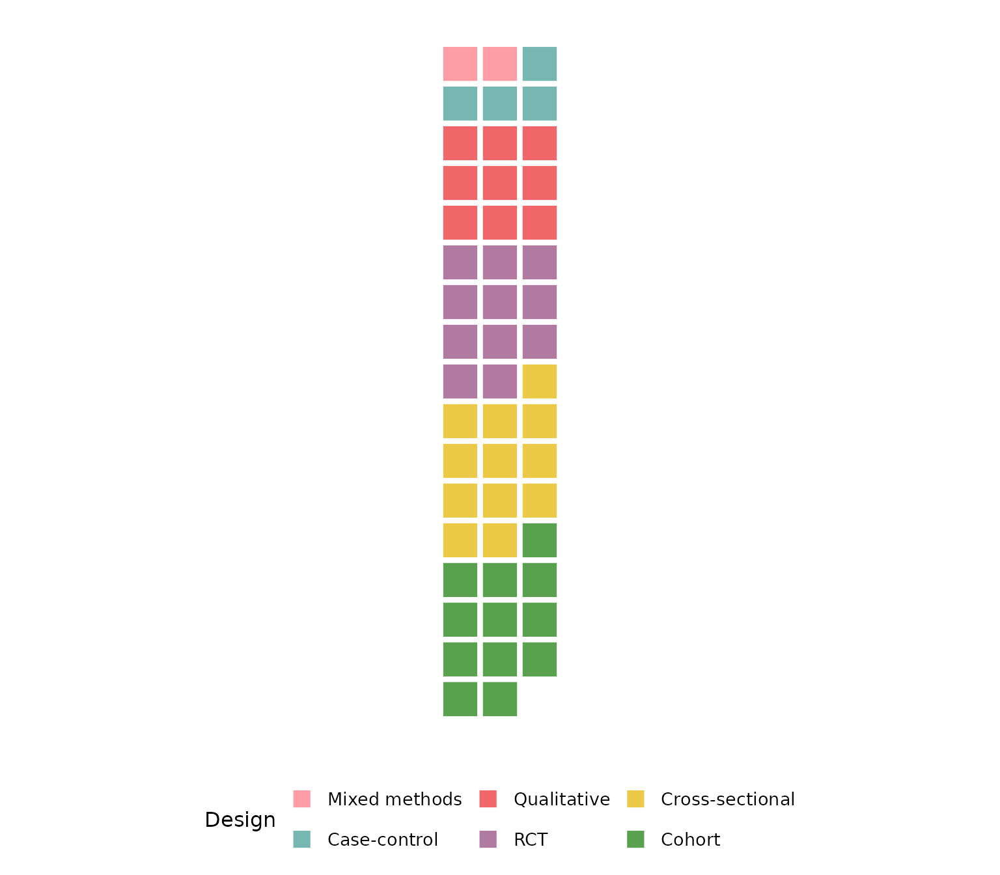

A large value makes a short, wide grid:

``` r

reviewWaffle(studies, Design, ncol = 15)
```

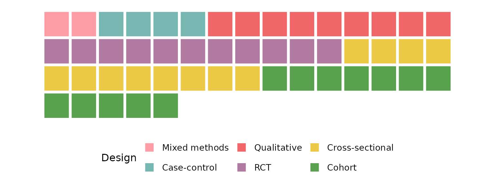

## `study_id`: the identifier column

`study_id` names the column of study identifiers (default `StudyID`)
used internally to count occurrences. It rarely needs changing, but if
your ID lives in a different column you can point to it. The counts —
and therefore the squares — are unchanged when every row has a unique
identifier:

``` r

reviewWaffle(studies, Design, study_id = Author)
```


## `base_size`: overall text and element scaling

A single knob scales all text and spacing (including the white grout
between squares) proportionally. Smaller, for multi-panel figures:

``` r

reviewWaffle(studies, Design, base_size = 9)
```

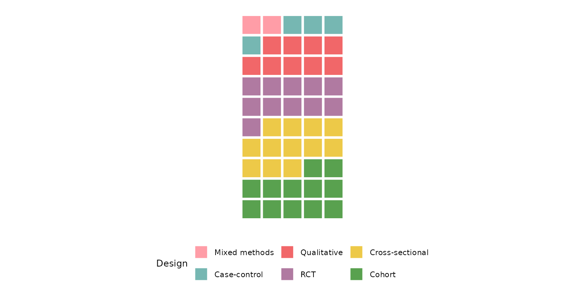

Larger, for slides or posters:

``` r

reviewWaffle(studies, Design, base_size = 18)
```

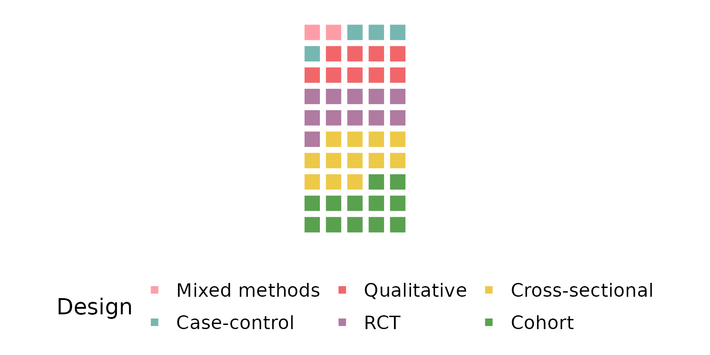

## Missing data: `na.rm`, `na_label`, `na_in_percent`, `na_last`

These four arguments control how `NA` (and empty) cells are treated. We
use a column that actually has missing values — `FundingSource`.

By default `na.rm = TRUE` drops missing rows entirely, so they
contribute no squares:

``` r

reviewWaffle(studies, FundingSource)
```

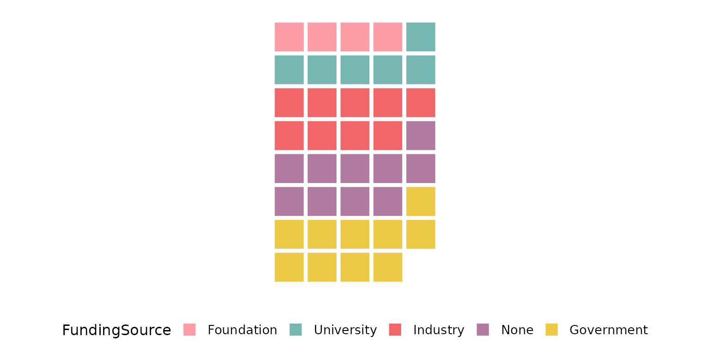

Keep the missing rows as their own category with `na.rm = FALSE`;
`na_label` sets its name and it gets its own block of squares:

``` r

reviewWaffle(studies, FundingSource, na.rm = FALSE, na_label = "Not reported")
```

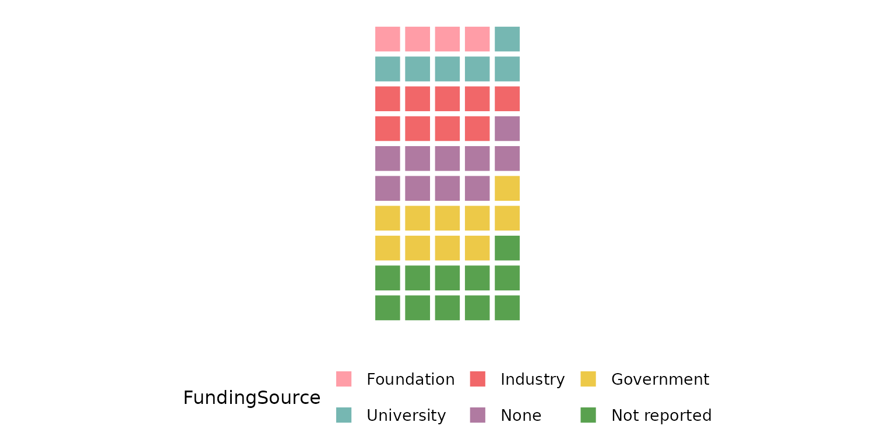

`na_in_percent` controls whether missing rows count toward the
percentage denominator used when summarizing the data. Excluding them
changes the underlying proportions (though the waffle draws one square
per occurrence either way):

``` r

reviewWaffle(studies, FundingSource, na.rm = FALSE, na_in_percent = FALSE)
```


`na_last = TRUE` forces the missing-value category to sort last, so its
block of squares appears at the end of the grid regardless of its
frequency:

``` r

reviewWaffle(studies, FundingSource, na.rm = FALSE, na_last = TRUE)
```

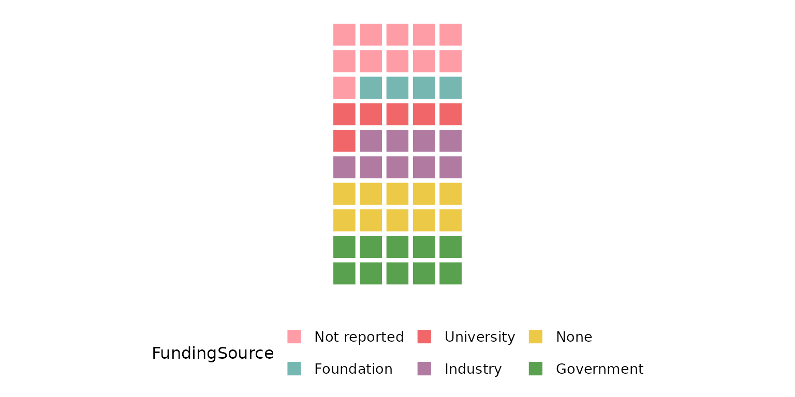

## Composing with ggplot2

Every `review*()` function returns a plain ggplot, so you can keep
adding layers, scales, and labels with `+`:

``` r

reviewWaffle(studies, Design, colors = PALETTE) +
  labs(title = "Study designs", subtitle = "n = 50 studies",
       caption = "Source: example dataset") +
  theme(plot.title.position = "plot")
```

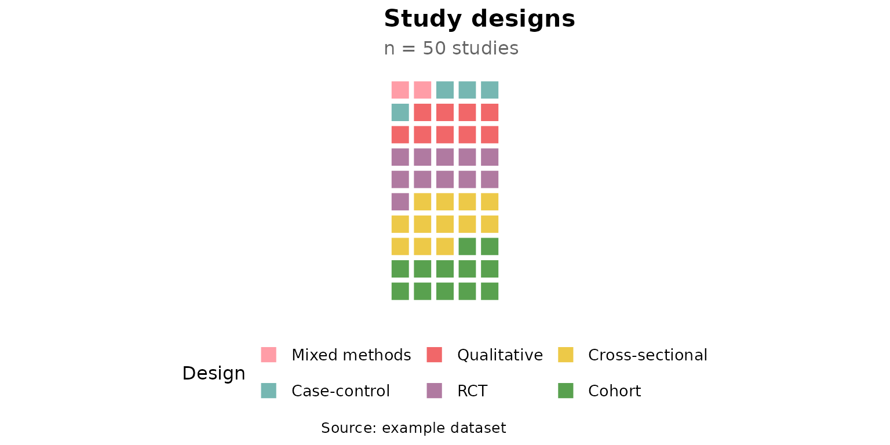
