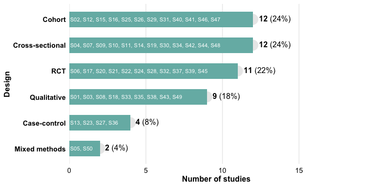
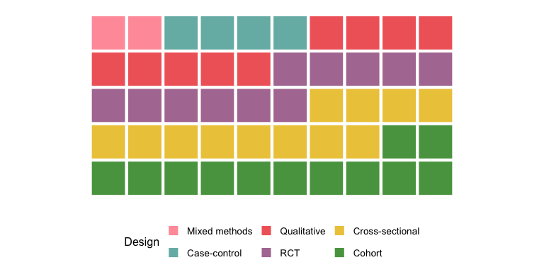
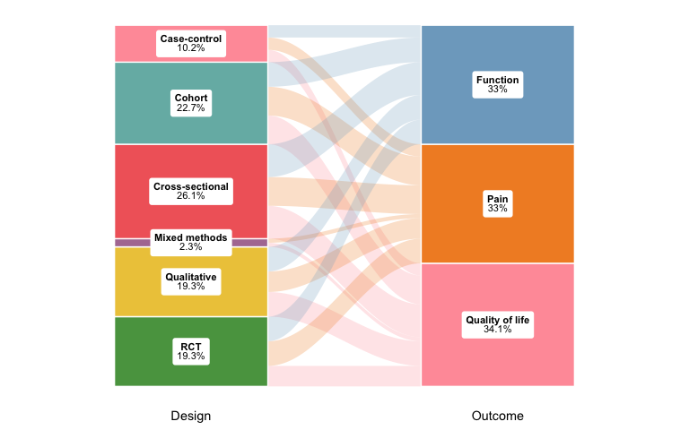
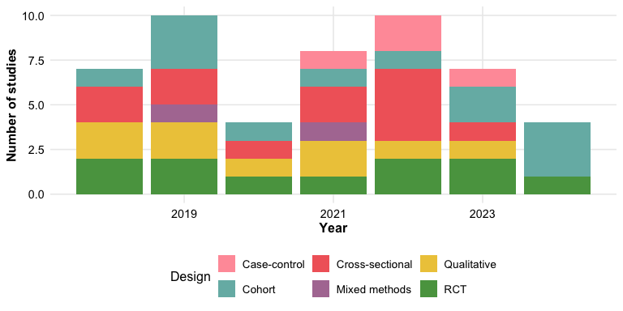
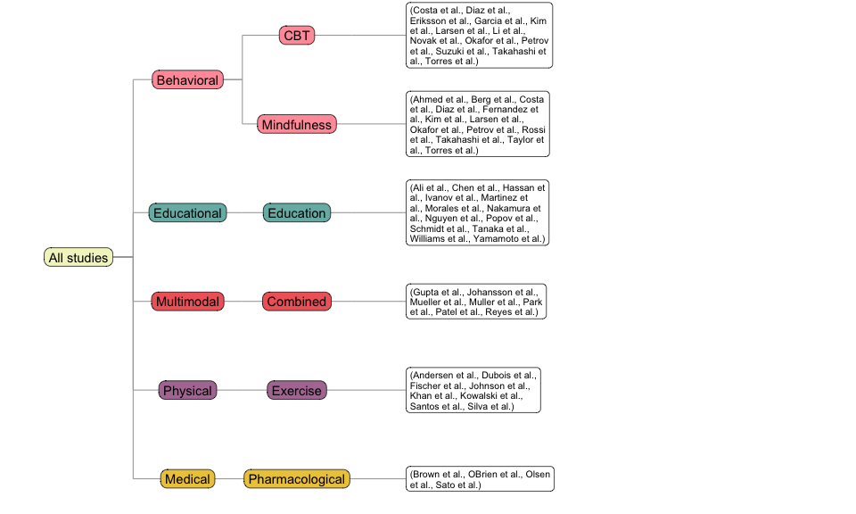
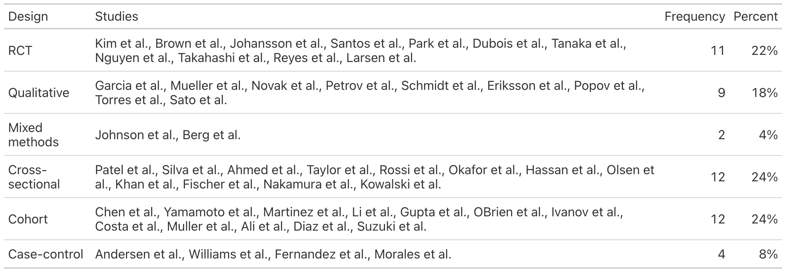
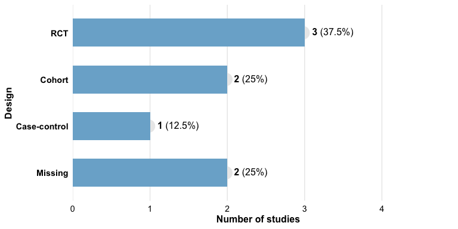

# `litReview`: An R package for plotting literature review results

`litReview` provides functions to summarize and visualize categorical
data from literature reviews. All plot functions return standard ggplot
objects you can customize with `+`.

## Installation

Install the released version from CRAN:

``` r

install.packages("litReview")
```

Or the development version from GitHub:

``` r

# install.packages("remotes")
remotes::install_github("sonsoleslp/litReview")
```

## Usage

``` r

library(litReview)
data(studies)
```

### Bar chart

``` r

reviewBar(studies, Design)
```


``` r

reviewBar(studies, Design, fill = "#59a14f") +
  ggplot2::labs(title = "Study Designs")
```


### Study labels on bars

``` r

reviewBar(studies, Design, fill = PALETTE[2], studlabs = TRUE)
```



### Stacked bar chart

[`reviewStackedBar()`](https://sonsoles.me/litReview/reference/reviewStackedBar.md)
compares the composition of one category across another. By default each
bar is scaled to 100% to compare proportions:

``` r

reviewStackedBar(studies, Design, RiskOfBias)
```


Use `position = "stack"` for raw counts:

``` r

reviewStackedBar(studies, Design, RiskOfBias, position = "stack")
```


### Histogram

[`reviewHistogram()`](https://sonsoles.me/litReview/reference/reviewHistogram.md)
bins a numeric column; add `fill_by` to stack by a group.

``` r

reviewHistogram(studies, SampleSize, bins = 15)
```


### Waffle chart

``` r

reviewWaffle(studies, Design, ncol = 10)
```



### Donut chart

``` r

reviewPie(studies, Design)
```


### Co-occurrence heatmap

``` r

reviewOverlap(studies, Design, Outcome, fill = "#b07aa1")
```


### UpSet plot

[`reviewUpset()`](https://sonsoles.me/litReview/reference/reviewUpset.md)
shows how the values of a multi-value column co-occur across studies — a
scalable alternative to the pairwise heatmap. Requires the `ggupset`
package.

``` r

reviewUpset(studies, Outcome,  fill = "#f16769")
```


### Alluvial plot

``` r

reviewAlluvial(studies, c("Design", "Outcome"), labels = "prop")
```



### Year trend

``` r

reviewTrend(studies, Design)
```



### World map

``` r

reviewMap(studies)
```


### Treemap

``` r

reviewTreemap(studies, Design)
```


``` r

reviewTreemap(studies, Intervention, color_by = InterventionType)
```


### Coding matrix

[`reviewMatrix()`](https://sonsoles.me/litReview/reference/reviewMatrix.md)
shows a study-by-criteria evidence matrix: a tile wherever a study
addresses a criterion, coloured by a study attribute with the coding
level inside.

``` r

criteria <- c("Randomization", "Blinding", "SampleJustification",
              "AttritionReported", "EthicsApproval", "EffectSize")
reviewMatrix(studies[1:20, ], criteria, color_by = "PubType",
             levels = c(F = "Full", P = "Partial", M = "Mention"))
```


### Tree diagram

[`reviewTree()`](https://sonsoles.me/litReview/reference/reviewTree.md)
draws a left-to-right hierarchy from columns given in order, listing the
studies at each leaf.

``` r

reviewTree(studies, c("InterventionType", "Intervention"), study_id = Author)
```



### Summary table

``` r

reviewTable(studies, Design, study_id = "Author")
```



### Handling missing data

``` r

df_na <- data.frame(
  StudyID = paste0("S", 1:8),
  Design  = c("RCT", "Cohort", NA, "RCT", "Case-control", NA, "RCT", "Cohort"),
  stringsAsFactors = FALSE
)
reviewBar(df_na, Design, na.rm = FALSE, na_label = "Missing", na_last = TRUE)
```


